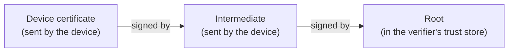

The most common reason a certificate-based setup fails on the first try is not the certificate.
It is that the thing checking the certificate was never told whom to trust, or was told half of it.
This page is about that half.

## A verifier only knows what it was given

When a device presents a certificate, the verifier, whether a RADIUS server, an identity provider, an SSH daemon, or a web server, has one question:
was this signed by an authority I trust?
It answers by looking in its own trust store.
Whatever is in that store is the whole universe of authorities the verifier will accept.
A certificate from anyone else is rejected with an error that usually blames the certificate.

Every use case therefore has a step that is easy to skip:
put your authority's trust roots where the verifier will look.
The [Wi-Fi guide](../tutorials/protect-wireless-networks.mdx) does it when it registers your client CA with the RADIUS server; the [SSH guide](../ssh/hosts.mdx) does it when it points `sshd` at the user CA; a web app does it in its server configuration.

## Roots and intermediates

An authority is usually two certificates, not one.

The **root** is self-signed and long-lived.
Its private key signs only the intermediate's certificate and is otherwise kept out of reach.
The root is what goes into trust stores, because it changes rarely.

The **intermediate** is signed by the root and does the daily signing of device, user, and workload certificates.
It can be rotated, replaced, or revoked without touching a single trust store, as long as the new one is signed by the same root.

A hosted Smallstep authority is built this way, and so is a [`step-ca`](../step-ca/certificate-authority-core-concepts.mdx) you run yourself.
Bringing your own root keeps the same shape:
your existing root signs a Smallstep intermediate, and everything that already trusts your root trusts what the intermediate issues.

## The chain

A verifier that trusts the root has never seen the intermediate.
The presenter must therefore send both its own certificate and the intermediate's certificate, and the verifier walks the chain:

Three ways this breaks, and they all look the same from the outside:

- The device sends only its own certificate, and the verifier cannot get from it to the root.
- The verifier's trust store holds the intermediate but not the root, or a root that has since been rotated.
- The verifier holds the right root but the certificate was issued by a different authority than the one whose root was installed.

Where the chain is supplied depends on the verifier.
A RADIUS server is usually given the full bundle, root and intermediate, because EAP-TLS clients do not always send intermediates.
A web server is given the root and relies on the client to send its intermediate.
The guide for each use case says which.

## Trust goes both ways

Most conversations about trust roots are about the verifier trusting the device.
In the Wi-Fi case the device also has to trust the RADIUS server, or it will refuse to hand over its certificate to an impostor access point.
That is a second trust root, the RADIUS server's CA, delivered to the device in the network profile.
The two are independent: your client CA on the server, the server's CA on the client.
The [Wi-Fi guide](../tutorials/protect-wireless-networks.mdx#step-3-configure-clients) sets both.

## What "trust roots" means on the platform

On the platform, *trust roots* are the anchors of an authority as a verifier needs them: the root, usually with the intermediate, as a PEM bundle.
Every authority publishes its bundle on its page under **Authorities**, and at a fixed URL on the authority's domain, `https://<authority-domain>/roots.pem`, so you can fetch it in automation.

Where those bundles go today:

| Verifier | Where the trust roots go | Guide |
|---|---|---|
| Smallstep RADIUS | The `clientCA` of the RADIUS server | [Wi-Fi](../tutorials/protect-wireless-networks.mdx#option-1-smallstep-managed-radius) |
| Your own RADIUS server | Its trusted client CA bundle | [Wi-Fi](../tutorials/protect-wireless-networks.mdx#option-3-bring-your-own-radius-server) |
| The device, for the RADIUS server | `radiusServerCA` on the Wi-Fi resource | [Wi-Fi](../tutorials/protect-wireless-networks.mdx#step-3-configure-clients) |
| A relay | The relay's trust bundle | [Relays](../tutorials/configure-enterprise-relay.mdx) |
| A web server or SaaS app | Its client CA configuration | [Web apps](../tutorials/browser-certificate-setup-guide.mdx) |
| An SSH host | `TrustedUserCAKeys` in `sshd_config` | [SSH hosts](../ssh/hosts.mdx) |

That the roots are copied into several places by hand is a known cost, and the reason a rotation has to be planned.
A Trust view that records which verifier relies on which authority, and verifies it, is planned; it is not available today.

## Where this shows up in Smallstep

- Download an authority's trust roots from its page under [Trust](../platform/concepts/trust.mdx).
- [Bring your own root](../certificate-manager/byo-root.mdx) explains the root-signs-intermediate arrangement when the root is yours.
- Every use-case guide has the step where trust roots are placed; the [Wi-Fi](../tutorials/protect-wireless-networks.mdx) and [wired](../tutorials/protect-wired-networks.mdx) guides are the clearest examples.
- [PKI in one page](./pki-in-one-page.mdx) defines the words; the open-source [`step ca root`](../step-cli/reference/ca/root/README.mdx) and [`step certificate install`](../step-cli/reference/certificate/install/README.mdx) commands fetch and install a root from any `step-ca`, hosted or not.
