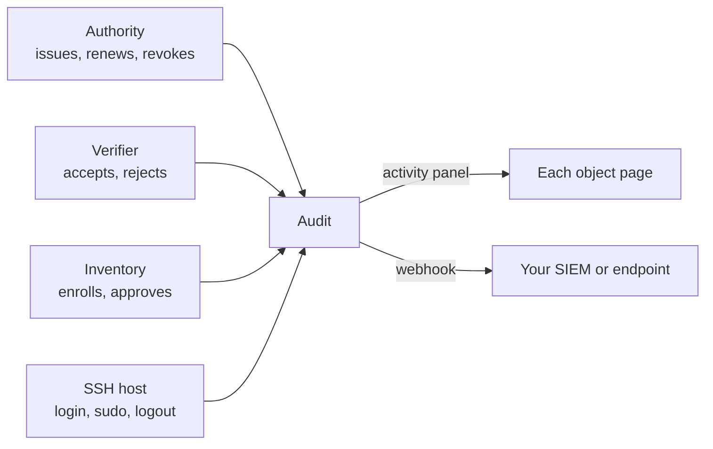

Audit is the team's record of what happened:
every certificate issued, every authentication accepted or rejected, every device enrolled or approved, every SSH session.
Every object page shows the slice about itself; the Audit tab shows all of it with one set of filters.
Records are append-only.

## The record kinds

**Event.**
One thing that happened, with a time, a category, a type, and a subject: a certificate was issued, RADIUS answered Access-Accept, a device registered, an MDM sync completed.
Events are what you filter and search.

**Session.**
A bounded interaction with a timeline.
An SSH session records the login, `su` and `sudo` changes, and the logout on a host, with a terminal recording where enabled.

**Export.**
A copy of selected records pushed to your own systems.
Webhooks today: certificate requests, certificate expirations, and SSH session events, delivered as JSON to an endpoint you register.

## How it relates

Audit records; it does not interpret.
Whether a fleet is healthy is a question for the resource and device pages, computed from these records and the inventory.

## Where it appears

- **Console**: the **Audit** tab lists the team's events with filters by time, type, and subject.
  A device's page shows its own events; a Wi-Fi resource shows its authentication activity; SSH sessions are listed under the SSH configuration (the **SSH Pro** menu today), with a per-session timeline.
- **Webhooks**: registered under **Settings › Webhooks** and documented on [Webhook events](../../certificate-manager/webhook-events.mdx).
- **API**: certificate lifecycle is visible through [`/certificates`](https://gateway.smallstep.com/v2025-01-01/operations/ListCertificates); SSH session webhooks carry the session ID.
  See [Smallstep API](../smallstep-api.mdx).

A single Sessions view for SSH and other session kinds, policy decisions as records, and a SIEM export in a standard schema are planned and not available today.

## Guides that use it

- The [Wi-Fi guide](../../tutorials/protect-wireless-networks.mdx#verify-and-troubleshoot) verifies a deployment by watching the resource's authentication activity.
- [Webhook events](../../certificate-manager/webhook-events.mdx) for exports.
- [How SSH works](../../ssh/how-it-works.mdx) for how session events are produced on a host.
- [Agent troubleshooting](../troubleshooting-agent.mdx) starts from a device's events.
- Related concepts: every other surface emits into Audit; [Policy](./policy.mdx) decisions will be recorded here once policy modes ship.
