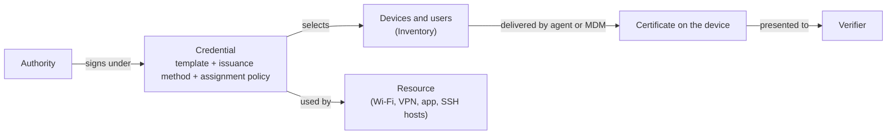

A credential is the certificate a device, user, or host gets so that it can reach a resource.
It is a configuration, not an issued certificate:
one credential produces many certificates, one per device or user it is assigned to, and renews them for as long as the assignment holds.

## Three parts

**A certificate template.**
Which authority signs, the certificate's lifetime, what goes in the subject and the subject alternative names (the device's serial, hostname, or permanent identifier; the bound user's email; static values), and the key usages.
The open-source [Templates](../../step-ca/templates.mdx) page documents the template language; on a credential the common fields are filled from device and user metadata.

**An issuance method.**
How the certificate is obtained and how strongly its key is protected:

- *Hardware-attested*: the key is generated in the device's TPM or Secure Enclave and the authority requires an attestation before signing.
- *Hardware with fallback*: hardware where available, a software key elsewhere.
- *SCEP*: issued through the MDM's SCEP flow, for devices without the agent.
- *Single sign-on*: the person authenticates with your identity provider and the certificate carries their identity.

[Attestation explained](../../learn/attestation-explained.mdx) explains what each level proves.

**An assignment policy.**
Which devices and users get the credential:
by assurance, ownership, operating system, source, and tags, and optionally only devices with a bound user.
An empty policy selects every device.
[Policy](./policy.mdx) describes it beside the other policy kinds.

## Two kinds

An **X.509 credential** is presented to Wi-Fi, wired networks, VPNs, identity providers, web apps, relays, and services.
An **SSH credential** is an SSH user certificate (for people logging in) or an SSH host certificate (for the host they log in to).

## Delivery

A credential is inert until something puts the certificate on the device and keeps it current:

- **The agent** enrolls, generates the key in hardware, requests and renews the certificate, and configures the resource (the Wi-Fi profile, the browser, the VPN, the service reload).
- **An MDM profile** delivers a certificate and a network or VPN profile to a device without the agent; the MDM's SCEP or ACME flow renews it.
- **The step-ssh host package** delivers the host certificate and access rules to an SSH host.
- **Manual**: `step ssh login` for an SSH user certificate, or a downloaded profile.

The API field for this choice is `managementMode`: `agent`, `mdm`, or `other` when some other process handles enrollment and renewal.

## How it relates

## Where it appears

- **Console**: credentials have their own list, labelled **Endpoints** under the **Certificate Manager** menu today; a resource under **Protect** references the credentials its clients authenticate with.
- **API**: [`/credentials`](https://gateway.smallstep.com/v2025-01-01/operations/PostCredentials) in the 2025-01-01 version; a resource such as `/protect/wifi` lists the credential IDs it uses.
  The older `/endpoint-configurations` and `/accounts` paths are deprecated.
  See [Smallstep API](../smallstep-api.mdx).

## Guides that use it

- The [Wi-Fi guide](../../tutorials/protect-wireless-networks.mdx#step-1-configure-credential-issuance) creates a credential and explains every field; the [Quickstart](../../start-here/quickstart.mdx) does it in one call.
- [Wired networks](../../tutorials/protect-wired-networks.mdx), [VPN](../../tutorials/vpn-setup-guide.mdx), and [web apps](../../tutorials/browser-certificate-setup-guide.mdx) reuse the same object.
- [Templates](../../certificate-manager/custom-certs.mdx) for lifetimes and custom fields.
- SSH user credentials: the [SSH client quickstart](../../ssh/client.mdx); SSH host credentials: the [host quickstart](../../ssh/hosts.mdx).
- Related concepts: [Trust](./trust.mdx) for the authority; [Inventory](./inventory.mdx) for what is selected; [Verifiers](./verifiers.mdx) for what checks the result.
