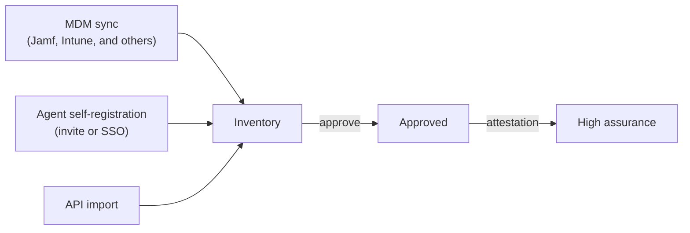

Inventory is the set of devices your team knows about that can hold a credential, plus the users bound to them.
Every credential is issued to something in the inventory, every access decision is about something in the inventory, and every audit record names something in it.
Nothing outside the inventory gets a certificate.

## What is in it

**Devices.**
A laptop, a phone, a server, a VM, a cloud instance.
There is no separate category for servers; a host is a device that runs a workload.
Each device record carries:

- **Identity**: the identifier the platform matched it on, in order of preference a host ID reported by the agent, a permanent identifier from the MDM or an attestation, or a serial number.
- **Source**: where it came from (the agent, an MDM sync, the API).
- **Assurance**: *high* if the device attested through its secure element, *normal* otherwise. [Attestation explained](../../learn/attestation-explained.mdx) defines the levels.
- **Enrollment state**: whether the device has been approved for credentials.
- **Ownership** (company or user), operating system, tags, and metadata you set.
- **Certificates** issued to it and the agent's status, if it runs the agent.
- **Users** bound to it, with one primary.

**Users.**
People from your directory, synced from Okta, Google Workspace, or Entra ID, with their groups.
A user bound to a device is what lets a credential carry the person's email as well as the device's serial.

## How a device gets in

Four routes, and a device can arrive by more than one; records from different sources are linked into one device.

| Route | Approved automatically | High assurance |
|---|---|---|
| A user installs the agent and registers, by invitation or by single sign-on | No, an admin approves, unless you change the team setting | Once the agent attests |
| An MDM sync imports the MDM's inventory | No | Once the agent, or an ACME device attestation profile, attests |
| An import through the API | Yes | Once the agent attests |

The details are in [Build your inventory](../enrollment-guide.mdx) and the per-MDM pages under Inventory › Enrollment.

## Tags organize; what is configured discriminates

Tags are yours.
You decide the axes (`env:prod`, `role:bastion`, `team:payments`), and a credential's assignment policy selects devices by them, together with assurance, ownership, operating system, and source.
The platform reserves no tag and never infers a category from one.

What a device *does* is visible in what is configured on it:
a Wi-Fi network, a browser certificate, a VPN, a workload.
A laptop and a server are the same kind of record; they differ in what their credentials configured.

## Where it appears

- **Console**: the **Devices** tab is the one list, with a detail page per device showing identity, status, certificates, and activity.
  The **Users** tab lists directory users and their device bindings.
  MDM connections and the enrollment policy are under **Settings**.
- **API**: [`/devices`](https://gateway.smallstep.com/v2025-01-01/operations/ListDevices) to list, import, and update devices; `/platforms` for MDM connections; `/device-enrollment-policy` for the approval rules.
  See [Smallstep API](../smallstep-api.mdx).

## Guides that use it

- [Build your inventory](../enrollment-guide.mdx), then connect an MDM: [Jamf Pro](../../tutorials/connect-jamf-pro-to-smallstep.mdx), [Intune](../../tutorials/connect-intune-to-smallstep.mdx), [Mosyle](../../tutorials/connect-mosyle-to-smallstep.mdx), [Workspace ONE](../../tutorials/connect-workspace-one-to-smallstep.mdx), [JumpCloud](../../tutorials/connect-jumpcloud-to-smallstep.mdx), [Fleet](../../tutorials/connect-fleet-dm-to-smallstep.mdx), [Google Workspace](../../tutorials/connect-google-workspace-to-smallstep.mdx).
- Sync users from [Okta](../../tutorials/sync-okta-users-to-smallstep.mdx), [Google Workspace](../../tutorials/sync-google-workspace-users-to-smallstep.mdx), or [Entra ID](../../tutorials/sync-entra-id-users-to-smallstep.mdx).
- [Install the agent](../smallstep-agent.mdx).
- Related concepts: [Credentials](./credentials.mdx) are issued to inventory items; [Policy](./policy.mdx) selects them.
