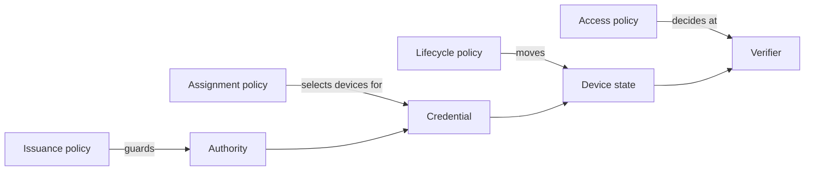

A policy is a rule the platform evaluates to decide something about a credential:
whether an authority will sign it, who gets it, what its holder may do, and what happens to it when a device changes state.
Four kinds, distinguished by *when* they are evaluated.

## The four kinds

| Kind | Question | Evaluated | Lives on |
|---|---|---|---|
| **Issuance policy** | Will this authority sign this? | At signing, in the authority | The authority, an issuance method, or an ACME account |
| **Assignment policy** | Which devices and users get this credential? | When a device's configuration is computed | The credential |
| **Access policy** | May this holder do this action on this resource now? | At the verifier, per login or per request | The resource or verifier |
| **Lifecycle policy** | What moves a device between states, and what happens to its credentials? | On an event: an enrollment, an admin action | The team |

Keeping issuance separate from assignment matters:
the authority is the last line of defense and must be able to refuse what the rest of the platform asked for.
Keeping lifecycle separate from access matters too:
quarantining a device is a state change with consequences for every credential it holds, not a per-request decision.

## What exists today

**Issuance policy.**
Allow and deny rules over the names an authority will sign: DNS names, IP addresses, email addresses, URIs, common names, SSH principals.
On a hosted authority they can be set at the authority, per issuance method, and per ACME account.
The rules and their evaluation are documented on the open-source [Policies](../../step-ca/policies.mdx) page, which applies to hosted authorities as well.

**Assignment policy.**
On every credential: match on assurance (*high* or *normal*), ownership (company or user), operating system, source, and tags, and optionally require a bound user.
An empty policy selects every device.
The Wi-Fi guide's [credential step](../../tutorials/protect-wireless-networks.mdx#create-the-credential) shows the fields.

**Access policy.**
Two places today.
For SSH hosts, grants map an identity-provider group to hosts with a tag, with or without sudo; the rules are synchronized to each host and enforced at login.
The [access control](../../ssh/acls.mdx) page documents them (shown in the Console under the **SSH Pro** menu today).
For networks, a dedicated RADIUS deployment can return reply attributes, such as a VLAN, chosen by the device's certificate fields or inventory attributes, as the [Wi-Fi guide](../../tutorials/protect-wireless-networks.mdx#option-2-smallstep-enterprise-radius) describes.
The device factor applies a fixed rule: the device must be active and bound to the user signing in.

**Lifecycle policy.**
The enrollment policy: which sources may add devices and whether they are approved automatically, set in team settings and through `/device-enrollment-policy`.
[Build your inventory](../enrollment-guide.mdx) explains the approval step.

## How it relates

## Where it appears

- **Console**: each policy is on the object it governs.
  Assignment policy on the credential; SSH access rules under the SSH configuration; the enrollment policy under **Settings**; issuance policy on the authority.
  There is no **Policy** tab today.
- **API**: `policy` on [`/credentials`](https://gateway.smallstep.com/v2025-01-01/operations/PostCredentials); `/device-enrollment-policy`; `/grants` in the 2023 API for SSH.
  See [Smallstep API](../smallstep-api.mdx).

A cross-cutting Policy view, with every policy able to run in Off, Monitor, or Enforce mode and record its decisions, is planned and not available today.

## Guides that use it

- [Wi-Fi](../../tutorials/protect-wireless-networks.mdx): the assignment policy on the credential and, with a dedicated RADIUS deployment, VLAN reply attributes.
- [SSH access control](../../ssh/acls.mdx): grants over groups and host tags.
- [Build your inventory](../enrollment-guide.mdx): the enrollment policy.
- Related concepts: [Credentials](./credentials.mdx), [Inventory](./inventory.mdx), [Verifiers](./verifiers.mdx), and [Audit](./audit.mdx), where decisions are recorded.
