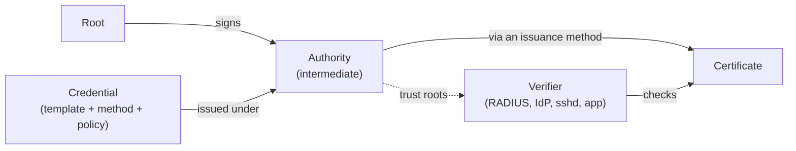

Trust is your team's cryptographic estate:
the authorities that sign certificates, the ways a certificate can be obtained from each, the trust roots a verifier needs to accept what they sign, and every certificate they have issued.
It answers the question every use case ends with: who trusts whom, and why.

## The objects

**Authority.**
A certificate authority the team owns or links.
A *hosted* authority runs on the platform; Smallstep holds its signing keys in a cloud key management service.
An authority created with *your own root* is a hosted intermediate signed by a root you keep.
A *linked* authority is a `step-ca` you run yourself, registered with the platform so its issuance methods and admins are managed here.
Each team also has an attestation authority, which verifies device attestations rather than issuing certificates for resources.
Every hosted authority is a `step-ca`; [How Smallstep hosts step-ca](../../learn/how-smallstep-hosts-step-ca.mdx) says what that shares with the open-source project.

**Issuance method.**
How a requester obtains a certificate from an authority: hardware-attested (ACME device attestation), standard ACME, SCEP for an MDM, single sign-on (OIDC) for people, cloud instance identity, JWK for pipelines, Kubernetes service account.
The open-source word is *provisioner*, and that is what the API and the Advanced view call it; the types are documented on the open-source [Provisioners](../../step-ca/provisioners.mdx) page.

**Trust roots.**
The root, usually with the intermediate, as a PEM bundle a verifier can install.
Available on each authority's page and at `https://<authority-domain>/roots.pem`.
[Trust roots and chains](../../learn/trust-roots-and-chains.mdx) explains why a verifier needs them.

**Certificate.**
An issued leaf, X.509 or SSH, with its authority, issuance method, subject, validity, and status.
Certificates can be searched, inspected, revoked, and, for the ones the agent does not manage, renewed and downloaded.

## How it relates

A credential names the authority it is issued under.
A verifier holds that authority's trust roots.
The certificate the device presents chains to the root the verifier holds.
That dotted edge, the verifier relying on the authority, is placed by hand today, once per verifier; the guides say where.

## Where it appears

- **Console**: **Authorities** and **Certificates** under the **Certificate Manager** menu.
  An authority's page shows its issuance methods (labelled provisioners), its trust roots, and its settings; the certificates list shows X.509 and SSH certificates with search, revoke, and download.
- **API**: `/authorities`, `/authorities/{id}/provisioners`, and [`/certificates`](https://gateway.smallstep.com/v2025-01-01/operations/ListCertificates).
  See [Smallstep API](../smallstep-api.mdx).

A **Trust** tab that groups authorities into zones and records which verifier relies on which authority is planned and not available today.

## Guides that use it

- [Create a hosted authority](../../certificate-manager/getting-started.mdx) and [bring your own root](../../certificate-manager/byo-root.mdx).
- Issuance methods: [ACME](../../certificate-manager/acme/README.mdx) and [single sign-on certificates](../../certificate-manager/oidc.mdx).
- [Issue certificates with your own clients](../../certificate-manager/basic-ops.mdx), the general-PKI job.
- [Registration authorities](../../registration-authorities/README.mdx) in front of a hosted authority, and [ACME for Google CAS](../../registration-authorities/acme-for-cas.mdx).
- Every use-case guide has a trust-roots step; [Wi-Fi](../../tutorials/protect-wireless-networks.mdx#find-your-authority) starts by finding the authority.
- Related concepts: [Credentials](./credentials.mdx) are issued under an authority; [Verifiers](./verifiers.mdx) hold its trust roots.
