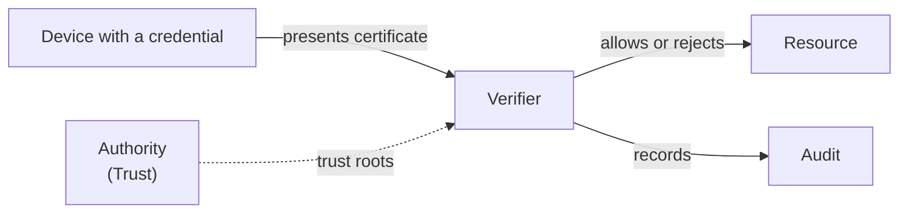

A verifier is the thing that checks a credential when a device, user, or workload presents it.
It holds the trust roots of the authority that issued the credential, completes the handshake, and decides.
Some verifiers are run by Smallstep; the rest are yours, configured from a guide.

## The kinds

**Smallstep RADIUS.**
The verifier for Wi-Fi and wired networks.
Your access points and switches relay the EAP-TLS handshake to it; it validates the full chain against your client CA and checks revocation on every authentication.
Two forms: a multi-tenant service you create yourself with the API (**Managed RADIUS** in the guides), and a dedicated deployment with static IPs, RadSec, reply attributes for VLAN assignment, and authorization webhooks (**Enterprise RADIUS**, provisioned by Smallstep for your team).
[RadSec](../../learn/radsec.mdx) explains the transport.

**Your own RADIUS.**
FreeRADIUS, Cisco ISE, Aruba ClearPass, NPS, or any server that speaks EAP-TLS, given your authority's trust roots.

**The device factor.**
Your identity provider, configured to require a Smallstep device certificate at sign-in so that a session is only issued to a person on an enrolled device.
The identity provider is the verifier; Smallstep supplies the certificate and the trust roots.

**Relays.**
A Smallstep-run MASQUE relay that accepts connections only from devices with a valid certificate and forwards them to resources that cannot verify certificates themselves.
Provisioned by Smallstep for your team.

**Your own apps and hosts.**
A web server or SaaS app that verifies client certificates (mutual TLS); an SSH host whose `sshd` trusts your user CA, with or without the step-ssh package; a service that checks a workload's certificate.

An MCP gateway that puts your MCP servers behind device identity is planned and not generally available today.

## How it relates

Every verifier needs the authority's trust roots before it can accept anything, and, for Wi-Fi, the device needs the verifier's CA too.
[Trust roots and chains](../../learn/trust-roots-and-chains.mdx) lists where each verifier takes them.
Some verifiers also apply an access policy after the certificate checks out: an SSH host decides whether this user may log in here; a RADIUS server with reply attributes decides which VLAN.
[Policy](./policy.mdx) covers that.

## Where it appears

- **Console**: RADIUS servers and the resources they protect are under **Protect**; the identity provider for the device factor is configured with the SSO integration; relays are provisioned by Smallstep.
- **API**: [`/managed-radius`](https://gateway.smallstep.com/v2025-01-01/operations/PostManagedRadius) creates a RADIUS server; `/protect/wifi` and `/protect/ethernet` reference the server CA; `/sso` sets the identity provider.
  See [Smallstep API](../smallstep-api.mdx).

## Guides that use it

- [Wi-Fi](../../tutorials/protect-wireless-networks.mdx#step-2-configure-the-enforcement-point) and [wired networks](../../tutorials/protect-wired-networks.mdx): Smallstep RADIUS or your own.
- [Web apps](../../tutorials/browser-certificate-setup-guide.mdx): your app or identity provider as the verifier.
- [Relays](../../tutorials/configure-enterprise-relay.mdx).
- [SSH hosts](../../ssh/hosts.mdx) and [access control](../../ssh/acls.mdx): `sshd` with the step-ssh package.
- [VPN](../../tutorials/vpn-setup-guide.mdx): strongSwan, F5, or Azure VPN Gateway verifying device certificates.
- Related concepts: [Trust](./trust.mdx) supplies the roots; [Audit](./audit.mdx) receives the decisions.
