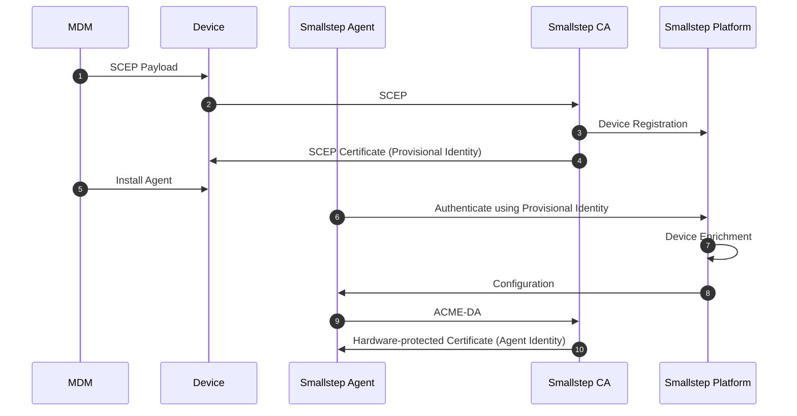
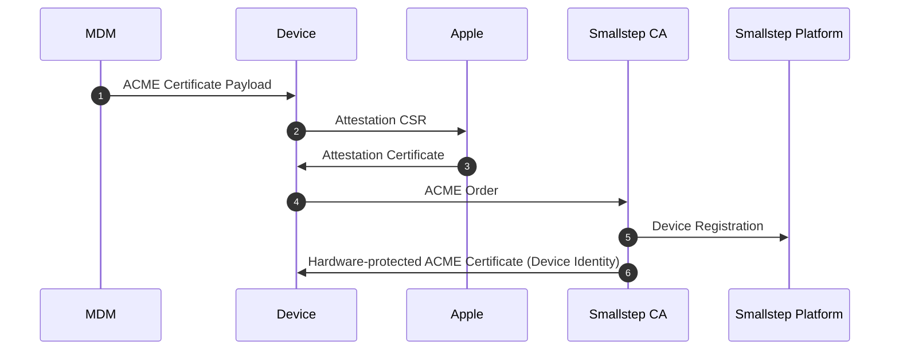
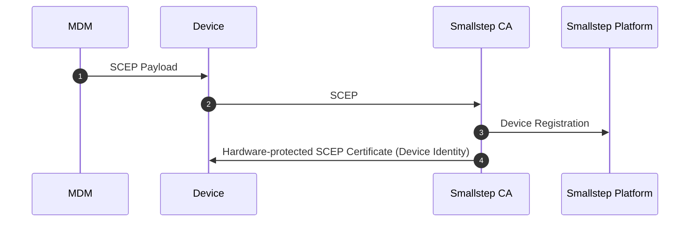
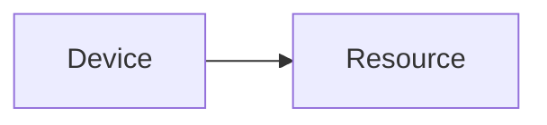
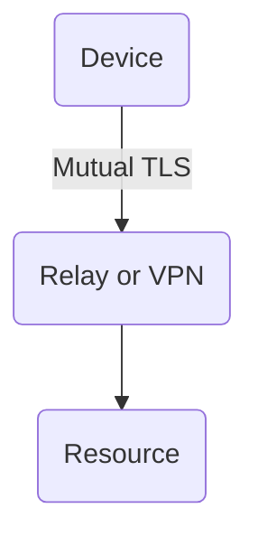
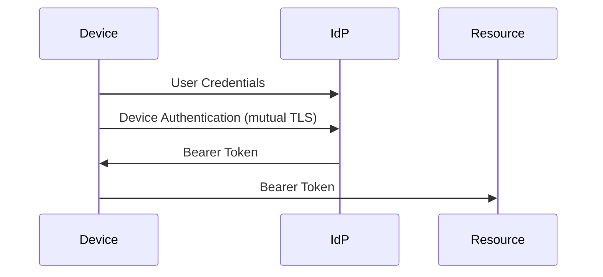

Device Identity ensures that only company-owned devices can access your enterprise's most sensitive resources, from Wi-Fi networks to SaaS apps. By using certificates to bind access to hardware, Smallstep neutralizes security threats and ensures compliance and governance across your organization.

This document describes the core concepts integral to the Smallstep platform.

## Device inventory

The Smallstep **device inventory** is a canonical list of your approved devices and their hardware identifiers. It forms the basis of your device-based authentication policies. 

In order to build an inventory, we need to understand how to identify a device, and how to bootstrap trust with devices.

And trust is a gradient.

### Assurance levels

For decades, devices were identified by a nominal identifier such as a MAC address or IP address. Because they are self-reported and mutable, MAC and IP addresses are **device identifiers with no assurance**. These identifiers don’t offer a stable foundation for a device security policy.

How, then, can we identify devices without the ground shifting beneath our feet?

We can improve our assurance of a device's identity by having a user self-identify the device. They might literally DM the IT security team and say, "My device's serial number is XA47ADKM5." Let's call this a **low-assurance device identifier**. The team has to trust the user to confirm the serial number. But, at least they have an identifier that is permanent, immutable, and unique.

When the company purchases a device, an IT administrator can directly inspect it and retrieve some device identifiers. That gives us better assurance of the identifiers, and we can start building an inventory from this.

### Device attestation

But having an inventory doesn’t solve the whole problem. When we start interacting with the devices in our inventory over a network, how do we authenticate them? What prevents a device from spoofing its serial number?

What we need is cryptographic proof of a device’s identity.

And for that, we need a **secure element**. A secure element is a crypto processor chip or firmware—TPM 2.0 or Secure Enclave are examples. It contains permanent device identifiers that can be cryptographically proven (”attested”) to a third party by the manufacturer. This is the foundation for **high-assurance device identity**.

A high-assurance device identity requires:
* Proof of the device's identity (using a platform certificate issued by the device's manufacturer, eg. Lenovo, Dell)
* Proof of the secure element's identity (using an Endorsement Key certificate issued by the TPM manufacturer, eg. Infineon, STMicro)
* Cryptographic binding between the trusted platform and the trusted secure element (provided by the platform)
* Proof that a private key associated with the device is **hardware-bound** on its secure element. Hardware-bound keys can be used by the device, but there’s no way to extract them without an exploit or destructive disassembly in a semiconductor forensics lab.

Once this identity is established and a device certificate is issued, a third party (aka “relying party”) can trust not only the identity of the device, but also verify the residency of keys generated in its secure element. 

Now we have a great foundation for device identity. And, we've unlocked another gift: **zero-touch provisioning**. It's possible for new devices to automatically enroll themselves on their first boot, with no credentials required.

### Building an inventory

Smallstep uses the following attestable device identifiers to build a high-assurance inventory:

- On Apple platforms, the device’s serial number or hardware UDID.
- On Windows, Linux, and ChromeOS devices with TPMs, there is a TPM Endorsement Key and a Platform Certificate.

With Smallstep, you can build a device inventory by syncing devices from your MDM, via our API, or by having users self-register (with optional SSO).

See our [Enrollment Guide](https://smallstep.com/docs/platform/enrollment-guide/) for details.

<Alert severity="info">
    A note on BYO devices

    BYO devices pose a privacy challenge: Unique hardware identifiers cannot not be exposed to the organization when a device is used for both personal and organizational work. But, as long as we have a continuity of device identity across interactions with BYO devices, we don’t need to use permanent hardware identifiers. Instead, cryptographically secure software identifiers—scoped to the organization—can form a foundation for policy and authentication. BYO device identifiers aren’t usable for trust bootstrapping, though. The device’s owner will need to prove possession of the device before its identity can be trusted. 
</Alert>

## Smallstep agent

Once you have a high-assurance device inventory, you still need enrollment, renewal, and revocation of certificates for those devices. That’s where the **Smallstep Agent** comes in. The Smallstep Agent is a lightweight program that runs in the background on devices and manages end-to-end certificate lifecycle for various resources.

## Device bootstrapping and enrollment

The Smallstep Agent uses a **provisional identity** (eg. an SCEP certificate issued via MDM) to bootstrap with the Smallstep platform. On Linux, or in other cases where there is no MDM, a short-lived bootstrapping token can be used as a provisional identity.

The provisional identity is a pre-enrollment credential that allows the device to begin the enrollment process and potentially be auto-approved. Note that a device inventory must already be imported or synced (eg. from an MDM) before bootstrapping.

Here’s a typical step-by-step bootstrapping and enrollment workflow on a device with a TPM. Bootstrapping (aka “credential activation”) is standardized by the [Trusted Computing Group](https://trustedcomputinggroup.org/):

1. The **Smallstep agent** is installed on a device that is not yet in the Smallstep inventory.
2. A provisional identity is also procured from Smallstep, via an MDM SCEP payload or short-lived bootstrapping token.
3. When the agent starts up, it kicks off a device trust bootstrapping process, using the provisional identity to establish a mutual TLS channel to Smallstep.
4. The agent creates an Attestation Key pair in the TPM.
5. The agent requests a device attestation certificate from Smallstep’s Attestation CA. The Attestation CA verifies that the request is coming from a device in your inventory where the Endorsement Key (EK) is resident.
6. Upon successful verification, the Smallstep Attestation CA signs an Attestation Certificate for the agent. This Attestation Certificate is used for remote key attestation.
7. The agent uses the Attestation certificate to complete an ACME `device-attest-01` challenge from the **Smallstep Agent CA** to obtain a Smallstep **device certificate**. The device certificate cryptographically proves both the identity of the device and the hardware binding of the private key.
8. Finally, the agent uses the device certificate to enroll short-lived client credentials needed for accessing protected resources. These come from the **Smallstep Account CA** or the **Smallstep Devices CA**, depending on the use case.

## Other enrollment workflows

### Self-registration

With self-registration, an end user can use our agent to sign into Smallstep (optionally via SSO) and register their device. The device is added to the team’s device inventory. An admin must approve the device before any certificates will be issued to it.

### Bulk registration via API

Admins can add devices that are not in MDM, including Linux endpoints, to your team's device inventory via the [Smallstep API](./smallstep-api.mdx).
Devices added via API will be marked as approved for use with [the Smallstep agent](./smallstep-agent.mdx).

### Agentless MDM enrollment

On Apple platforms, Smallstep can be used without our agent software, with some limitations. For this workflow, there is no bootstrapping required. The device needs to be in the Smallstep inventory and marked as trusted before enrolling.

Here’s an ACME Device Attestation enrollment workflow on an Apple device:

### ACME-based MDM enrollment (agentless)

Here’s a Windows device doing a SCEP-based enrollment with Intune:

### SCEP-based MDM enrollment (agentless)

After enrollment, the resulting device identity certificate can be used for any first-party Apple services: Wi-Fi networks, network relays, VPNs, S/MIME, or client certificates for Safari.

# Key protection

Now let’s turn our attention toward the client credentials issued by Smallstep.

Smallstep uses secure elements to offer the most advanced hardware key protection available today. And while secure elements are ubiquitous, application support for them is still uneven. Our goal is to smooth that out by offering the strongest key protection available for a given platform and application.

Smallstep uses several private key protection levels depending on the use case, protection method, and operating system.

Let’s clarify what’s available and explore how Smallstep helps smooth out some of the differences to offer a seamless UX for end users. We are here to lead the way on best practices in this arena, and we hope that our work will encourage broader support for hardware key protection.

## Private key protection levels

### **Software protected keys**

**Software protected** private keys are either resident in memory (eg. a key in an OpenSSH agent) or stored on the file system (eg. a key in an NSS database). This is the weakest key protection level.

- Trust profile: To keep software protected keys safe, a third party must trust the OS, applications, and end users

### **Hardware bound keys**

**Hardware protected** private keys are generated and stored inside a secure element such as a TPM, Secure Enclave, or YubiKey. These keys are bound to the hardware. They are *not exportable*, which means they can only be used for signing or decryption operations.

From the perspective of the local system, hardware protected keys are much stronger than keys stored in memory or on disk. They provides assurance *to the application and its users* that keys cannot be exfiltrated.

But, without cryptographic proof of the key's provenance, a relying party can't differentiate hardware keys from software keys. No *proof* ("attestation") exists that a given key was generated in a secure element.

**Smallstep Attested keys**

To support some applications on Apple platforms, our agent can emulate TPM remote key attestation. We use a process similar to the Trusted Computing Group’s remote attestation process. This is not device attestation, however.

Here's the workflow:
1. The Smallstep agent creates a key pair. The private key is generated in the Secure Enclave, and the public key is sent to the Smallstep attestation authority.
2. The attestation authority responds with an encrypted secret that can only be decrypted using the private key.
3. The Smallstep agent then proves to the attestation authority that is in possession of the private key by sending the decrypted secret.
4. Finally, the attestation authority returns a signed attestation certificate.

This certificate attests that the client is in possession of the private key, but it cannot prove that the key is stored in a genuine Apple Secure Enclave.

Locally, with a CLI tool, it’s possible to confirm that the key the CA has issued a certificate for matches the private key protected by the Secure Enclave.

This is the lowest level of key protection that Smallstep offers, and it’s only used for applications and use cases that do not support anything stronger. It increases attack cost to a level that is sufficient for some use cases. But in practice, its easier to bypass than hardware attestations. 

This protection level depends on trusted compute primitives available on some platforms (for example, system integrity protection, binary authorization).

- Trust profile: To keep these keys safe, you’re trusting system integrity protection, a specific application, and the secure element.

**Hardware attested keys**

With a hardware attested key, the secure element produces an attestation statement that proves that the key is hardware bound. Approaches here vary, from [Apple Managed Device Attestation](https://support.apple.com/guide/deployment/managed-device-attestation-dep28afbde6a/web) to [Chrome Verified Access](https://developers.google.com/chrome/verified-access/developer-guide), but the industry is standardizing around ACME `device-attest-01`.

- Trust profile: To keep these keys safe, you’re trusting the secure element manufacturer

**Device attested keys**

This allows a third party to prove that a specific key is stored on *a specific device* or secure element. The device attestation includes cryptographic proof of the device’s serial number or other unique hardware identifier. Having the hardware identifier aids in zero-touch bootstrapping and enrollment flows.

- Trust profile: To keep these keys safe, you’re trusting the secure element manufacturer

<Alert severity="info">
  Apple platforms do not provide user-space APIs for device attestations due to privacy concerns – hardware identifiers used for attestation can be used to identify a device and correlate end-user activity across remote systems in a way that violates end-user privacy expectations. For this reason, Apple limits hardware attestations to the Managed Device Attestation (MDA) workflow, using ACME DA, which is only available to managed devices in Supervised mode.
</Alert>

### A note about provisioned credentials

Because many client apps are unable to directly use hardware bound keys, Smallstep’s agent may issue **provisioned credentials** from the CA—using hardware bound key for authentication to the CA—as a compatibility tradeoff.

These provisioned credentials are short-lived. Their key attestation level varies based on the application and operating system:

|  | macOS (Smallstep agent) | macOS (agentless) | Windows | Linux | ChromeOS |
| --- | --- | --- | --- | --- | --- |
| Wi-Fi | Smallstep attested | device attested | device attested | device attested | device attested |
| SSH | Smallstep attested | n/a | device attested | device attested | n/a |
| Safari | Smallstep attested | device attested | n/a | n/a | n/a |
| Chrome | Smallstep attested | n/a | device attested | device attested | device attested |
| Firefox | Smallstep attested | n/a | device attested | device attested | n/a |
| Edge | talk to us | n/a | device attested | talk to us | n/a |
| IPSec VPN | Smallstep attested | device attested | talk to us | talk to us | device attested |
| Relay (MASQUE) | Smallstep attested | device attested | device attested | device attested | n/a |

### A note about fallbacks

Due to uneven support for hardware protection and attestation across operating systems and use cases, Smallstep’s agent offers an optional “hardware protection with fallback” approach. With this option, our software will use the highest key protection level available for a given environment.

For example, Apple platforms support device attested keys for Enterprise Wi-Fi certificates. But Windows has no native ACME Device Attestation support, so we can only offer Smallstep attested keys for Enterprise Wi-Fi on Windows.

## Resource protection patterns

Now let's look at the other end of the handshake:
what happens at the enforcement point?

When an access request is made to a protected resource, *something* needs to check whether the device making the request has a valid certificate.

Smallstep integrates with three types of protection patterns.

### Direct (eg. mutual TLS)

The most straightforward way to ensure device authentication is with **direct enforcement**. Some protected resources support direct certificate-based authentication with clients, usually with mutual TLS authentication (**mTLS**).

Pros

- Simple architecture
- High-assurance device authentication

Cons

- Not widely supported
- Can be hard to configure enforcement points and certificates
- Every enforcement point adds a maintenance burden

Examples

- Google Workplace Apps (Docs, Sheets, Drive, etc), using [context-aware access](https://support.google.com/a/answer/9275380?hl=en)
- GCP Portal, using [certificate-based access](https://cloud.google.com/beyondcorp-enterprise/docs/securing-resources-with-certificate-based-access)
- Microsoft Office365 and other Apps, using [conditional access](https://learn.microsoft.com/en-us/entra/identity/conditional-access/overview)
- Microsoft Entra, using [certificate-based access](https://learn.microsoft.com/en-us/entra/identity/authentication/concept-certificate-based-authentication)
- Databases like MySQL & Postgres using certificates & mTLS

**Variants**

Other variants of this pattern exist, in which the resource is configured to enforce device identity using some mechanism other than mutual TLS.

Examples

- Wi-Fi, using WPA3 Enterprise EAP-TLS
- Ethernet, using 802.1X
- GitHub Enterprise repositories, using an [SSH Certificate Authority](https://docs.github.com/en/enterprise-cloud@latest/organizations/managing-git-access-to-your-organizations-repositories/about-ssh-certificate-authorities)
- AWS API, using [AWS IAM Roles Anywhere](https://docs.aws.amazon.com/rolesanywhere/latest/userguide/introduction.html)
- Passkeys with Enterprise Attestation. An extension to the Passkey protocol, supported on managed Apple devices, adds certificate-based authentication to a Passkey authentication flow. This approach seems promising for SaaS and internal web applications.

### Middlebox (eg. ZTNA)

A lot of SaaS apps don’t support mutual TLS. We can use a middlebox approach instead.

In this scenario, a relay or VPN server is configured to use mTLS. The resource is configured to only accept connections from the relay.

Either the relay is the only way to connect into a private network segment where the resource resides, or the resource may be on the public internet, but configured to only accept connections from the relay’s egress IP address.

Pros

- Simple and fast to deploy and maintain
- Very well-known pattern
- Works for most network resources
- High assurance device authentication
- Continuous authentication
- IP allow lists are broadly supported by Public SaaS applications

Cons

- Device Identity is not enforced if an attacker can get around the relay
- The relay is a failure point, network choke-point, or latency concern

### Delegated (eg. SSO)

The resource is configured to trust SSO for login. The Single Sign-on (SSO) provider (aka Identity Provider or IdP) is configured to require a hardware-bound device certificate at login.

An important nuance to this pattern is that the IdP only verifies Device Identity during sign-on as a condition of issuing a *bearer token*. The bearer token—not the device certificate—is then used to access the Resource. Bearer tokens can’t be device-bound. They can be exfiltrated and used on different devices. Key protection is hardware bound at login, but it is software protected at access time.

This pattern can be combined with the middlebox pattern, if the middlebox is configured to authenticate the IdP-issued bearer token.

Pros

- Simple and fast to deploy and maintain
- Independent configuration of the enforcement point
- One enforcement point covers many applications

Cons

- Bearer tokens are software protected

