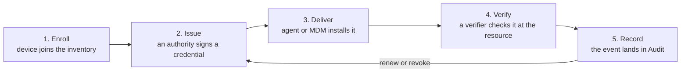

Smallstep gives every device, person, and workload in your organization a certificate that proves what it is,
puts that certificate in front of the things you want to protect,
and records what happened.
Everything else on this site is a detail of that loop.

## The loop

A device enrolls and becomes part of your inventory.
An authority issues it a credential.
Something delivers that credential to the device and keeps it current.
The device presents the credential to a resource, and a verifier checks it.
The result is recorded.
Then the credential renews, or is revoked, and the loop continues.

Each step of the loop has a question behind it, and each question has a surface in the Console and the API.

| Step | Question | Surface |
|---|---|---|
| Enroll | What do we have? | Inventory |
| Issue | What do we trust, and who relies on it? | Trust |
| Deliver | What are we protecting, with which credential, delivered how? | Protect and Credentials |
| Verify | What is allowed? | Policy |
| Record | What happened? | Audit |

## The five surfaces

### Inventory

Inventory is the set of devices your team knows about and the users bound to them.
A device gets in by enrolling with the Smallstep agent, by syncing from your MDM, or through the API.
Each device carries an assurance level that says how strongly its identity was proven.
Only devices in the inventory can receive credentials.
In the Console this is the **Devices** tab and the **Users** tab.
Read [Inventory](../platform/concepts/inventory.mdx).

### Trust

Trust is your cryptographic estate:
the authorities that sign certificates, the ways a certificate can be obtained from them, and the trust roots a verifier needs to accept what they sign.
Smallstep hosts authorities for you, and you can bring your own root.
Every hosted authority runs the open-source `step-ca`, so the mechanics are documented once, in the [step-ca section](../step-ca/README.mdx).
In the Console this is **Authorities** and **Certificates** (under the **Certificate Manager** menu today).
Read [Trust](../platform/concepts/trust.mdx).

### Protect and Credentials

A **resource** is the thing you protect:
a Wi-Fi network, a wired network, a VPN, a web app, your SSH hosts, a workload's clients.
A **credential** is the certificate a device, user, or host gets so that it can reach the resource.
It is defined by a certificate template, an issuance method, and an assignment policy that says who gets it.
Something delivers the credential:
the Smallstep agent, an MDM profile, the step-ssh host package, or a manual step.
In the Console, resources live under **Protect** and credentials have their own list (labelled **Endpoints**, under the same menu as Authorities today).
Read [Credentials](../platform/concepts/credentials.mdx) and [Verifiers](../platform/concepts/verifiers.mdx).

### Policy

A policy is a rule the platform evaluates about a credential:
whether an authority will sign it, which devices and users get it, what its holder may do, and what happens to it when a device changes state.
Today each policy lives on the object it governs.
The assignment policy is on the credential, the enrollment policy is in team settings, and SSH access rules are on the SSH configuration.
Read [Policy](../platform/concepts/policy.mdx).

### Audit

Audit is the record:
every certificate issued, every authentication accepted or rejected, every device that enrolled, every SSH session.
Each device page shows its own activity, and the **Audit** tab shows all of it with one set of filters.
Webhooks push selected events to your own systems.
Read [Audit](../platform/concepts/audit.mdx).

## One example: a laptop joins the Wi-Fi

1. A MacBook enrolls with the agent.
   The agent proves, using the Secure Enclave, that it is the device your MDM says it is, and the device appears in **Devices** as high assurance.
2. You create a Wi-Fi resource under **Protect**, with a credential whose assignment policy selects company-owned laptops.
3. The agent on that MacBook requests the credential.
   Your hosted authority checks the attestation and signs a certificate whose private key never leaves the Secure Enclave.
4. The agent installs the certificate and the network profile.
   Nobody types a password.
5. The MacBook connects.
   The access point hands the handshake to Smallstep RADIUS, which checks the certificate against your authority's trust roots and answers Access-Accept.
6. The accept appears on the Wi-Fi resource's activity and in **Audit**.
7. Before the certificate expires, the agent renews it.
   If the device is retired, its certificates are revoked and the next attempt is rejected.

The [Quickstart](./quickstart.mdx) walks this path with real commands.

## Why it is built this way

The loop only works if step 1 is strong.
A certificate that can be copied to another machine proves nothing about the machine.
Smallstep binds each credential to a key that lives in the device's secure hardware, and requires the device to attest to that binding before an authority signs anything.
That is the difference between "a device that has a certificate" and "this device".
[Why device identity](../learn/why-device-identity.mdx) makes the argument; [Attestation explained](../learn/attestation-explained.mdx) shows the mechanism.

## Where to go next

- **Evaluating?** Start with [Why device identity](../learn/why-device-identity.mdx) and read through the Learn section.
- **Building?** Follow the [Quickstart](./quickstart.mdx), then the guide for your use case, beginning with [Wi-Fi](../tutorials/protect-wireless-networks.mdx).
- **Operating?** Read the six [Concepts](../platform/concepts/README.mdx) pages, then [build your inventory](../platform/enrollment-guide.mdx).
- **Running your own CA?** The open-source [step-ca](../step-ca/README.mdx) section stands on its own; [How Smallstep hosts step-ca](../learn/how-smallstep-hosts-step-ca.mdx) explains what the platform adds.
