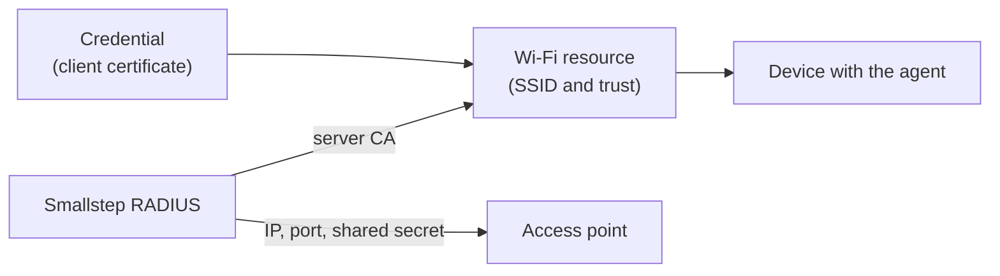

The shortest path from a team with devices to one device that joined a Wi-Fi network with a certificate instead of a password.
This page condenses the [Wi-Fi guide](../tutorials/protect-wireless-networks.mdx).
Go there for MDM-managed clients, per-vendor access-point instructions, and troubleshooting.

<Alert severity="info">
  <div>
    Use a test SSID for this walk-through.
    Do not change a production network until you have seen a device join.
  </div>
</Alert>

## What you get

At the end you have:

- A **credential** that issues a client certificate to each of your devices, with the private key generated in the device's secure hardware.
- A **RADIUS server** run by Smallstep that verifies those certificates during the EAP-TLS handshake.
- A **Wi-Fi resource** that tells the agent which network to configure and which RADIUS server to trust.
- One device on the network, and its Access-Accept visible in the Console.



## Before you start

You need:

1. A Smallstep team, and at least one device [enrolled in your inventory](../platform/enrollment-guide.mdx) with the [Smallstep agent](../platform/smallstep-agent.mdx) installed on macOS, Windows, or Linux.
   The device must be approved.
2. The authority that will sign your client certificates.
   Open **Authorities** in the Console (under the **Certificate Manager** menu) and note the **Authority ID**; download its root certificate as `client_ca.crt`.
3. An [API token](https://smallstep.com/app/?next=/settings/api/tokens/add).
   This quickstart uses the API because every value it needs is in one response; the same objects can be created under the **Protect** tab.
4. The public IP address your access points or wireless controller send RADIUS traffic from.
5. Admin access to the access point and a test SSID.

Store the token in a headers file for `curl`:

```bash
set +o history
echo "Authorization: Bearer [your API token]" > api_headers
set -o history
```

## Create the network

Three calls: the credential, the RADIUS server, and the Wi-Fi resource.

### 1. Create the credential

The credential names the authority, the certificate shape, and the devices that get it.
Copy the request body from the Wi-Fi guide's [Create the credential](../tutorials/protect-wireless-networks.mdx#create-the-credential) step, which selects high-assurance macOS, Windows, and Linux devices and asks for a hardware-attested key, save it as `credential.json`, and post it:

```bash
curl -sH @api_headers --request POST \
  --url https://gateway.smallstep.com/api/credentials \
  --header 'Accept: application/json' \
  --header 'Content-Type: application/json' \
  --header 'x-smallstep-api-version: 2025-01-01' \
  --data @credential.json | jq
```

Save the `id` from the response as your credential ID.

### 2. Create the RADIUS server

Register the public IP your access points use and the root you downloaded, so the server can verify your client certificates:

```bash
jq -n --rawfile ca client_ca.crt \
  '{name: "Quickstart RADIUS", nasIPs: ["203.0.113.10"], clientCA: $ca}' \
| curl -sH @api_headers --request POST \
  --url https://gateway.smallstep.com/api/managed-radius \
  --header 'Accept: application/json' \
  --header 'Content-Type: application/json' \
  --header 'x-smallstep-api-version: 2025-01-01' \
  --data @- | jq
```

From the response, keep `serverIP`, `serverPort`, and `serverHostname`, and save `serverCA` to `radius_ca.crt`.
Then fetch the shared secret:

```bash
curl -sH @api_headers --request GET \
  --url "https://gateway.smallstep.com/api/managed-radius/[your RADIUS server ID]?secret=true" \
  --header 'Accept: application/json' \
  --header 'x-smallstep-api-version: 2025-01-01' | jq -r '.secret'
```

Treat the secret like a password.

### 3. Create the Wi-Fi resource

```bash
jq -n --rawfile ca radius_ca.crt \
  '{
    ssid: "[your test SSID]",
    hidden: false,
    autojoin: true,
    radiusServerCA: $ca,
    radiusServerDomain: "[serverHostname from step 2]",
    credentials: ["[your credential ID]"]
  }' \
| curl -sH @api_headers --request POST \
  --url https://gateway.smallstep.com/api/protect/wifi \
  --header 'Accept: application/json' \
  --header 'Content-Type: application/json' \
  --header 'x-smallstep-api-version: 2025-01-01' \
  --data @- | jq
```

The resource now appears under [Protect → Wi-Fi](https://smallstep.com/app/?next=/protect/wifi).

## Point your access points at Smallstep

On the access point or controller, set the test SSID to WPA2 Enterprise or WPA3 Enterprise and enter the RADIUS server's IP, port, and shared secret from step 2.
The Wi-Fi guide has [per-vendor instructions](../tutorials/protect-wireless-networks.mdx#access-point-configuration-reference) for UniFi, Aruba, Cisco, Meraki, Juniper Mist, MikroTik, and others.

## Deliver

For a device running the agent there is nothing to do.
On its next sync the agent requests the certificate with a key generated in the device's secure hardware, trusts the RADIUS server CA for this network, creates the network profile, and renews the certificate before it expires.

If the device is managed by an MDM without the agent, follow the [MDM-managed clients](../tutorials/protect-wireless-networks.mdx#mdm-managed-clients) section of the Wi-Fi guide instead.

## Verify

1. On the test device, select the SSID.
   It should connect without asking for a password.
2. In the Console, open the Wi-Fi resource under **Protect → Wi-Fi**.
   The issued certificate and the authentication activity for the device appear there.

If the device does not connect, work through [Verify and troubleshoot](../tutorials/protect-wireless-networks.mdx#verify-and-troubleshoot) in the Wi-Fi guide and the [agent troubleshooting page](../platform/troubleshooting-agent.mdx).

## Next

- Roll out to more devices by widening the credential's assignment policy; the same credential can serve a [wired network](../tutorials/protect-wired-networks.mdx) too.
- Read [How Smallstep works](./how-smallstep-works.mdx) to see where each object you just created lives.
- Automate the same three objects with the [Terraform provider](https://registry.terraform.io/providers/smallstep/smallstep/latest/docs).
