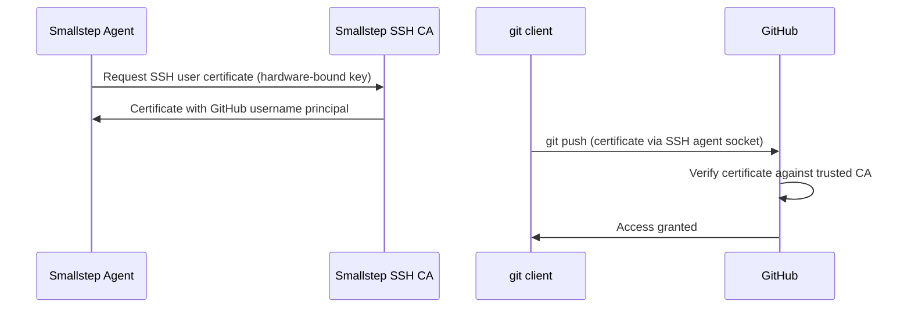

This guide shows how to protect access to your GitHub organization's repositories with Smallstep,
using SSH certificates issued to hardware-bound keys.

By configuring GitHub to trust an SSH Certificate Authority (CA),
you can use the Smallstep Agent to manage SSH credentials
that are protected by your device's native security hardware—a TPM on Windows and Linux systems, or the Secure Enclave on macOS devices.
Private keys never leave the secure hardware,
and the agent integrates with your `git` client through a standard SSH agent socket,
so developers authenticate without managing SSH keys at all.



<Alert severity="info" mb={4}>
  <div>
    SSH certificate authorities are a <a href="https://docs.github.com/en/enterprise-cloud@latest/organizations/managing-git-access-to-your-organizations-repositories/about-ssh-certificate-authorities">GitHub Enterprise feature</a>.
    You'll need a GitHub Enterprise Cloud organization (or GitHub Enterprise Server) to complete this guide.
  </div>
</Alert>

## Before you begin

You will need:

- A GitHub Enterprise Cloud organization where you are an owner.
- Devices enrolled in Smallstep with the [Smallstep Agent](../platform/smallstep-agent.mdx) installed,
  each with a user assigned.
- Users synced from your identity provider, with a GitHub username attribute (next section).

## Sync users and their GitHub usernames

Smallstep issues each user an SSH certificate whose *principals* must include the user's GitHub username—that's how GitHub maps a certificate to a GitHub account.
To make the username available, configure your identity provider to sync users to Smallstep
with a custom `githubUsername` attribute.

### Okta

First, [sync Okta users to Smallstep](./sync-okta-users-to-smallstep.mdx) via SCIM provisioning, if you haven't already.

Then add the GitHub username attribute:

1. **Add GitHub username to the Okta user profile:**
    - In Okta, go to **Directory** → **Profile Editor**
    - Find and click on the **User (default)** profile
    - Click **Add Attribute** and configure it:
        - **Data type:** string
        - **Display name:** GitHub Username
        - **Variable name:** `githubUsername`
        - **Description:** User's GitHub username for SSH certificate authentication
    - Save the attribute
2. **Add GitHub username to the Smallstep application profile:**
    - Open the Smallstep application in Okta
    - Go to the **Provisioning** tab → **To App**
    - Scroll to **Smallstep Attribute Mappings** and click **Go to Profile Editor**
    - Click **Add Attribute** and fill the form with the following details:
        - **Data type:** string
        - **Display name:** GitHub Username
        - **Variable name:** `githubUsername`
        - **External name:** `githubUsername`
        - **External namespace:** `urn:scim:smallstep:ssh:schema`
        - **Attribute type:** `personal`
    - Save the attribute
3. **Map the attribute:**
    - Return to the Smallstep application's **Provisioning** tab → **To App**
    - Scroll to **Smallstep Attribute Mappings** and click **Show Unmapped Attributes**
    - Find the **GitHub Username** attribute and edit the mapping:
        - **Attribute value type:** Map from Okta Profile
        - **Attribute value:** `githubUsername`
        - **Apply on:** Create and Update
    - Save the mapping
4. **Populate GitHub usernames:**
    - Go to **Directory** → **People**, open each user's profile, and enter their GitHub username
      in the **GitHub Username** field
    - Assign the user to the Smallstep application if not already assigned
5. **Verify synchronization:**
    - In your Smallstep dashboard, go to **Users** and verify that users are syncing from Okta
      with their GitHub usernames populated.
      It may take a few minutes for changes to sync.

### Google Workspace and Microsoft Entra ID

User sync is available for [Google Workspace](./sync-google-workspace-users-to-smallstep.mdx)
and [Entra ID](./sync-entra-id-users-to-smallstep.mdx).
For help mapping a GitHub username attribute from these providers,
[contact us](https://support.smallstep.com/en/contact-us).

# Step 1: Configure credential issuance

Create a **credential** that tells the Smallstep Agent to issue a hardware-bound SSH user certificate
to each of your devices.

You will need [an API token](https://smallstep.com/app/?next=/settings/api/tokens/add).
See [Smallstep API](../platform/smallstep-api.mdx) for details.

Store your API token in a headers file for `curl`:

```bash
set +o history
echo "Authorization: Bearer [your API token]" > api_headers
set -o history
```

Find the authority that should issue your SSH certificates with the
[List Authorities](https://gateway.smallstep.com/v2025-01-01/operations/GetAuthorities) endpoint:

```bash
curl -sH @api_headers --request GET \
  --url https://gateway.smallstep.com/api/authorities \
  --header 'Accept: application/json' \
  --header 'x-smallstep-api-version: 2025-01-01' | jq '.[] | {id, name, domain}'
```

Then create the credential with the [Create Credential](https://gateway.smallstep.com/v2025-01-01/operations/PostCredentials) endpoint:

```bash
curl -sH @api_headers --request POST \
  --url https://gateway.smallstep.com/api/credentials \
  --header 'Accept: application/json' \
  --header 'Content-Type: application/json' \
  --header 'x-smallstep-api-version: 2025-01-01' \
  --data @- <<'EOF' | jq
{
  "slug": "github",
  "certificate": {
    "type": "SSH_USER",
    "authorityID": "[your authority ID]",
    "fields": {
      "keyId": {
        "deviceMetadata": "smallstep:identity",
        "static": "github"
      },
      "principals": {
        "deviceMetadata": ["SSH.Principals", "smallstep:identity"]
      }
    }
  },
  "key": {
    "protection": "HARDWARE_ATTESTED"
  },
  "managementMode": "agent",
  "policy": {
    "assurance": ["high"],
    "operatingSystem": ["macOS", "Windows", "Linux"]
  }
}
EOF
```

Here's what the fields mean:

- **`certificate.type: "SSH_USER"`** issues SSH user certificates instead of X.509 certificates.
- **`fields.keyId`** sets the certificate's key ID, used for identification and audit logging.
- **`fields.principals`** populates the certificate's principals from device metadata.
  `SSH.Principals` includes the user's SSH principals synced from your identity provider—including the `githubUsername` attribute you configured above—and `smallstep:identity` adds the email address of the user assigned to the device.
- **`key.protection: "HARDWARE_ATTESTED"`** generates the private key in the device's
  secure hardware (TPM or Secure Enclave), where it can never be exported.
- **`policy`** selects the devices that receive this credential;
  here, high-assurance macOS, Windows, and Linux devices.

Once this credential is created, the Smallstep Agent on matching devices automatically requests
and renews hardware-bound SSH certificates with the appropriate GitHub username as a principal.

# Step 2: Configure the enforcement point

The enforcement point is GitHub itself:
your GitHub Enterprise organization is configured to trust SSH certificates signed by your Smallstep SSH CA.

## Retrieve your SSH CA public key

On a machine with the [`step` CLI](../step-cli/README.mdx) installed,
bootstrap with your team and print your SSH user CA public key:

```bash
step ssh config --team [your team slug]
step ssh config --roots
```

The output is your SSH CA's public key.
Copy the entire key; it will look similar to:

```
ecdsa-sha2-nistp256 AAAAE2VjZHNhLXNoYTItbmlzdHAyNTYAAAAIbmlzdHAyNTYAAABBBK...
```

## Add the CA to your GitHub organization

1. On GitHub, navigate to your organization's **Settings**
2. Under **Authentication security**, find **SSH certificate authorities**
3. Click **New CA**
4. Paste the public key from `step ssh config --roots` into the **Key** field
5. Click **Add CA**

The CA now appears in your list of SSH certificate authorities,
and any SSH certificate signed by your Smallstep CA with a valid GitHub username principal
will be accepted for authentication to your organization's repositories.

For more information,
see [GitHub's documentation on SSH certificate authorities](https://docs.github.com/en/enterprise-cloud@latest/organizations/managing-git-access-to-your-organizations-repositories/about-ssh-certificate-authorities).

## Optional: Require SSH certificates

GitHub Enterprise lets you **require SSH certificates** for all Git access to your organization's repositories,
which blocks personal SSH keys entirely.

<Alert severity="warning" mb={4}>
  <div>
    Only enable this setting once you have fully migrated all of your clients, remotes, and CI systems to SSH certificates.
    Certificate authentication uses a special SSH login of the form <code>org-[your org ID]@github.com</code>—the usual <code>git@github.com</code> login is not compatible.
    See <a href="#migrate-your-remotes-and-submodules">Migrate your remotes and submodules</a> below.
  </div>
</Alert>

# Step 3: Configure clients

Client configuration for SSH is handled by the Smallstep Agent—there is no MDM-managed path for SSH credentials.
The agent exposes an SSH agent socket that your `git` and `ssh` clients use for authentication,
so the only client-side setup is pointing `SSH_AUTH_SOCK` at it.

The agent's SSH socket location per platform:

| Platform | SSH agent socket |
|----------|------------------|
| macOS | `~/Library/Application Support/Smallstep/step-agent-ssh.sock` |
| Linux | `/run/step-agent/step-agent-ssh.sock` |
| Windows | `\\.\pipe\step-agent-ssh` |

<Alert severity="info" mb={4}>
  <div>
    The steps below make the Smallstep Agent's keys your only SSH agent keys.
    For gradual adoption, you can instead scope the agent to specific projects:
    tools like <code>direnv</code> can set <code>SSH_AUTH_SOCK</code> per directory,
    and <code>git</code> supports conditional configuration with
    <code>[includeIf "env:SSH_AUTH_SOCK=..."]</code> directives.
  </div>
</Alert>

## macOS

Add the following to your shell configuration file (`~/.zshrc` for zsh, or `~/.bash_profile` for bash):

```bash
export SSH_AUTH_SOCK="$HOME/Library/Application Support/Smallstep/step-agent-ssh.sock"
```

Reload your shell configuration with `source ~/.zshrc` (or `source ~/.bash_profile`).

## Linux

When the agent runs under `systemd`, add the following to your `~/.bashrc` or `~/.zshrc`:

```bash
export SSH_AUTH_SOCK="/run/step-agent/step-agent-ssh.sock"
```

Reload your shell configuration with `source ~/.bashrc` (or `source ~/.zshrc`).

## Windows

Set the environment variable for your user:

1. Press `Win + X` and select **System**
2. Click **Advanced system settings** → **Environment Variables**
3. Under **User variables**, click **New**
    - **Variable name:** `SSH_AUTH_SOCK`
    - **Variable value:** `\\.\pipe\step-agent-ssh`
4. Click **OK**, and restart any open terminal windows

## Verify SSH authentication

Confirm the agent's certificate is available:

```bash
ssh-add -l
```

You should see your hardware-bound SSH certificate listed.

Next, find your GitHub organization's database ID—certificate authentication uses an `org-[ID]@github.com` login instead of `git@github.com`:

```bash
gh api /orgs/[your org name] --jq '.id'
```

Then test authentication:

```bash
ssh -T org-[your org ID]@github.com
```

You should receive a success message confirming your authentication.

## Migrate your remotes and submodules

The usual `git@github.com` SSH login is not compatible with SSH certificate authentication.
Update each clone's remotes (and any submodule URLs) to use the `org-[ID]@github.com` login:

```bash
git remote set-url origin org-[your org ID]@github.com:[your org]/[repo].git
```

To rewrite all GitHub remotes for your organization without touching each repository,
you can add a global rewrite rule instead:

```bash
git config --global url."org-[your org ID]@github.com:[your org]/".insteadOf "git@github.com:[your org]/"
```

## Optional: Sign commits with your hardware-bound key

You can configure `git` to sign commits with the same hardware-protected SSH credential,
providing cryptographic proof of commit authorship.

1. Tell Git to use SSH for signing, and set your signing key:

    ```bash
    git config --global gpg.format ssh
    step ssh list --raw | head -1 | step crypto key format --ssh
    git config --global user.signingkey "[your SSH public key]"
    ```

2. Configure allowed signers, so `git` can verify signatures locally:

    ```bash
    echo '[certificate principal] namespaces="git" [key type] [base64 public key]' > ~/.ssh/allowed_signers
    git config --global gpg.ssh.allowedSignersFile "~/.ssh/allowed_signers"
    ```

3. Sign commits with `git commit -S`, or enable signing for all commits:

    ```bash
    git config --global commit.gpgsign true
    ```

4. Verify with a test commit:

    ```bash
    git commit --allow-empty -S -m "Test signed commit"
    git log --show-signature -1
    ```

5. To get the “Verified” badge on GitHub,
   [add your SSH public key to your GitHub profile](https://docs.github.com/en/authentication/connecting-to-github-with-ssh/adding-a-new-ssh-key-to-your-github-account)
   as a *signing key*:

    ```bash
    gh ssh-key add [key file] --type signing --title "Smallstep"
    ```

For more, see [GitHub's documentation on commit signature verification](https://docs.github.com/en/authentication/managing-commit-signature-verification/about-commit-signature-verification).

# Verify and troubleshoot

- Clone, push, and pull from a repository in your organization using an `org-[ID]@github.com` remote.
- Run `ssh -vT org-[your org ID]@github.com` and look for the certificate being offered during authentication.
- Run `ssh-add -l` to confirm the agent socket is reachable and a certificate is loaded.
  If nothing is listed, confirm the device matches the credential's policy
  (assurance level, operating system, and tags),
  and see the [agent troubleshooting guide](../platform/troubleshooting-agent.mdx).
- In the Smallstep dashboard, confirm the user's device shows an issued SSH certificate.
