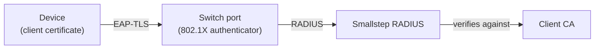

This guide shows how to protect a wired (Ethernet) network with Smallstep,
using 802.1X EAP-TLS certificate-based authentication.

With 802.1X on a wired network, your switch acts as the authenticator:
when a device plugs into a port, the switch delegates authentication to a RADIUS server,
and the RADIUS server verifies the client certificate presented during the EAP-TLS handshake
before the port forwards any traffic.



The building blocks are the same as for [wireless networks](./protect-wireless-networks.mdx):
a **credential** (the client certificate issued to each device),
a **managed RADIUS server** (the enforcement point),
and an **Ethernet resource** (the client-facing network configuration).

<Alert severity="info" mb={4}>
  <div>
    Already set up <a href="./protect-wireless-networks.mdx">wireless networks</a>?
    You can reuse the same credential and RADIUS server for your wired network—skip ahead to <a href="#step-3-configure-clients">Step 3</a>.
  </div>
</Alert>

# Step 1: Configure credential issuance

Create a **credential** describing the client certificate issued to each device.

You will need [an API token](https://smallstep.com/app/?next=/settings/api/tokens/add).
See [Smallstep API](../platform/smallstep-api.mdx) for details.

Store your API token in a headers file for `curl`:

```bash
set +o history
echo "Authorization: Bearer [your API token]" > api_headers
set -o history
```

Next, choose the authority that should issue your client certificates.
In the Smallstep dashboard, go to **Certificate Manager → Authorities** and open the authority.
From the **Authority Settings** panel, copy the **Authority ID**,
and download the **Root Certificate** as `client_ca.crt`.
You'll register the root certificate with your RADIUS server in Step 2.

Then create the credential with the [Create Credential](https://gateway.smallstep.com/v2025-01-01/operations/PostCredentials) endpoint:

```bash
curl -sH @api_headers --request POST \
  --url https://gateway.smallstep.com/api/credentials \
  --header 'Accept: application/json' \
  --header 'Content-Type: application/json' \
  --header 'x-smallstep-api-version: 2025-01-01' \
  --data @- <<'EOF' | jq
{
  "slug": "dot1x",
  "certificate": {
    "type": "X509",
    "authorityID": "[your authority ID]",
    "duration": "24h0m0s",
    "fields": {
      "commonName": {
        "deviceMetadata": "smallstep:identity",
        "static": "Corporate Network"
      },
      "sans": {
        "deviceMetadata": ["smallstep:identity", "Device.Serial"]
      },
      "extendedKeyUsage": ["clientAuth"]
    }
  },
  "key": {
    "type": "ECDSA_P256",
    "protection": "HARDWARE_ATTESTED"
  },
  "managementMode": "agent",
  "policy": {
    "assurance": ["high"],
    "operatingSystem": ["macOS", "Windows", "Linux"]
  }
}
EOF
```

Save the `id` returned in the response; you'll reference it when you create the Ethernet resource in Step 3.

See the [wireless networks guide](./protect-wireless-networks.mdx#step-1-configure-credential-issuance)
for a full explanation of the certificate fields, key protection levels, and device policy matching.
A single credential can be shared by your Wi-Fi and Ethernet resources.

# Step 2: Configure the enforcement point

The enforcement point for a wired network is your switch (the 802.1X authenticator)
backed by a RADIUS server.

## Create a managed RADIUS server

If you don't already have one from your wireless setup,
create a Smallstep managed RADIUS server with the
[Create Managed RADIUS](https://gateway.smallstep.com/v2025-01-01/operations/PostManagedRadius) endpoint.
`nasIPs` are the public (WAN) IP addresses your switches will send RADIUS traffic from,
and `clientCA` is the authority root certificate from Step 1:

```bash
jq -n --rawfile ca client_ca.crt \
  '{name: "Corporate RADIUS", nasIPs: ["203.0.113.10"], clientCA: $ca}' \
| curl -sH @api_headers --request POST \
  --url https://gateway.smallstep.com/api/managed-radius \
  --header 'Accept: application/json' \
  --header 'Content-Type: application/json' \
  --header 'x-smallstep-api-version: 2025-01-01' \
  --data @- | jq
```

The response contains the `serverIP`, `serverPort`, and `serverHostname` for your switch configuration,
and the `serverCA` your clients will trust (save it for Step 3).
Retrieve the shared secret with the `secret` query parameter:

```bash
curl -sH @api_headers --request GET \
  --url "https://gateway.smallstep.com/api/managed-radius/[your RADIUS server ID]?secret=true" \
  --header 'Accept: application/json' \
  --header 'x-smallstep-api-version: 2025-01-01' | jq -r '.secret'
```

The RADIUS service is EAP-TLS only, and it validates the full certificate chain and checks revocation on every authentication.
For dynamic VLAN assignment, RadSec transport, dedicated static IPs, and authorization webhooks,
see [Enterprise RADIUS](./protect-wireless-networks.mdx#option-2-smallstep-enterprise-radius).
You can also [bring your own RADIUS server](./protect-wireless-networks.mdx#option-3-bring-your-own-radius-server).

## Configure your switch

Every switch vendor exposes 802.1X differently, but the configuration follows the same shape:

1. **Register the RADIUS server**: add the Smallstep RADIUS `serverIP`, `serverPort`, and shared secret
   as an authentication server (often called a AAA or RADIUS client configuration).
2. **Enable 802.1X globally** on the switch.
3. **Enable port authentication** on each access port
   (for example, `dot1x port-control auto` on a Cisco IOS-style CLI).
4. **Decide how to handle non-802.1X devices.**
   Printers and other devices without certificates need a plan:
   a guest VLAN, a dedicated unauthenticated VLAN, or separate ports.
   Note that MAC Authentication Bypass (MAB) is not supported by Smallstep RADIUS—it authenticates certificates only.
5. **(Enterprise RADIUS) Assign VLANs dynamically** with RADIUS reply attributes
   (`Tunnel-Type`, `Tunnel-Medium-Type`, `Tunnel-Private-Group-ID`)
   instead of configuring VLANs per port.

Consult your switch vendor's 802.1X documentation for exact commands.

# Step 3: Configure clients

Create the **Ethernet resource** that describes the wired network to your clients,
using the [Create Ethernet](https://gateway.smallstep.com/v2025-01-01/operations/PostEthernet) endpoint:

```bash
jq -n --rawfile ca radius_ca.crt \
  '{
    name: "Corporate wired network",
    autojoin: true,
    radiusServerCA: $ca,
    credentials: ["[your credential ID]"]
  }' \
| curl -sH @api_headers --request POST \
  --url https://gateway.smallstep.com/api/protect/ethernet \
  --header 'Accept: application/json' \
  --header 'Content-Type: application/json' \
  --header 'x-smallstep-api-version: 2025-01-01' \
  --data @- | jq
```

- **`radiusServerCA`** is the CA bundle clients use to verify the RADIUS server:
  the `serverCA` you saved in Step 2 (or your own server's CA, if you brought your own RADIUS).
- **`credentials`** references the credentials from Step 1 that clients authenticate with.

The new resource appears in the dashboard under [Protect → Ethernet](https://smallstep.com/app/?next=/protect/ethernet).

## Agent-managed clients

If your devices run the [Smallstep Agent](../platform/smallstep-agent.mdx), you're done.

On its next sync, the agent on every device matching the credential's policy will
request a hardware-bound client certificate,
install the RADIUS server CA as trusted,
and configure the wired 802.1X network profile—on macOS, Windows, and Linux.

## MDM-managed clients

You can also deliver the wired network profile with your MDM.
This is useful when you need a custom 802.1X configuration,
or when you prefer to consolidate network settings in your MDM
while the Smallstep Agent manages the credential itself.

### Windows with Intune (agent credential + OMA-URI profile)

In this hybrid workflow, the client certificate comes from the credential you created in Step 1,
and Intune deploys a wired network profile that selects it by issuer.
The profile selects the credential based on the SHA-1 fingerprint of the issuing CA certificate.

To gather the two fingerprints referenced in the XML below:

```bash
# SHA-1 fingerprint of your RADIUS server CA (radius_ca.crt from Step 2)
openssl x509 -in radius_ca.crt -noout -fingerprint -sha1

# SHA-1 fingerprint of the CA that issues your client certificates
# (the *intermediate* CA of the authority you chose in Step 1;
# download it from the authority's page in the Smallstep dashboard)
openssl x509 -in issuing_ca.crt -noout -fingerprint -sha1
```

Remove the colons from the fingerprint values before using them.

1. In Intune, begin at [Device Configuration](https://intune.microsoft.com/#view/Microsoft_Intune_DeviceSettings/DevicesMenu/~/configuration)
2. Click **Create** and then select **New Policy**
    - Platform: **Windows 10 and Later**
    - Profile Type: **Templates**
    - Template Name: **Custom**
3. Click **Create**, name the policy (for example, **EAP-TLS Wired Network with Smallstep**), and click **Next**
4. Click **Add** next to **OMA-URI Settings**:
    - Name: **Wired Network Configuration**
    - OMA-URI: `./Device/Vendor/MSFT/WiredNetwork/LanXML`
    - Data Type: **String**
    - Value: your LAN profile XML (example below).
      For details on this XML, see [Microsoft’s documentation](https://learn.microsoft.com/en-us/windows/win32/nativewifi/lan-profileschema-lanprofile-element).

```xml
<?xml version="1.0"?>
<LANProfile xmlns="http://www.microsoft.com/networking/LAN/profile/v1">
    <MSM>
        <security>
            <OneXEnforced>false</OneXEnforced>
            <OneXEnabled>true</OneXEnabled>
            <OneX xmlns="http://www.microsoft.com/networking/OneX/v1">
                <authMode>machine</authMode>
                <EAPConfig>
                    <EapHostConfig xmlns="http://www.microsoft.com/provisioning/EapHostConfig">
                        <EapMethod>
                            <Type xmlns="http://www.microsoft.com/provisioning/EapCommon">13</Type>
                            <VendorId xmlns="http://www.microsoft.com/provisioning/EapCommon">0</VendorId>
                            <VendorType xmlns="http://www.microsoft.com/provisioning/EapCommon">0</VendorType>
                            <AuthorId xmlns="http://www.microsoft.com/provisioning/EapCommon">0</AuthorId>
                        </EapMethod>
                        <Config>
                            <Eap xmlns="http://www.microsoft.com/provisioning/BaseEapConnectionPropertiesV1">
                                <Type>13</Type>
                                <EapType xmlns="http://www.microsoft.com/provisioning/EapTlsConnectionPropertiesV1">
                                    <CredentialsSource>
                                        <CertificateStore>
                                            <SimpleCertSelection>true</SimpleCertSelection>
                                        </CertificateStore>
                                    </CredentialsSource>
                                    <ServerValidation>
                                        <DisableUserPromptForServerValidation>false</DisableUserPromptForServerValidation>
                                        <ServerNames>radius.smallstep.com</ServerNames>
                                        <TrustedRootCA>RADIUS_CA_SHA1_FINGERPRINT</TrustedRootCA>
                                    </ServerValidation>
                                    <DifferentUsername>false</DifferentUsername>
                                    <PerformServerValidation xmlns="http://www.microsoft.com/provisioning/EapTlsConnectionPropertiesV2">true</PerformServerValidation>
                                    <AcceptServerName xmlns="http://www.microsoft.com/provisioning/EapTlsConnectionPropertiesV2">true</AcceptServerName>
                                    <TLSExtensions xmlns="http://www.microsoft.com/provisioning/EapTlsConnectionPropertiesV2">
                                        <FilteringInfo xmlns="http://www.microsoft.com/provisioning/EapTlsConnectionPropertiesV3">
                                            <AllPurposeEnabled>false</AllPurposeEnabled>
                                            <CAHashList Enabled="true">
                                                <IssuerHash>ISSUING_CA_SHA1_FINGERPRINT</IssuerHash>
                                            </CAHashList>
                                            <EKUMapping>
                                                <EKUMap>
                                                    <EKUName>Client Authentication</EKUName>
                                                    <EKUOID>1.3.6.1.5.5.7.3.2</EKUOID>
                                                </EKUMap>
                                            </EKUMapping>
                                            <ClientAuthEKUList Enabled="true">
                                                <EKUMapInList>
                                                    <EKUName>Client Authentication</EKUName>
                                                </EKUMapInList>
                                            </ClientAuthEKUList>
                                        </FilteringInfo>
                                    </TLSExtensions>
                                </EapType>
                            </Eap>
                        </Config>
                    </EapHostConfig>
                </EAPConfig>
            </OneX>
        </security>
    </MSM>
</LANProfile>
```

<Alert severity="info" mb={4}>
  <div>
    The <code>IssuerHash</code> value is the SHA-1 fingerprint of the <strong>intermediate (issuing) CA</strong> for your client credential,
    and <code>TrustedRootCA</code> is the SHA-1 fingerprint of your RADIUS server CA.
    The EKU filtering section restricts credential selection to certificates with the Client Authentication extended key usage.
    The <code>authMode</code> element must match the certificate store where the credential is placed:
    on Windows, the agent stores credentials with <code>HARDWARE_ATTESTED</code> key protection in the computer certificate store (use <code>machine</code>, as in this guide's example),
    and credentials with all other protection levels in the user certificate store (use <code>user</code>).
    See <a href="https://learn.microsoft.com/en-us/windows/win32/nativewifi/onexschema-onex-element">Microsoft's OneX schema documentation</a>.
  </div>
</Alert>

5. Click **Save**, then **Next**
6. Set the assignments as desired, including any groups / users to which the configuration should apply
7. Click **Next**, skip “Applicability Rules”, and on “Review and Create”, click **Create**

### Windows with Workspace ONE UEM

Workspace ONE UEM can deploy the same LAN profile XML shown above.
Create a Windows Device Profile, add the **Wired Network** template,
and paste the LAN profile XML.
Set the assignments as desired, and save and publish the profile.

# Verify and troubleshoot

Plug a test device into an 802.1X-enabled port and confirm it authenticates:

- On the switch, check the port's authentication state
  (for example, `show dot1x interface` or `show authentication sessions` on a Cisco-style CLI).
- In the Smallstep dashboard, open your Ethernet resource under
  [Protect → Ethernet](https://smallstep.com/app/?next=/protect/ethernet)
  to see issued certificates and authentication activity.
- For agent-managed devices, see the [agent troubleshooting guide](../platform/troubleshooting-agent.mdx).
- On Windows, 802.1X events are logged in Event Viewer under
  **Applications and Services Logs** → **Microsoft** → **Windows** → **Wired-AutoConfig**.
