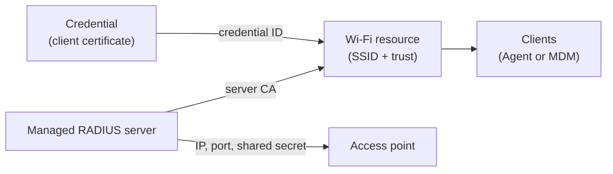

This guide shows how to protect a wireless network with Smallstep,
using [802.1X EAP-TLS (certificate-based) Wi-Fi](https://smallstep.com/blog/eaptls-certificate-wifi/) authentication.

For EAP-TLS Wi-Fi deployments in security-sensitive environments, you’ll generally need four things:

- A Certificate Authority
- A RADIUS server
- A properly configured Access Point (AP)
- A process for distributing trusted CA certificates, client certificates, and network profiles to your devices

Smallstep provides the Certificate Authority and the RADIUS server,
and it can configure your clients directly (via the Smallstep Agent) or alongside your MDM.

Here’s a simplified diagram of a laptop getting a client certificate and joining an 802.1X EAP-TLS authenticated network.
With EAP-TLS, the RADIUS server must complete a mutual TLS handshake with the device before giving the thumbs up to the access point:


<Alert severity="info" mb={4}>
  <div>
    Ensure test WLANs are used for initial integration testing. Do not complete these steps on a production WLAN until after testing has been validated.
  </div>
</Alert>

## On this page, you'll find:

- [How it fits together](#how-it-fits-together)
- [Step 1: Configure credential issuance](#step-1-configure-credential-issuance)
- [Step 2: Configure the enforcement point](#step-2-configure-the-enforcement-point)
- [Step 3: Configure clients](#step-3-configure-clients)
- [Verify and troubleshoot](#verify-and-troubleshoot)
- Reference sections:
  - [Access point configuration reference](#access-point-configuration-reference)
  - [RADIUS authorization webhooks](#radius-authorization-webhooks)

# How it fits together

Three Smallstep resources work together to protect a wireless network,
and you can create all of them with the [Smallstep API](../platform/smallstep-api.mdx):

- A **credential** describes the client certificate and private key issued to each device:
  which authority signs it, what goes in the subject, how the key is protected, and which devices receive it.
- A **managed RADIUS server** is the enforcement point.
  Your access points delegate authentication to it, and it verifies each client certificate presented during the EAP-TLS handshake.
- A **Wi-Fi resource** describes the network itself:
  the SSID, the RADIUS server CA that clients should trust, and the credentials clients authenticate with.



There are two ways to configure clients, and you can mix them across your fleet:

- **Agent-managed**: The [Smallstep Agent](../platform/smallstep-agent.mdx) enrolls the device,
  requests a hardware-bound certificate, and configures the Wi-Fi network profile on the device.
- **MDM-managed**: Your MDM deploys a network profile,
  and the client certificate is issued via SCEP or ACME Device Attestation.
  This path works without installing the agent.

Everything in this guide can also be configured in the [Smallstep dashboard](https://smallstep.com/app/?next=/protect/wifi) under the **Protect** tab,
or with the [Smallstep Terraform provider](https://registry.terraform.io/providers/smallstep/smallstep/latest/docs).
This guide uses the API.

# Step 1: Configure credential issuance

In this step, you'll create a **credential**:
the configuration Smallstep uses to issue a Wi-Fi client certificate to each of your devices.

<Alert severity="info" mb={4}>
  <div>
    If all of your clients will be MDM-managed (using SCEP or ACME Device Attestation to get certificates),
    you can skip to <a href="#step-2-configure-the-enforcement-point">Step 2</a>.
    A credential resource is only needed for agent-managed clients.
  </div>
</Alert>

You will need [an API token](https://smallstep.com/app/?next=/settings/api/tokens/add).
See [Smallstep API](../platform/smallstep-api.mdx) for details.

Store your API token in a headers file for `curl`:

```bash
set +o history
echo "Authorization: Bearer [your API token]" > api_headers
set -o history
```

## Find your authority

Certificates are issued by one of your team's X.509 authorities.
Use the [List Authorities](https://gateway.smallstep.com/v2025-01-01/operations/GetAuthorities) endpoint to find the authority
that should issue your Wi-Fi client certificates:

```bash
curl -sH @api_headers --request GET \
  --url https://gateway.smallstep.com/api/authorities \
  --header 'Accept: application/json' \
  --header 'x-smallstep-api-version: 2025-01-01' | jq '.[] | {id, name, domain}'
```

Save two values from the authority you choose:

- The `id`, which you'll use as the `authorityID` when creating the credential.
- The `root` certificate (PEM), which you'll register with your RADIUS server in Step 2
  so it can verify client certificates issued by this authority:

```bash
curl -sH @api_headers --request GET \
  --url https://gateway.smallstep.com/api/authorities \
  --header 'Accept: application/json' \
  --header 'x-smallstep-api-version: 2025-01-01' \
  | jq -r '.[] | select(.id == "[your authority ID]") | .root' > client_ca.crt
```

## Create the credential

Create the credential with the [Create Credential](https://gateway.smallstep.com/v2025-01-01/operations/PostCredentials) endpoint:

```bash
curl -sH @api_headers --request POST \
  --url https://gateway.smallstep.com/api/credentials \
  --header 'Accept: application/json' \
  --header 'Content-Type: application/json' \
  --header 'x-smallstep-api-version: 2025-01-01' \
  --data @- <<'EOF' | jq
{
  "slug": "wifi",
  "certificate": {
    "type": "X509",
    "authorityID": "[your authority ID]",
    "duration": "24h0m0s",
    "fields": {
      "commonName": {
        "deviceMetadata": "smallstep:identity",
        "static": "Corporate Wi-Fi"
      },
      "sans": {
        "deviceMetadata": ["smallstep:identity", "Device.Serial"]
      },
      "extendedKeyUsage": ["clientAuth"]
    }
  },
  "key": {
    "type": "ECDSA_P256",
    "protection": "HARDWARE_ATTESTED"
  },
  "managementMode": "agent",
  "policy": {
    "assurance": ["high"],
    "operatingSystem": ["macOS", "Windows", "Linux"]
  }
}
EOF
```

Here's what the fields mean:

- **`certificate.fields`** populates the certificate subject.
  Each field takes a `static` value, one or more `deviceMetadata` keys, or both
  (the static value is used as a fallback when the metadata key is not present on a device).
  In addition to any custom metadata keys you've set on devices,
  reserved keys include `smallstep:identity` (the email address of the user assigned to the device),
  `Device.Serial`, `Device.Hostname`, `Device.PermanentIdentifier`, and `Device.DisplayName`.
- **`key.protection`** controls private key storage.
  `HARDWARE_ATTESTED` generates the key in the device's secure hardware (TPM or Secure Enclave) and requires remote attestation.
  Use `HARDWARE_WITH_FALLBACK` to prefer hardware protection but allow software keys where hardware isn't available.
- **`policy`** selects the devices that receive this credential.
  An empty policy provisions the credential for every device.
  You can match on `assurance` (`normal`, `high`), `ownership` (`company`, `user`),
  `operatingSystem`, discovery `source`, and device `tags`.
- **`managementMode: "agent"`** tells the Smallstep Agent to manage the certificate lifecycle:
  enrollment, renewal, and key management are automatic.

Save the `id` returned in the response; you'll reference it when you create the Wi-Fi resource in Step 3.

<Alert severity="warning" mb={4}>
  <div>
    If you have existing automation built on the <code>/accounts</code> or <code>/endpoint-configurations</code> endpoints,
    migrate it to <code>/credentials</code> and <code>/protect/*</code>.
    The older endpoints are deprecated in the 2025-01-01 API version and will be removed in a future version.
  </div>
</Alert>

# Step 2: Configure the enforcement point

The enforcement point for a wireless network is a RADIUS server.
Your access point delegates authentication to RADIUS,
and the RADIUS server verifies the client certificate presented during the EAP-TLS handshake.

## Option 1: Smallstep Managed RADIUS

Smallstep operates a multi-tenant RADIUS service, so you don't have to run your own.
The service authenticates clients with EAP-TLS only:
it validates the full certificate chain against your client CA and checks revocation on every authentication.
Password-based methods (EAP-TTLS, PEAP-MSCHAPv2), MAC Authentication Bypass, RADIUS accounting,
and Change of Authorization are not supported—certificate-only, by design.

Create a managed RADIUS server with the [Create Managed RADIUS](https://gateway.smallstep.com/v2025-01-01/operations/PostManagedRadius) endpoint.
You provide:

- **`nasIPs`**: the public (WAN) IP addresses your access points or wireless controllers will send RADIUS traffic from.
  This is how the service attributes incoming requests to your team, so each IP must be unique across Smallstep customers.
- **`clientCA`**: the CA bundle the RADIUS server will trust to verify clients—the authority root you saved in Step 1.

```bash
jq -n --rawfile ca client_ca.crt \
  '{name: "Corporate RADIUS", nasIPs: ["203.0.113.10"], clientCA: $ca}' \
| curl -sH @api_headers --request POST \
  --url https://gateway.smallstep.com/api/managed-radius \
  --header 'Accept: application/json' \
  --header 'Content-Type: application/json' \
  --header 'x-smallstep-api-version: 2025-01-01' \
  --data @- | jq
```

The response contains the server coordinates you'll enter into your access point:

- **`serverIP`** and **`serverPort`**: where your access point sends RADIUS traffic
- **`serverHostname`**: the DNS name on the RADIUS server's TLS certificate (for example, `radius.smallstep.com`)
- **`serverCA`**: the CA your clients should use to verify the RADIUS server.
  Save it—you'll need it in Step 3:

```bash
curl -sH @api_headers --request GET \
  --url "https://gateway.smallstep.com/api/managed-radius/[your RADIUS server ID]" \
  --header 'Accept: application/json' \
  --header 'x-smallstep-api-version: 2025-01-01' | jq -r '.serverCA' > radius_ca.crt
```

The RADIUS shared secret is not included in responses by default.
Retrieve it by passing the `secret` query parameter to
[Get Managed RADIUS](https://gateway.smallstep.com/v2025-01-01/operations/GetManagedRadius):

```bash
curl -sH @api_headers --request GET \
  --url "https://gateway.smallstep.com/api/managed-radius/[your RADIUS server ID]?secret=true" \
  --header 'Accept: application/json' \
  --header 'x-smallstep-api-version: 2025-01-01' | jq -r '.secret'
```

<Alert severity="warning" mb={4}>
  <div>
    Treat the shared secret like a password.
    Anyone who can send traffic from your registered NAS IPs and knows the secret can relay authentication requests to your RADIUS server.
  </div>
</Alert>

If your network equipment's public IP addresses change (a new office, a new ISP),
update the `nasIPs` on your managed RADIUS server to match.

### Configure your access point

Configure your wireless network to use WPA2 Enterprise or WPA3 Enterprise security,
and point it at your RADIUS server using the `serverIP`, `serverPort`, and shared secret from above.

See the [access point configuration reference](#access-point-configuration-reference) below for
step-by-step instructions covering Ubiquiti UniFi, Aruba, Cisco WLC, Meraki, Juniper Mist, MikroTik,
and other popular access points.

## Option 2: Smallstep Enterprise RADIUS

Enterprise RADIUS is Smallstep's premium tier for larger deployments.
In addition to everything in Managed RADIUS, it provides:

- **Dedicated infrastructure** with stable static IPs, deployed in the cloud regions you choose.
  Your NAS source IPs no longer need to be registered or kept in sync.
- **RadSec** (RADIUS over TLS) transport with a dedicated hostname, alongside standard RADIUS over UDP.
- **Reply attributes**, including dynamic VLAN assignment.
  Attribute values can be static, extracted from a field of the client certificate by OID,
  or sourced from your Smallstep device inventory.
  For example, to assign a VLAN based on a custom certificate extension:

  ```json
  "replyAttributes": [
    { "name": "Tunnel-Type", "value": "VLAN" },
    { "name": "Tunnel-Medium-Type", "value": "IEEE-802" },
    { "name": "Tunnel-Private-Group-ID", "valueFromCertificate": "1.3.6.1.4.1.37476.9000.64.1" }
  ]
  ```

- **[Authorization webhooks](#radius-authorization-webhooks)**:
  your own HTTP endpoint is consulted on every authentication,
  so you can layer device posture or custom authorization checks on top of certificate verification.

<Alert severity="info" mb={4}>
  <div>
    Enterprise RADIUS is provisioned by Smallstep for your team.
    <a href="https://support.smallstep.com/en/contact-us">Contact us</a> to get set up.
  </div>
</Alert>

## Option 3: Bring your own RADIUS server

You can also use Smallstep-issued client certificates with a RADIUS server you operate
(FreeRADIUS, Cisco ISE, Aruba ClearPass, NPS, and others).

Configure your RADIUS server for EAP-TLS,
and add the authority root certificate from Step 1 (`client_ca.crt`) to its trusted client CA bundle.
Then, in Step 3, use *your* RADIUS server's CA certificate as the `radiusServerCA` on the Wi-Fi resource
so that clients trust your server during the EAP-TLS handshake.

# Step 3: Configure clients

Now that certificates are being issued and the RADIUS server is running,
create the **Wi-Fi resource** that describes the network to your clients.

Use the [Create Wi-Fi](https://gateway.smallstep.com/v2025-01-01/operations/PostWifi) endpoint:

```bash
jq -n --rawfile ca radius_ca.crt \
  '{
    ssid: "[your SSID]",
    hidden: false,
    autojoin: true,
    radiusServerCA: $ca,
    radiusServerDomain: "radius.smallstep.com",
    credentials: ["[your credential ID]"]
  }' \
| curl -sH @api_headers --request POST \
  --url https://gateway.smallstep.com/api/protect/wifi \
  --header 'Accept: application/json' \
  --header 'Content-Type: application/json' \
  --header 'x-smallstep-api-version: 2025-01-01' \
  --data @- | jq
```

- **`radiusServerCA`** is the CA bundle clients use to verify the RADIUS server:
  the `serverCA` you saved in Step 2 (or your own server's CA, if you brought your own RADIUS).
- **`radiusServerDomain`** requires the RADIUS server certificate to match this DNS name (honored on Windows).
  For Managed RADIUS, use the `serverHostname` value from Step 2.
- **`credentials`** references the credentials from Step 1 that clients authenticate with.

The new Wi-Fi resource appears in the dashboard under [Protect → Wi-Fi](https://smallstep.com/app/?next=/protect/wifi).

## Agent-managed clients

If your devices run the [Smallstep Agent](../platform/smallstep-agent.mdx), you're done.

On its next sync, the agent on every device matching the credential's policy will:

1. Request a client certificate, generating the private key in the device's secure hardware.
2. Install the RADIUS server CA as trusted for this network.
3. Create the Wi-Fi network profile (SSID, WPA-Enterprise, EAP-TLS) on the device.
4. Renew the certificate automatically before it expires.

## MDM-managed clients

Your MDM can deploy the Wi-Fi profile and, if you like, manage certificate issuance too.
The subsections below cover the common combinations:

- [macOS and iOS with Jamf Pro (SCEP)](#macos-and-ios-with-jamf-pro-scep)
- [macOS with Jamf Pro (ACME Device Attestation)](#macos-with-jamf-pro-acme-device-attestation)
- [Windows with Intune (SCEP)](#windows-with-intune-scep)
- [Windows with Intune (agent credential + OMA-URI profile)](#windows-with-intune-agent-credential--oma-uri-profile)
- [Windows with Workspace ONE UEM](#windows-with-workspace-one-uem)

### macOS and iOS with Jamf Pro (SCEP)

In this workflow, Jamf deploys a configuration profile that establishes CA trust,
gets a client certificate via Smallstep's SCEP server (using dynamic, single-use challenges),
and configures the Wi-Fi network.
The Smallstep Agent is not required on the device.

First, [connect Jamf Pro to Smallstep](./connect-jamf-pro-to-smallstep.mdx) if you haven't already.

<Alert severity="info" mb={4}>
  <div>
    **Will I need a Jamf SCEP Proxy?**<br />
    Because your Smallstep hosted CA is reachable from the public internet, you do not need a Jamf SCEP proxy.
  </div>
</Alert>

For a video walkthrough of this section:

<iframe 
   width="560" 
   height="315" 
   src="https://www.youtube.com/embed/KSL_Ke7HcpU?si=ifvHIp8HS4h7qpLN" 
   title="Secure EAP-TLS Wi-FI in minutes, with Smallstep and Jamf" 
   frameborder="0" 
   allow="accelerometer; autoplay; clipboard-write; encrypted-media; gyroscope; picture-in-picture; web-share" allowfullscreen>
</iframe>

#### Download the configuration profile template

Open your Wi-Fi resource in the dashboard, under [Protect → Wi-Fi](https://smallstep.com/app/?next=/protect/wifi).

Choose the **Configuration Profile** link to download a `.mobileconfig` template that you'll import into Jamf.
You'll also find the **Jamf Settings** for this resource:
a webhook URL, username, and password to be used when configuring a Jamf `SCEP Challenge` webhook, below.

<Alert severity="info" mb={4}>
  <div>
     Resist the temptation to manually install the `.mobileconfig` file for testing; it won’t work.
  </div>
</Alert>

#### Configure a SCEP challenge webhook

Add a SCEP Challenge webhook to your Jamf tenant configuration.
You'll only need to do this once.

1. In the Jamf console, go to `Settings` and search for `Webhooks`
2. Click **+ New**
3. Fill out the form as follows:
    - Set a descriptive name, e.g. `SCEP Challenge`
    - Select ✅ **Enabled**
    - Use `Basic Authentication`
    - Populate the webhook URL, username, and password with what you were given by Smallstep
    - Select JSON as the Content Type
    - Select `SCEPChallenge` as the webhook event
    - **Here's an example of the completed form:**
        
        

4. Choose **Save** in the bottom right

#### Upload and test the configuration profile

Next, upload the Configuration Profile you downloaded from Smallstep, and map it to a test device.

1. In the Jamf console, go to Configuration Profiles (for Computers or Devices)
2. Choose **Upload**.
3. **Choose File** and select the `.mobileconfig` template you downloaded from Smallstep
4. Choose the Scope tab, and select a device or user for testing. For the device to appear, the device should already be enrolled with a basic Jamf MDM profile.

Enrolled devices will immediately receive the configuration profile updates from Jamf and will be ready to join the network.
If you need to make changes, you can change the settings in Smallstep and download a new Configuration Profile template.

#### Deploying production profiles

As you plan to deploy your configuration profile, it is recommended to stage your changes.
Here's one approach:
- Clone your production profile in Jamf
- Exclude your test computer or device from your production profile
- Add your test computer or device to the cloned profile
- Make and test changes to the cloned profile
- Apply your changes back to the production profile
- Re-add your test device to the production profile scope
- Finally, remove the cloned profile

#### Running your own RADIUS server?

If you run your own RADIUS server, you'll need to modify your Configuration Profile to match your setup.
Link the Certificate Trust settings for your `Wi-Fi` Payload to your RADIUS server's Root CA certificate instead of Smallstep's. You may need to add an additional `Certificate` payload for your RADIUS server's Root CA.

<Alert severity="info" mb={4}>
  <div>
    If you’re planning to deploy Wi-Fi and EAP-TLS using a JumpCloud RADIUS server, you will need to use an RSA CA.
    This requires creating an Advanced Authority.
    When creating the Authority, use key type `RSA_SIGN_PKCS1_2048_SHA256` for both root & intermediate CAs.
  </div>
</Alert>

### macOS with Jamf Pro (ACME Device Attestation)

On macOS, you can replace SCEP with **ACME Device Attestation** (ACME-DA) for a higher-assurance workflow:
the private key is hardware-bound,
and Apple's attestation authority cryptographically proves the certificate request came from a specific, genuine Apple device.
Jamf manages all settings; the Smallstep Agent is not involved.

Before a device can obtain a certificate through ACME-DA:

- The device must already be synced from Jamf into your Smallstep inventory,
  because ACME-DA requests are checked against known device identifiers (the serial number, on macOS).
- The device must have a user assigned, and it must be approved.

In Jamf, create a new Computer Configuration Profile:

1. Navigate to the Computer Configuration Profiles page and click **New**.
2. In the general settings, make it a “Computer Level” profile,
   and ensure “Install automatically” is chosen as the “Distribution Method”.

Add an **ACME Certificate** payload:

- Put the full URL of your device authority's ACME-DA provisioner in the “ACME directory URL” field.
  It will look like `https://devices.[your team].ca.smallstep.com/acme/acme-da/directory`.
- Set `$SERIALNUMBER` as the “Client identifier”
- Set 384 as the “Key Size”
- Select “ECSECPrimeRandom” as the “Key Type”
- Set “Hardware Bound” to “True”
- Set “Subject” to `CN=$SERIALNUMBER`
- Set “Extended Key Usage” to `1.3.6.1.5.5.7.3.2`
- Set “Attest” to “True”
- Set “Allow all apps access” to “True”
- Set “Key is extractable” to “False”

Add **Certificate** payloads for the CAs the device must trust:

- Your device authority's root certificate (name it “Smallstep Devices Root”)
- Your device authority's intermediate certificate (name it “Smallstep Devices Intermediate”)
- The RADIUS server CA from Step 2 (name it “Smallstep RADIUS Root”)

For each, select “Upload”, upload the certificate, and check “Allow all apps access”.

Add a **Network** payload for the Wi-Fi configuration:

- Select “Wi-Fi” as the “Network Interface”
- Set the “Service Set Identifier (SSID)” to the name of your Wi-Fi network
- Check “Hidden Network”, “Auto-Join”, and “Disable MAC Address Randomization” as required
- Select “WPA3 Enterprise” (or “WPA2 Enterprise”, depending on network gear) as the “Security Type”
- Check “TLS” under “Accepted EAP Types”
- Pick the ACME Certificate you created earlier as the “Identity Certificate”
- Switch to the “Trust” tab, and select the “Smallstep RADIUS Root” certificate as trusted
- Set the RADIUS server hostname from Step 2 (for example, `radius.smallstep.com`) as the “Certificate Common Name”

Finally, assign the Configuration Profile to a test user or device in the “Scope” tab.

After the profile is installed, an `ACME Certificate` signed by your device authority appears in the `Profiles` section of the `Settings` app.
The Subject Common Name will contain the device serial number, and the `Hardware Bound` property should say `Yes`.
Due to how managed device attestation works on macOS,
the issued certificate won't appear in the Keychain application;
you can inspect it with `sudo /usr/libexec/mdmclient QueryCertificates` instead.

### Windows with Intune (SCEP)

In this workflow, Intune deploys CA trust, a SCEP-issued client certificate, and the Wi-Fi profile.
The Smallstep Agent is not required on the device.

First, [connect Intune to Smallstep](./connect-intune-to-smallstep.mdx) if you haven't already—that tutorial covers registering the Entra ID application that lets Smallstep validate SCEP enrollments.

Then open your Wi-Fi resource in the dashboard, under [Protect → Wi-Fi](https://smallstep.com/app/?next=/protect/wifi), and gather:

- Your Root CA Certificate (download)
- Your Intermediate CA Certificate (download)
- Your SCEP URL (copy)

<Alert severity="info" mb={4}>
  <div>
[Microsoft recommends a staged approach to Intune enrollment](https://download.microsoft.com/download/e/6/2/e6233fdd-a956-4f77-93a5-1aa254ee2917/msft-intune-enrollment-options.pdf). Create an evaluation Group, if you don’t already have one, so that any breaking changes are limited to the  group.
  </div>
</Alert>

In Intune, create three Configuration Profiles, then a Wi-Fi profile:

#### Create a trusted certificate profile for your root CA

Create a [new Trusted certificate profile](https://intune.microsoft.com/#view/Microsoft_Intune_DeviceSettings/CreatePolicyFullScreenBlade/policyId/00000000-0000-0000-0000-000000000000/policyType/Windows10TrustedCertificate/policyJourneyState~/0) with the following properties:

- Name: **Smallstep Root CA**
- Certificate file: Upload your Smallstep Root CA certificate
- Destination store: **Computer certificate store - root**
- Included groups: Include the users or groups you are using for your staged enrollment. As you roll out into production, you will expand this list.
- Create the profile

#### Create a trusted certificate profile for your intermediate CA

Create a [new Trusted certificate profile](https://intune.microsoft.com/#view/Microsoft_Intune_DeviceSettings/CreatePolicyFullScreenBlade/policyId/00000000-0000-0000-0000-000000000000/policyType/Windows10TrustedCertificate/policyJourneyState~/0) with the following properties:

- Name: **Smallstep Intermediate CA**
- Certificate file: Upload your Smallstep Intermediate CA certificate
- Destination store: **Computer certificate store - root**
  
  <Alert severity="warning">
    <div>
      **Careful!** Add your intermediate CA to the computer’s *root* store.
      Do not choose the intermediate certificate store—it will cause enrollment errors.
    </div>
  </Alert>
  
- Included groups: Include the users or groups you are using for testing.
- Create the profile

#### Create a SCEP certificate profile

Create [a new SCEP certificate profile](https://intune.microsoft.com/#view/Microsoft_Intune_DeviceSettings/CreatePolicyFullScreenBlade/policyId/00000000-0000-0000-0000-000000000000/policyType/Windows10SCEP/policyJourneyState~/0) with the following properties:

- Name: **Smallstep SCEP Certificate**
- Certificate type: Device
- The certificate properties may vary depending on your use case and threat model. Here are some good starting points:
    - Subject name / SANs: For a test deployment, use the default values.
    - Certificate validity period: Use the same duration you configured with Smallstep
    - Key storage provider: **Enroll to TPM KSP if available, Software KSP if not**
    - Key usage: **✓ Digital certificate** and **✓ Key encipherment**
    - Key size: **2048**
    - Hash algorithm: **SHA-2**
    - Extended key usage: Under Predefined values, select **Client Authentication**
    - Renewal Threshold (%): Select **20%**
- Root Certificate: Select your **Intermediate CA**
    
  <Alert severity="warning">
    <div>
    **Careful!** Select your intermediate CA here. An enrolling device’s SCEP client will check the fingerprint of the intermediate, *not* the root.
    </div>
  </Alert>
    
- SCEP Server URL: Use the SCEP URL you copied from Smallstep

#### Test and verify your profiles

Now try enrolling or syncing a device.

These instructions may vary depending on your enrollment method.
We assume you’ve enabled Automatic Enrollment in Intune’s [Windows enrollment blade](https://intune.microsoft.com/#view/Microsoft_Intune_DeviceSettings/DevicesEnrollmentMenu/~/windowsEnrollment).

- For a new device: Go to **Windows Settings → Accounts → Access work or school**. Then, under **Add a work or school account**, choose **Connect** to sign in to your tenant.
- For a previously enrolled device: Go to **Windows Settings → Accounts → Access work or school**. Expand the box for the signed-in account and select **Info**. Select **Sync**.

After the sync completes, it may take a minute for the certificate to appear in your Windows trust store.
Check the reports in Intune to ensure your devices have enrolled without errors.

#### Add the Wi-Fi profile

With CA trust and a client certificate in place, configure an EAP-TLS Wi-Fi connection:

1. In your Intune [Device Configuration Profiles](https://intune.microsoft.com/#view/Microsoft_Intune_DeviceSettings/DevicesMenu/~/configurationProfiles), create a **+ New Policy**.
2. Choose your Platform, select **Templates**, and choose the **Wi-Fi** template.
3. Select **Create** to continue, and give your template a clear name.
4. For **Wi-Fi type**, choose Enterprise.
5. Configure your SSID and other basic network settings.
6. For **EAP type**, choose **EAP - TLS**.
7. Under the Certificate server names, enter the Common Name that's on your RADIUS server certificate.
   For Managed RADIUS, this is the `serverHostname` from Step 2.
8. Under the Trust tab, add a Trusted Certificate for your RADIUS server.

    If your RADIUS server certificate is managed by Smallstep, add the <a href="https://dl.smallstep.com/radius.smallstep.com-root.crt">Smallstep RADIUS Root CA PEM</a> here (this is the same CA as the `serverCA` returned by the managed RADIUS API).

    If your RADIUS server certificate is from a different PKI, you’ll need to add a new Certificate payload containing your RADIUS server’s Root CA certificate.
9. Under **Client Authentication**, for **Authentication method** choose SCEP Certificate.
10. Select the client certificate profile you created earlier.
11. Choose **Review + save**.

Once you've saved your profile, you'll be ready to test and verify your Wi-Fi connection.

### Windows with Intune (agent credential + OMA-URI profile)

The Smallstep Agent can manage Windows Wi-Fi configurations on your endpoints end to end (see [Agent-managed clients](#agent-managed-clients)).
In some cases, though, you may want the agent to manage the *credential* while Intune manages the *Wi-Fi profile*—for example, if you need a custom network configuration, or want to consolidate network settings in Intune.

In this hybrid workflow, the client certificate comes from the credential you created in Step 1,
and Intune deploys a Wi-Fi profile that selects it by issuer.
The profile selects the Wi-Fi credential based on the SHA-1 fingerprint of the issuing CA certificate.

To gather the two fingerprints referenced in the XML below:

```bash
# SHA-1 fingerprint of your RADIUS server CA (radius_ca.crt from Step 2)
openssl x509 -in radius_ca.crt -noout -fingerprint -sha1

# SHA-1 fingerprint of the CA that issues your client certificates
# (the *intermediate* CA of the authority you chose in Step 1;
# download it from the authority's page in the Smallstep dashboard)
openssl x509 -in issuing_ca.crt -noout -fingerprint -sha1
```

Remove the colons from the fingerprint values before using them.

1. In Intune, begin at [Device Configuration](https://intune.microsoft.com/#view/Microsoft_Intune_DeviceSettings/DevicesMenu/~/configuration)
2. Click **Create** and then select **New Policy**
    - Platform: **Windows 10 and Later**
    - Profile Type: **Templates**
    - Template Name: **Custom**
3. Click **Create**, name the policy (for example, **EAP-TLS Wi-Fi with Smallstep**), and click **Next**
4. Click **Add** next to **OMA-URI Settings**:
    - Name: **Wi-Fi Configuration**
    - OMA-URI: `./Vendor/MSFT/WiFi/Profile/[your SSID]/WlanXml`
      - Replace `[your SSID]` with your own SSID.
        If your SSID contains any spaces, they must be URL-encoded with `%20`.
    - Data Type: **String**
    - Value: your WLAN profile XML (example below).
      For details on this XML, see [Microsoft’s documentation](https://learn.microsoft.com/en-us/intune/intune-service/configuration/wi-fi-settings-import-windows-8-1).

```xml
<?xml version="1.0"?>
<WLANProfile xmlns="http://www.microsoft.com/networking/WLAN/profile/v1">
	<name>YOUR_SSID</name>
	<SSIDConfig>
		<SSID>
			<name>YOUR_SSID</name>
		</SSID>
		<nonBroadcast>false</nonBroadcast>
	</SSIDConfig>
	<connectionType>ESS</connectionType>
	<connectionMode>auto</connectionMode>
	<autoSwitch>false</autoSwitch>
	<MSM>
		<security>
			<authEncryption>
				<authentication>WPA3ENT192</authentication>
				<encryption>GCMP256</encryption>
				<useOneX>true</useOneX>
				<FIPSMode xmlns="http://www.microsoft.com/networking/WLAN/profile/v2">false</FIPSMode>
			</authEncryption>
			<PMKCacheMode>enabled</PMKCacheMode>
			<PMKCacheTTL>720</PMKCacheTTL>
			<PMKCacheSize>128</PMKCacheSize>
			<preAuthMode>disabled</preAuthMode>
			<OneX xmlns="http://www.microsoft.com/networking/OneX/v1">
				<cacheUserData>true</cacheUserData>
				<authMode>machine</authMode>
				<EAPConfig>
					<EapHostConfig xmlns="http://www.microsoft.com/provisioning/EapHostConfig">
						<EapMethod>
							<Type xmlns="http://www.microsoft.com/provisioning/EapCommon">13</Type>
							<VendorId xmlns="http://www.microsoft.com/provisioning/EapCommon">0</VendorId>
							<VendorType xmlns="http://www.microsoft.com/provisioning/EapCommon">0</VendorType>
							<AuthorId xmlns="http://www.microsoft.com/provisioning/EapCommon">0</AuthorId>
						</EapMethod>
						<Config xmlns="http://www.microsoft.com/provisioning/EapHostConfig">
							<Eap xmlns="http://www.microsoft.com/provisioning/BaseEapConnectionPropertiesV1">
								<Type>13</Type>
								<EapType xmlns="http://www.microsoft.com/provisioning/EapTlsConnectionPropertiesV1">
									<CredentialsSource>
										<CertificateStore>
											<SimpleCertSelection>true</SimpleCertSelection>
										</CertificateStore>
									</CredentialsSource>
									<ServerValidation>
										<DisableUserPromptForServerValidation>true</DisableUserPromptForServerValidation>
										<ServerNames>radius.smallstep.com</ServerNames>
										<TrustedRootCA>RADIUS_CA_SHA1_FINGERPRINT</TrustedRootCA>
									</ServerValidation>
									<DifferentUsername>false</DifferentUsername>
									<PerformServerValidation xmlns="http://www.microsoft.com/provisioning/EapTlsConnectionPropertiesV2">true</PerformServerValidation>
									<AcceptServerName xmlns="http://www.microsoft.com/provisioning/EapTlsConnectionPropertiesV2">true</AcceptServerName>
									<TLSExtensions xmlns="http://www.microsoft.com/provisioning/EapTlsConnectionPropertiesV2">
										<FilteringInfo xmlns="http://www.microsoft.com/provisioning/EapTlsConnectionPropertiesV3">
											<CAHashList Enabled="true">
												<IssuerHash>ISSUING_CA_SHA1_FINGERPRINT</IssuerHash>
											</CAHashList>
										</FilteringInfo>
									</TLSExtensions>
								</EapType>
							</Eap>
						</Config>
					</EapHostConfig>
				</EAPConfig>
			</OneX>
		</security>
	</MSM>
</WLANProfile>
```

<Alert severity="info" mb={4}>
  <div>
    The <code>IssuerHash</code> value is the SHA-1 fingerprint of the <strong>intermediate (issuing) CA</strong> for your client credential,
    and <code>TrustedRootCA</code> is the SHA-1 fingerprint of your RADIUS server CA.
    The <code>authentication</code> and <code>encryption</code> values must match your network gear—use <code>WPA2</code>/<code>AES</code> for WPA2-Enterprise networks.
    The <code>authMode</code> element must match the certificate store where the credential is placed:
    on Windows, the agent stores credentials with <code>HARDWARE_ATTESTED</code> key protection in the computer certificate store (use <code>machine</code>, as in this guide's example),
    and credentials with all other protection levels in the user certificate store (use <code>user</code>).
    See <a href="https://learn.microsoft.com/en-us/windows/win32/nativewifi/onexschema-onex-element">Microsoft's OneX schema documentation</a>.
  </div>
</Alert>

5. Click **Save**, then **Next**
6. Set the assignments as desired, including any groups / users to which the configuration should apply
7. Click **Next**, skip “Applicability Rules”, and on “Review and Create”, click **Create**

### Windows with Workspace ONE UEM

Workspace ONE UEM can deploy the same WLAN profile XML shown above:

1. In Workspace ONE, begin at **Profiles**
2. Click **Add** and then select **Add Profile**
    - Select **Windows**, then **Device Profile**
3. Name the policy (for example, **EAP-TLS Wi-Fi with Smallstep**)
4. Find the **WiFi** template and click **Add**
5. Enter the WLAN profile XML in the `Wlan Xml` field
6. Click **Next**, set the assignments as desired, and click **Save and Publish**

# Verify and troubleshoot

To verify the end-to-end setup, join the network with a test device and confirm it authenticates.

- In the Smallstep dashboard, open your Wi-Fi resource under [Protect → Wi-Fi](https://smallstep.com/app/?next=/protect/wifi)
  to see issued certificates and authentication activity.
- For agent-managed devices, see the [agent troubleshooting guide](../platform/troubleshooting-agent.mdx).

**On Windows (Intune):**

- Check the expected certificates have been deployed to the right stores on Windows: user vs. device; trusted roots; trusted intermediates; personal certificates.
- On the client side, use **Settings → Accounts → Access work or school → Info** to check the last sync status. You can also trigger a Sync on this screen.
    - Sometimes restarting Windows is required to trigger (re-)enrollment / profile deployment. This can happen if the machine has been online for a while, has been suspended for a while, etc. It may have been disconnected from WNS in this case, resulting in no notifications being received.
- Use Windows Event Viewer to diagnose issues. SCEP related (error) logs can be found in **Applications and Services Logs** → **Microsoft** → **Windows** → **DeviceManagement-Enterprise-Diagnostics-Provider**.
- See also: Microsoft’s [SCEP Troubleshooting Documentation](https://learn.microsoft.com/en-us/troubleshoot/mem/intune/certificates/troubleshoot-scep-certificate-profiles)

**On macOS (Jamf):**

- Check the expected certificates have been deployed to the right stores on macOS: user vs. device; trusted roots; personal certificates.
    - Jamf logging can be found by navigating to the Configuration Profile and looking for the `Logs` option in the bottom right. Check out the `History` → `Management History` tab for the device.
- Use the macOS Console application to diagnose issues. SCEP related (error) logs can be found by searching for “scep”. It’s also possible to follow these logs in realtime.
- The `.mobileconfig` file is a text file and sometimes it can be useful to inspect it for debugging purposes.
- If all else fails: Have you tried turning it off and on again? This can sometimes help a device to do things again.

# Access point configuration reference

Each Access Point will have a slightly different configuration UI, but these network settings are constant no matter what AP you’re using:

- Security Protocol: WPA2 Enterprise or WPA3 Enterprise
- RADIUS server information (provided by Smallstep in Step 2)
    - RADIUS server IP
    - RADIUS server port
    - RADIUS server shared secret

### Ubiquiti UniFi

First, create a RADIUS Profile in the UniFi Network app:

1. Go to **Settings** → **Profiles** → **RADIUS** → **Create New**
2. Give the profile a name
3. Under Authentication servers, add the RADIUS server IP address, port, and shared secret you received from Smallstep
4. Choose **Save.**

Next, create a new 802.1x EAP-TLS WPA-Enterprise authenticated Wi-Fi network and link your new Smallstep RADIUS profile to it:

1. Go to **Settings** → **WiFi** → **Create New**
2. Give your network an SSID
3. Under **Advanced Configuration**, choose **Manual**
4. Go to **Security**
    1. For **Security Protocol**, select **WPA-3 Enterprise**
    2. For **RADIUS Profile**, select the RADIUS profile you created above
5. Go back and choose **Save**

Your new 802.1x EAP-TLS WPA-Enterprise Wi-Fi network is ready for use.

### MikroTik

This section is suitable for a MikroTik AP that uses RouterOS.
You can use the WebFig UI or the MikroTik Terminal to configure your AP.

1. Add a new RADIUS client, replacing the RADIUS IP and secret with the values you received from Smallstep:

   1. Go to **RADIUS** -> **Add New**
   2. For **Service**, select **wireless**
   3. Enter the **Address** and **Secret** for the Smallstep RADIUS server
   4. Adjust the **Timeout** to 5000ms
   5. Choose **Ok**
   
   Or, in the terminal:

   ```bash
   /radius
   add address=123.123.123.123 secret="secret-goes-here" \
   service=wireless timeout=5s
   ```

2. Add a security profile:

   1. Go to **Wireless** -> **Security Profiles** -> **Add New**
   2. Give the profile the name **EAP_AP**
   3. For **Mode**, choose **dynamic keys**
   4. For **Authentication Types**, select **WPA2 EAP**
   5. For **Supplicant Identity**, enter **Mikrotik**
   6. Choose **Ok**

   Or, in the terminal:

   ```bash
   /interface wireless security-profiles
   add authentication-types=wpa2-eap eap-method=passthrough mode=dynamic-keys name=EAP_AP supplicant-identity=Mikrotik
   ```

3. Associate the security profile with the Wireless interface:

   1. Go to **Wireless Interfaces** and choose the interface you'd like to use with EAP-TLS
   2. Update **Security Profile** to **EAP_AP**
   3. Choose **Ok**

   Or, in the terminal:

   ```bash
   /interface/wireless
   set [find] security-profile=EAP_AP
   ```

For more information, see [MikroTik Documentation](https://help.mikrotik.com/docs/display/ROS/Enterprise+wireless+security+with+User+Manager+v5). 

### Aerohive

First, create a new RADIUS profile:

1. On the Aerohive console, go to **Configuration**→ **Common Objects**→ **Authentication**→ **External RADIUS Servers,** and click on “**+**” to create a new RADIUS server
2. Provide a **Name** for the server
3. Enter the RADIUS server IP address, port, and shared secret you received from Smallstep into their respective fields
4. Click **Save**

Next, create a new 802.1x EAP-TLS WPA-Enterprise authenticated Wi-Fi network and link your new Smallstep RADIUS profile to it:

1. Go to **Configure** → **Network Policies** → **Add Network Policy**
2. Select **Wireless**, provide a **Policy Name**, and click **Next**
3. Click “**+**” to add a Wireless SSID.


4. Provide **SSID Name** and **SSID Broadcast Name** for your network
5. Under **SSID Usage**: 
    1. For **SSID Authentication**, select **Enterprise WPA/WPA2 802.1X**
    2. For **Key Management**, select **WPA2-(WPA2 Enterprise)-802.1X**
    3. For **Encryption Method**, select **CCMP (AES)**
6. Scroll down to **Authentication Settings**. Click on **+**, next to **Default RADIUS Server Group**, to add a RADIUS server
7. Select the Smallstep RADIUS profile you created above, and click on **Save**

Your 802.1x EAP-TLS WPA-Enterprise Wi-Fi network is ready for use.

### Aruba

*Note: these instructions follow setup for Aruba mobility controllers wireless AP portals. See [Aruba reference WLAN configuration documentation](https://arubanetworking.hpe.com/techdocs/VSG/docs/020-campus-deploy/esp-campus-deploy-110-configuring-wireless-access/)*

First, create a new RADIUS profile:

1. On the Aruba portal, go to **Configuration → Authentication → Auth Servers**
2. Click **+** in the **Server Group** table and provide a **Name** for the new server group, then click **Submit**
3. From the **Server Group** table, click the group you just created, then click **+** to add new RADIUS server details
4. Select the **Add new server** option, and then enter the RADIUS server IP address and hostname received from Smallstep into their respective fields
5. Select **RADIUS** from the **Type** drop-down list
6. Click **Submit**

Next, create a new 802.1x EAP-TLS WPA-Enterprise authenticated Wi-Fi network and link your new Smallstep RADIUS profile to it. 

1. On the console, go to **Configuration** → **WLAN**, then click the **+** icon to add a new WLAN
2. On the **General** tab:
    1. For **Name (SSID),** enter a name for the SSID
    2. For **Primary usage**, select the **Employee** option
    3. For **Broadcast on**, click on the **Select AP Groups** drop-down list, then select a desired AP group
    4. For **Forwarding Mode**, leave the default **tunnel** option
    5. Click **Next**
3. On the **VLANs** tab, select your **VLAN ID**, and click **Next**
4. On the **Security** > **Enterprise** tab: 
    1. For **Key management**, select **WPA-3 Enterprise**
    2. For **Auth servers** section, click **+**, select the Smallstep RADIUS profile, and click **OK**
    3. Click **Next**
5. On the **Access** tab: 
    1. For the **Default role** drop-down list, select an existing user role to be assigned to an employee that successfully authenticates to the WLAN, or define a new role by clicking on **Show Roles** and clicking ”**+”** in the **Roles** table
    2. Click **Finish**
6. On the next page, click on **Pending Changes**, then click on **Deploy Changes**

Your new 802.1x EAP-TLS WPA-Enterprise Wi-Fi network is ready for use.

### Meraki

1. On your Meraki console, navigate to **Wireless** >  **Configure** >  **SSIDs**
2. Enable an **Unconfigured SSID**
3. Under the newly **Unconfigured SSID**, click on **rename**, name the SSID accordingly,  then click **Save Changes**
4. Click on **edit settings**. This will take you to the Access control tab for the SSID


5. Set the **Association requirements** to **Enterprise with my RADIUS server**
6. Scroll to **RADIUS servers** to add your Smallstep RADIUS server. Enter the RADIUS server IP address, port, and shared secret you received from Smallstep into their respective fields
7. Click **Save**

Your new 802.1x EAP-TLS WPA-Enterprise Wi-Fi network is ready for use.

### Cisco Wireless LAN Controller

First, create a new RADIUS profile:

1. Go to **Security > RADIUS > Authentication**, then click **New** to add a new RADIUS server
2. Provide the **Server Address**, **Shared Secret** and **Port Number** obtained from Smallstep
3. Click **Apply**

Next, create a new 802.1x EAP-TLS WPA-Enterprise authenticated Wi-Fi network and link your new Smallstep RADIUS profile to it:

1. Click on the **WLANs** tab, choose **Create New** and click **Go**
2. Provide a name for your new WLAN, and click **Apply** to continue
3. Go to the **General** tab, ensure that **Status** is **Enabled**
4. Go to the **Security** tab > **AAA Servers**. In the **Server 1** dialog box, under **Authentication Servers**, select the RADIUS server that you just configured, and click **Apply**

Your new 802.1x EAP-TLS WPA-Enterprise Wi-Fi network is ready for use.

### Extreme Networks

First, create a new RADIUS profile: 

1. On your Extreme Networks console, navigate to **ONBOARD** > **AAA**
2. On the Default AAA Configuration page, scroll to **RADIUS Servers**, and click **Add** 
3. Provide the **RADIUS Server IP address**, **RADIUS Port**, and **Shared Secret** provided by Smallstep
4. Click **Save**


Next, create a new 802.1x EAP-TLS WPA-Enterprise authenticated Wi-Fi network and link your new Smallstep RADIUS profile to it:

1. Navigate to **Networks** > **Add:**
    - **For Network Name**, provide a suitable name
    - For **SSID**, enter a name for the SSID
    - For **Status**, select **Enable**
    - For **Auth Type**, select **WPA2 Enterprise w/ RADIUS**
    - For **Authentication Method**, select **RADIUS**
    - For **Primary RADIUS**, select the Smallstep RADIUS IP Address added earlier
    - For **Backup RADIUS**, select another if any
    - For **Default Auth Role**, select **Enterprise User**
    - For **Default VLAN**, select a VLAN
2. Click **Save**

Your new 802.1x EAP-TLS Enterprise Wi-Fi network is ready for use. 

### Juniper Mist

1. Navigate to **Organization** > **WLAN Templates**
2. Click a WLAN template (or create a template)
3. Click on **Add WLAN**
4. In the **Edit/Create WLAN** window, provide an **SSID** for your new WLAN
5. Scroll to the **Security** section, under Security Type, select **WPA3** or **WPA2, then click Enterprise (802.1X)**
6. Scroll to the **Authentication Servers** section, and click **Add Server**
7. Enter the **Hostname (IP Address)** and **Shared Secret** of the RADIUS server received from Smallstep
8. Click **Save**

Your 802.1x EAP-TLS WPA-Enterprise Wi-Fi network is ready for use. For more, see [Juniper Mist reference documentation](https://www.juniper.net/documentation/us/en/software/mist/mist-wireless/topics/topic-map/radius-configuration.html).

### Sophos UTM

First, create a new RADIUS profile: 

1. Go to **Definitions & Users** > **Authentication Services**
2. On the Servers tab, click **New Authentication Server** 
3. On the **Add Authentication Server** dialogue box:
    1. For **Backend**, select RADIUS
    2. For **Position**, select Top
    3. For **Server**, click **+** to add a new RADIUS server IP address provided by Smallstep
    4. For **Shared Secret**, enter the shared RADIUS server secret provided by Smallstep
4. Click **Save**

Next, configure 802.1x EAP-TLS WPA-Enterprise WLANs to use the new RADIUS profile for authentication: 

1. Go to **Wireless Protection > Global Settings > Advanced**.
2. On the **Enterprise Authentication** box, select the created RADIUS profile from the **Radius Server** dropdown.
3. Click **Apply**

Then, create a new 802.1x EAP-TLS WPA-Enterprise authenticated Wi-Fi network:

1. Go to **Wireless Protection > Wireless Networks**
2. Click on **Add Wireless Network**
3. On the **Add Wireless Network** dialog:
    1. For **Network name**, enter a descriptive name for the network
    2. For **Network SSID**, provide a suitable name
    3. For **Encryption mode**, select WPA2/WPA Enterprise
    4. For **Client traffic**, see the implications of the different options on the [Sophos UTM Administrator Guide.](https://docs.sophos.com/nsg/sophos-utm/utm/9.717/help/en-us/Content/utm/utmAdminGuide/WirelessNetworks.htm) 
4. Click **Save**

Go ahead to associate the new SSID network with your access point, and your new 802.1x EAP-TLS WPA-Enterprise Wi-Fi network is ready for use.

### Asus

These instructions follow setup for RT-AX1800S. However you should find most current ASUS routers have a similar interface.

*Tip: to set up an 802.1x EAP-TLS Enterprise Wi-Fi WLAN on your Asus router, start with a separate dual band setup so that you have a break-glass connection to a WPA2 Password connection in the event that your settings are not allowing access to the configured band.*

1. On the Asus Router console, navigate to **Advanced Settings > Wireless**
    
    
    
2. On the **General** tab, configure the following parameters: 
    1. For **Network Name (SSID)**, enter a name for the WLAN
    2. For **Authentication Method**, select WPA2-Enterprise 
    3. For **Server IP Address**, **Server Port**, and **Connection String**, provide the RADIUS server properties provided by Smallstep during setup
3. Click **Apply** to save changes to router

Your new 802.1x EAP-TLS WPA-Enterprise Wi-Fi network is ready for use.

<Alert severity="info" mb={4}>
  <div>
    Can’t find configuration instructions for your access point? Create an issue for it. 
  </div>
</Alert>

# RADIUS authorization webhooks

> This feature is available to Smallstep Enterprise RADIUS customers.

With RADIUS authorization webhooks, you can integrate Smallstep’s RADIUS authentication workflow with your own device posture or authorization checks during EAP-TLS connection requests. All you need is a webhook server that Smallstep can reach out to. Your webhook server will evaluate or log the presented client certificate, and return an authorization decision.

Smallstep can authenticate to your webhook server using a bearer token or HTTP basic authentication.

## Configuring a RADIUS webhook in Smallstep

Our [customer support team](https://support.smallstep.com/en/contact-us) can configure a new RADIUS webhook for you.

## RADIUS webhook specification

Your webhook server should use a TLS server certificate issued by a public Web PKI CA.

### Request format

Your webhook server should expect the following request format:

- Method: `POST`
- Content-Type: `application/json`
- Headers:
    - `X-Smallstep-Webhook-ID:` A UUID for the RADIUS webhook making the request
    - `X-Smallstep-Signature:` Hex‑encoded HMAC‑SHA256 of the raw request body using the webhook’s signing secret
    - `Authorization:` Optional. Either "Bearer &lt;token&gt;" or HTTP Basic auth, if configured.
- Body (JSON):
    - `timestamp`: The RFC8222 timestamp of the request
    - `x509Certificate`: A JSON representation of the certificate that follows [this data structure](https://github.com/smallstep/crypto/blob/master/x509util/certificate.go#L17). Additionally, there is a `raw`  field containing a base64-encoded DER representation of the client certificate.

Example request body:

```json
{
  "timestamp": "2024-01-15T10:30:00Z",
  "x509Certificate": {
    "subject": {
      "country": ["US"],
      "organization": ["Example Corp"],
      "organizationalUnit": ["Engineering"],
      "locality": ["San Francisco"],
      "province": ["CA"],
      "streetAddress": ["123 Main St"],
      "postalCode": ["94105"],
      "serialNumber": "123456",
      "commonName": "craig@smallstep.com",
      "names": [
        {
          "type": "2.5.4.3",
          "value": "craig@smallstep.com"
        }
      ],
      "extraNames": []
    },
    "issuer": {
      "country": ["US"],
      "organization": ["Example CA"],
      "organizationalUnit": ["CA Unit"],
      "locality": ["San Francisco"],
      "province": ["CA"],
      "streetAddress": ["456 CA St"],
      "postalCode": ["94105"],
      "serialNumber": "CA123",
      "commonName": "Example Root CA",
      "names": [],
      "extraNames": []
    },
    "serialNumber": "270390854734985720984572058347298347234",
    "sans": [
      {
        "type": "email",
        "value": "craig@smallstep.com"
      }
    ],
    "emailAddresses": ["craig@smallstep.com"],
    "ipAddresses": [],
    "uris": [],
    "extensions": [],
    "keyUsage": ["digitalSignature", "keyEncipherment"],
    "extKeyUsage": ["serverAuth", "clientAuth"],
    "unknownExtKeyUsage": [],
    "subjectKeyId": "base64EncodedSKID==",
    "authorityKeyId": "base64EncodedAKID==",
    "ocspServer": ["http://ocsp.example.com"],
    "issuingCertificateURL": ["http://ca.example.com/ca.crt"],
    "dnsNames": ["example.com", "www.example.com"],
    "permittedDNSDomainsCritical": false,
    "permittedDNSDomains": [],
    "excludedDNSDomains": [],
    "permittedIPRanges": [],
    "excludedIPRanges": [],
    "permittedEmailAddresses": [],
    "excludedEmailAddresses": [],
    "permittedURIDomains": [],
    "excludedURIDomains": [],
    "crlDistributionPoints": ["http://crl.example.com/ca.crl"],
    "policyIdentifiers": [],
    "publicKey": "MIIBIjANBgkqhkiG9w0BAQEFAAOCAQ8AMIIBCgKCAQEA...",
    "publicKeyAlgorithm": "RSA",
    "notBefore": "2024-01-01T00:00:00Z",
    "notAfter": "2025-01-01T00:00:00Z",
    "raw": "MIIDXTCCAkWgAwIBAgIJAKb..."
  }
}
```

### Signature verification

For signature verification, you will need the signing secret associated with `X-Smallstep-Webhook-ID`, which was given to you when your Smallstep support representative configured the webhook on your behalf. To verify the signature:

1. Compute HMAC‑SHA256 over the raw request body bytes
2. Hex‑encode the result and compare to the `X-Smallstep-Signature:` request header value

### Response format

Your server should respond with the following:

- Content-Type: `application/json`
- HTTP status codes:
    - `200`: Webhook processed successfully
    - Anything else: Authorization will be denied by RADIUS
- Body (JSON):
    - `allow`: boolean. Should the Wi-Fi client authentication request be allowed?
        
        Minimal success response:
        
        ```json
        { "allow": true }
        ```
        
    - `error`: object (optional). If an error is passed, it will be visible in your Smallstep event log.
        
        Deny with reason:
        
        ```json
        {
          "allow": false,
          "error": { 
             "message": "Device non-compliant with posture check",
             "code": "E1002"
           }
        }
        ```
        

## Example code

As a starting point for your implementation, Smallstep offers an [example RADIUS webhook server](https://github.com/smallstep/radius-webhooks/), written in Go.

## Operational guidance

- Multiple webhooks are supported. Webhooks are called after a client certificate is verified by Smallstep. They are called sequentially, but without any guarantee of order.
- Timeouts (10 seconds) or non-`200` HTTP status codes result in a denial decision by Smallstep. Build for high availability and fast failover. Run at least two replicas behind a load balancer.
- Smallstep may retry briefly if it receives a transient `5xx` HTTP status codes
- Deny known‑bad cases using `"allow": false`; reserve non‑`200` HTTP status codes for unexpected failures. This will avoid incidental denies.
- Store the signing secret securely. Rotate the secret by creating a new webhook, distributing its secret, then decommissioning the old one.
- It is recommended that you log request IDs, the webhook ID, and your decision for auditing. If possible, avoid logging full certificates.
