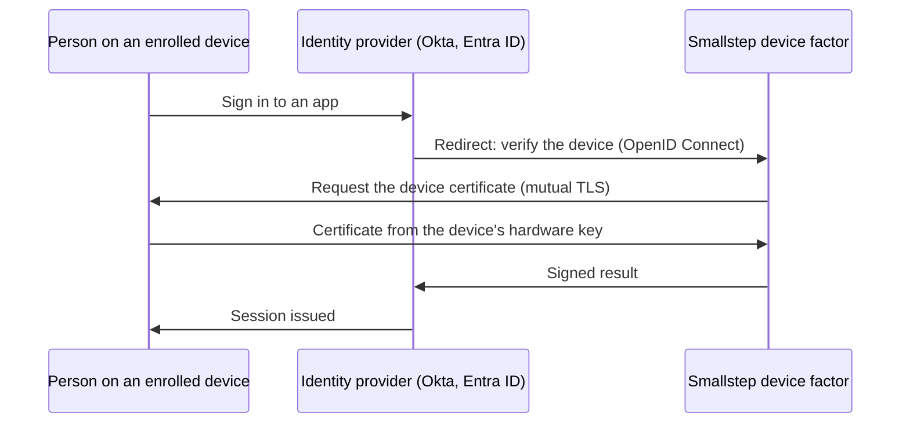

Require an enrolled device at sign-in.
About 30 minutes in Smallstep, plus the change in your identity provider.

<Alert severity="warning">
  <AlertTitle>Being validated</AlertTitle>
  <div>
    This guide is written from the API specification and the previous how-to article and has not yet been walked against the product end to end.
    It is hidden from the sidebar until it has been.
  </div>
</Alert>

## What you get {#what-you-get}

When a person signs in to an app through your identity provider, the identity provider sends them to Smallstep as a second factor.
Smallstep's device factor asks the browser for the device's certificate over mutual TLS, checks it against your authority, and returns the person to the identity provider with a signed answer.
Only a person on an enrolled device with a current certificate completes the sign-in; the phishing-resistant part is the key that never left the device's hardware.



Three objects do the work:

- The **device factor**: Smallstep's hosted OpenID Connect identity provider for your team, at `https://<<team-slug>>.id.smallstep.com`, configured with the trust roots of the authority that issues your device certificates.
- A **client** of the device factor: the client ID and secret your identity provider uses, with the redirect URI it needs.
- A **credential** and a **web app** resource, as in the [web apps guide](./web-apps.mdx), so the browser presents the certificate to the device factor's address.

The verifier is your identity provider's policy; the device factor is the part that checks the certificate.
[Why device identity](../learn/why-device-identity.mdx) explains why this is stronger than a second password.

## Before you start {#before-you-start}

1. **Devices enrolled.**
   At least one device in your [inventory](../platform/enrollment-guide.mdx), approved, with a user bound to it, and running the [agent](../platform/smallstep-agent.mdx).
2. **Users synced from the identity provider**, so the device's bound user matches the sign-in identity: [Okta](../tutorials/sync-okta-users-to-smallstep.mdx), [Entra ID](../tutorials/sync-entra-id-users-to-smallstep.mdx), or [Google Workspace](../tutorials/sync-google-workspace-users-to-smallstep.mdx).
3. **An authority** that issues the browser certificates: note its ID, <<authority-id>>, under [Authorities](https://smallstep.com/app/?next=/cm/authorities) and download its root certificate as `accounts_root.crt`.
   The certificate's first email SAN must be the person's sign-in username at the identity provider, so use an authority whose credentials carry `smallstep:identity`.
4. **An API token** from [Settings → API tokens](https://smallstep.com/app/?next=/settings/api/tokens/add), stored in `api_headers` as the [Wi-Fi guide](./wifi.mdx#before-you-start) shows.
   There is no form for the device factor in the Console today; **Protect → SSO** shows a request form for teams without the entitlement, and the objects are created with the API or Terraform.
5. **Admin access** to the identity provider, and its tenant address: <<okta-domain>> for Okta.

## Create it in Smallstep {#create}

### 1. Create the device factor

The device factor is one per team.
`trustRoots` is the CA bundle it verifies browser certificates against.
Use only the root if any intermediate under it should be trusted; use only the intermediate if only its leaves should be.
A bundle of root and intermediate trusts every intermediate under the root, whether or not it is in the bundle.

```bash
jq -n --rawfile roots accounts_root.crt '{trustRoots: $roots}' \
| curl -sH @api_headers --request PUT \
  --url https://gateway.smallstep.com/api/sso \
  --header 'Accept: application/json' \
  --header 'Content-Type: application/json' \
  --header 'x-smallstep-api-version: 2025-01-01' \
  --data @- | jq
```

The response holds the values your identity provider needs: `issuer` (<<idp-issuer>>), `authorizeEndpoint`, `tokenEndpoint`, and `jwksEndpoint`.
Confirm the discovery document is served at `<<idp-issuer>>/.well-known/openid-configuration`.

### 2. Create the client

One client per identity provider.
The redirect URI is where the identity provider expects to receive the answer:

| Identity provider | Redirect URI |
|---|---|
| Okta | `https://<<okta-domain>>/oauth2/v1/authorize/callback` |
| Entra ID (external authentication method) | `https://login.microsoftonline.com/common/federation/externalauthprovider` |

```bash
curl -sH @api_headers --request POST \
  --url https://gateway.smallstep.com/api/sso/clients \
  --header 'Accept: application/json' \
  --header 'Content-Type: application/json' \
  --header 'x-smallstep-api-version: 2025-01-01' \
  --data '{"redirectURI": "https://<<okta-domain>>/oauth2/v1/authorize/callback"}' | jq
```

Save `id` as <<idp-client-id>> and `secret` as <<idp-client-secret>>.
The secret is returned only at creation.
`lifecycleFailureURI` is optional: where to send the person when their device's lifecycle is not active.

### 3. Create the browser credential and web app

The device factor asks the browser for a certificate at <<idp-issuer>>, so the device needs a browser certificate and a rule to present it there.
Follow the [web apps guide's step 3](./web-apps.mdx#create) with `matchAddresses` set to `["<<idp-issuer>>"]`, a credential whose first SAN is `smallstep:identity`, and, because the key is hardware bound, a lifetime of up to a year.

## Configure your identity provider {#configure-external}

<Tabs>
  <Tab label="Okta">
    Add Smallstep as an identity provider used only as a factor, make it an authenticator, and attach it to a policy.

    1. In the Okta admin console, go to **Security → Identity Providers** and choose **Add identity provider → OpenID Connect IdP**.
       If **OpenID Connect IdP** is not in the list, ask Okta to enable the `GENERIC_OIDC_IDP` feature for your tenant.
    2. Configure it: **Name** `Smallstep`; **IdP Usage** **Factor only**; **Client ID** <<idp-client-id>>; **Client Secret** <<idp-client-secret>>; **Issuer** <<idp-issuer>>; and the **Authorization endpoint**, **Token endpoint**, and **JWKS endpoint** from step 3.
    3. Go to **Security → Authenticators**, choose **Add authenticator → IdP Authenticator**, and select the Smallstep identity provider.
    4. Go to **Security → Authentication Policies** and add the Smallstep authenticator to the policy for a pilot group or app.
       On a fresh tenant the default policy is "Any two factors", which makes Smallstep available as an optional second factor.
  </Tab>
  <Tab label="Entra ID">
    Entra ID takes Smallstep as an **external authentication method**, Microsoft's name for an OpenID Connect second factor.
    The client for it uses the redirect URI in step 3's table.
    In the Entra admin center, the method is registered with <<idp-client-id>> and <<idp-issuer>>, then enabled in a Conditional Access or authentication-methods policy for a pilot group.
    The exact Entra menu steps are not documented here yet; Microsoft's external authentication method documentation has them.
  </Tab>
</Tabs>

Google Workspace and other identity providers that support an OpenID Connect external factor take the same issuer, client ID, secret, and endpoints; their menu steps are not documented here yet.

## Deliver to devices {#deliver}

The same as the [web apps guide](./web-apps.mdx#deliver): the agent installs the browser certificate, and the auto-select policy for <<idp-issuer>> keeps the certificate picker from appearing.

<Tabs>
  <Tab label="Agent">
    Nothing to do for the certificate.
    Set the auto-select policy for <<idp-issuer>> per the web apps guide; without it, the person sees a certificate picker at the device check and must choose the Smallstep certificate.
  </Tab>
  <Tab label="MDM">
    Deliver the browser policy profiles from the web apps guide's [Jamf Pro and Google Workspace tabs](./web-apps.mdx#deliver) with <<idp-issuer>> as the URL pattern.
  </Tab>
</Tabs>

## Verify {#verify}

1. On the test device, confirm the browser has a current certificate from the authority in step 2 whose first email SAN is the person's sign-in username.
2. Sign in to an app covered by the pilot policy.
   When the identity provider asks for a second factor, choose Smallstep.
   The device check completes without a prompt (or with one certificate picker if the policy is not set) and the app opens.
3. Sign in from a device that is not enrolled.
   The Smallstep factor is not satisfied and the identity provider does not issue the session.

## Roll out and operate {#operate}

- **Widen the identity-provider policy** from the pilot group to everyone who should be device-bound; widen the credential's assignment policy in step.
- **Renewals** are automatic on agent-managed devices.
- **Revocation.**
  Revoke a device's certificate with [`/certificates/{serialNumber}/revoke`](https://gateway.smallstep.com/v2025-01-01/operations/RevokeCertificate); the next device check fails.
  Set `lifecycleFailureURI` on the client to land the person on a page that says why.
- **Rotate the client secret** by creating a new client, updating the identity provider, then deleting the old client with `DELETE /sso/clients/{idpClientID}`.
- **Several authorities.**
  To trust more than one CA, put their roots in one PEM bundle and `PUT /sso` again with the bundle as `trustRoots`.

## Troubleshoot {#troubleshoot}

- [`OpenID Connect IdP` is not in Okta's list of identity providers](../troubleshooting/sso-device-factor/okta-oidc-idp-missing.mdx)
- [The identity provider rejects the factor because the certificate's email does not match the username](../troubleshooting/sso-device-factor/email-san-mismatch.mdx)
- [A certificate selection dialog appears during the device check](../troubleshooting/sso-device-factor/certificate-picker-at-sign-in.mdx)
- [The person lands on the lifecycle failure page](../troubleshooting/sso-device-factor/lifecycle-failure.mdx)

For the certificate itself, use the [web apps troubleshooting entries](./web-apps.mdx#troubleshoot).

## Automate {#automate}

### REST

| Object | Create | Read |
|---|---|---|
| Device factor | `PUT /sso` | `GET /sso` |
| Client | `POST /sso/clients` | `GET /sso/clients/{idpClientID}` |
| Credential | `POST /credentials` | `GET /credential/{credentialID}` |
| Web app | `POST /protect/browser` | `GET /protect/browser/{browserID}` |

### Terraform

```hcl
resource "smallstep_identity_provider" "device_factor" {
  trust_roots = file("${path.module}/accounts_root.crt")
}

resource "smallstep_identity_provider_client" "okta" {
  redirect_uri = "https://<<okta-domain>>/oauth2/v1/authorize/callback"
  store_secret = true
  depends_on   = [smallstep_identity_provider.device_factor]
}

output "issuer" {
  value = smallstep_identity_provider.device_factor.issuer
}

output "client_id" {
  value = smallstep_identity_provider_client.okta.id
}

output "client_secret" {
  value     = smallstep_identity_provider_client.okta.secret
  sensitive = true
}
```

The resources are [`smallstep_identity_provider`](https://registry.terraform.io/providers/smallstep/smallstep/latest/docs/resources/identity_provider) and [`smallstep_identity_provider_client`](https://registry.terraform.io/providers/smallstep/smallstep/latest/docs/resources/identity_provider_client); the credential and web app are the [web apps guide's](./web-apps.mdx#automate).
