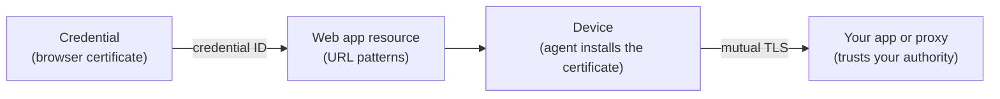

Protect a web app with device certificates in the browser.
About 15 minutes in Smallstep, plus the change on your app or proxy and a browser policy.

## What you get {#what-you-get}

When a person on an enrolled device opens the app, the browser presents a certificate issued to that device during the TLS handshake.
Your app, or the proxy in front of it, verifies the certificate against your authority and knows which device and which user is on the other end before a single request is served.
A device without a certificate, or with a revoked one, never gets past the handshake.



Two objects do the work:

- A **credential**: which authority signs, what identity the certificate carries (the bound user's email, the device serial), how the key is protected, and which devices get it.
- A **web app** resource: the URLs that require the certificate and the credential to present there.

The verifier is yours: the app, the proxy, or the identity provider that checks the certificate.
Smallstep supplies the certificate and the trust roots.
[Certificates for people, devices, and workloads](../learn/certificates-for-people-devices-and-workloads.mdx) explains why a browser certificate carries both a device and a person.
If the app is behind your single sign-on rather than checking certificates itself, use the [SSO device factor](./sso-device-factor.mdx) guide instead.

## Before you start {#before-you-start}

1. **Devices enrolled.**
   At least one device in your [inventory](../platform/enrollment-guide.mdx), approved, with a user bound to it, and running the [agent](../platform/smallstep-agent.mdx) on macOS, Windows, or Linux.
   ChromeOS devices use the Smallstep extension instead; see [ChromeOS device identity certificates](../tutorials/chromeos-device-identity-certificates.mdx).
2. **An MDM connected**, only if you will deliver the browser policy with one; the agent needs none.
3. **An authority** to sign the browser certificates: note its ID, <<authority-id>>, under [Authorities](https://smallstep.com/app/?next=/cm/authorities), and download its root and intermediate certificates; your app needs them in step 4.
4. **An API token** from [Settings → API tokens](https://smallstep.com/app/?next=/settings/api/tokens/add), stored in `api_headers` as the [Wi-Fi guide](./wifi.mdx#before-you-start) shows.
   The same objects can be created under **Protect → Browsers (mTLS)** in the Console.
5. **The URLs** that will require a certificate, <<app-url>>, and admin access to the app or proxy that serves them.

## Create it in Smallstep {#create}

### 1. Create the credential

The recipe for a browser certificate: the bound user's email as the common name and the first SAN, the device serial as a second SAN, client authentication only, a hardware-attested key, and assignment to high-assurance devices.
A longer lifetime is reasonable here because the key cannot leave the hardware.

{/* vale Google.Spacing = NO */}

```bash
curl -sH @api_headers --request POST \
  --url https://gateway.smallstep.com/api/credentials \
  --header 'Accept: application/json' \
  --header 'Content-Type: application/json' \
  --header 'x-smallstep-api-version: 2025-01-01' \
  --data @- <<'EOF' | jq
{
  "slug": "browser",
  "certificate": {
    "type": "X509",
    "authorityID": "<<authority-id>>",
    "duration": "168h0m0s",
    "fields": {
      "commonName": {
        "deviceMetadata": "smallstep:identity"
      },
      "sans": {
        "deviceMetadata": ["smallstep:identity", "Device.Serial"]
      },
      "extendedKeyUsage": ["clientAuth"]
    }
  },
  "key": {
    "type": "ECDSA_P256",
    "protection": "HARDWARE_ATTESTED"
  },
  "managementMode": "agent",
  "policy": {
    "assurance": ["high"],
    "operatingSystem": ["macOS", "Windows", "Linux"]
  }
}
EOF
```

{/* vale Google.Spacing = YES */}

The [Wi-Fi guide](./wifi.mdx#create) explains every field.
Shape the SANs for your verifier: an app that maps users by email wants `smallstep:identity` first; an app that maps devices wants `Device.Serial` or `Device.PermanentIdentifier`.
Save the `id` as <<credential-id>>.

### 2. Create the web app

```bash
curl -sH @api_headers --request POST \
  --url https://gateway.smallstep.com/api/protect/browser \
  --header 'Accept: application/json' \
  --header 'Content-Type: application/json' \
  --header 'x-smallstep-api-version: 2025-01-01' \
  --data @- <<'EOF' | jq
{
  "name": "Intranet",
  "matchAddresses": ["<<app-url>>"],
  "credentials": ["<<credential-id>>"]
}
EOF
```

- `matchAddresses` lists the URLs the certificate applies to.
- `credentials` lists the credentials the browser presents there.

The resource appears under [Protect → Browsers (mTLS)](https://smallstep.com/app/?next=/protect/browser).
Its ID is <<browser-id>>.

## Configure your app {#configure-external}

Your app or proxy must ask for a client certificate on <<app-url>>, verify it against your authority, and read the identity from it.

<Tabs>
  <Tab label="Your app or proxy">
    1. Download the authority's **root certificate** (and its intermediate, if your server does not build chains itself) from the authority's page under **Authorities**.
    2. Configure the server to require a client certificate on the protected paths and to trust that root for client verification.
       Every web server and proxy has a setting for this: `ssl_verify_client` and `ssl_client_certificate` in NGINX, `SSLVerifyClient` and `SSLCACertificateFile` in Apache, `client_auth` in Caddy, the mutual TLS listener on a load balancer.
    3. Map the certificate to a user or device in your app: the email in the first SAN, or the serial in the second, as you shaped the credential in step 3.

    [Trust roots and chains](../learn/trust-roots-and-chains.mdx) explains what to give the server and why the root alone is usually right.
  </Tab>
</Tabs>

Steps for specific verifiers (Entra certificate-based authentication, Cloudflare Access, Auth0, Salesforce, Okta) are not written yet; each takes the same root certificate and maps the same SANs.
For an identity provider that should require the device certificate as a sign-in factor, use the [SSO device factor](./sso-device-factor.mdx) guide.

## Deliver to devices {#deliver}

The agent installs the certificate where the browser looks: the keychain on macOS, the user's personal certificate store on Windows, and the NSS database through PKCS#11 on Linux.
What is left is the browser's **auto-select policy**, so the person sees no certificate picker.
Chrome and Edge take the `AutoSelectCertificateForUrls` policy; Firefox takes two preferences; Safari selects automatically and the agent sets its identity preferences.

The policy names the issuing CA.
Copy the exact intermediate CA name from the authority's page; for a hosted authority it looks like `Smallstep <<team-slug>> Accounts Intermediate CA`.

<Tabs>
  <Tab label="Agent">
    Nothing to do for the certificate.
    On its next sync, the agent on every device that matches the credential's assignment policy requests the certificate with the key in the device's secure hardware, installs it for the browsers, and renews it before it expires.

    Set the auto-select policy per operating system:

    **Windows (Chrome and Edge).**
    In the Registry Editor, under `HKEY_LOCAL_MACHINE\Software\Policies\Google\Chrome` for Chrome or `HKEY_CURRENT_USER\SOFTWARE\Policies\Microsoft\Edge` for Edge (create the keys if they do not exist), add a string value named `AutoSelectCertificateForUrls`:

    ```text
    ["{\"pattern\":\"<<app-url>>\",\"filter\":{\"ISSUER\":{\"CN\":\"Smallstep <<team-slug>> Accounts Intermediate CA\"}}}"]
    ```

    Restart the browser and confirm the policy at `chrome://policy` or `edge://policy`.

    **Linux (Chrome).**
    As root, create `/etc/opt/chrome/policies/managed/auto_select_cert.json`:

    ```json
    {
        "AutoSelectCertificateForUrls": ["{\"pattern\":\"<<app-url>>\",\"filter\":{\"ISSUER\":{\"CN\":\"Smallstep <<team-slug>> Accounts Intermediate CA\"}}}"]
    }
    ```

    Restart Chrome and confirm the policy at `chrome://policy`.
    Firefox on Linux shows its client certificates at `about:certificate`.

    **macOS.**
    Deliver the Chrome and Firefox preferences with your MDM (the Jamf Pro tab), or accept the picker on the first visit.
    Safari needs nothing.
  </Tab>
  <Tab label="Jamf Pro">
    Two configuration profiles under **Computers → Configuration Profiles**, each an **Application & Custom Settings → Upload** payload.
    Other MDMs take the same property lists.

    **Chrome.**
    Preference domain `com.google.Chrome`, with `com.google.Chrome.plist`:

    ```xml
    <?xml version="1.0" encoding="UTF-8"?>
    <!DOCTYPE plist PUBLIC "-//Apple//DTD PLIST 1.0//EN" "http://www.apple.com/DTDs/PropertyList-1.0.dtd">
    <plist version="1.0">
      <dict>
        <key>AutoSelectCertificateForUrls</key>
        <array>
          <string>{"pattern":"<<app-url>>","filter":{"ISSUER":{"CN":"Smallstep <<team-slug>> Accounts Intermediate CA"}}}</string>
        </array>
      </dict>
    </plist>
    ```

    The pattern is a [Chrome Enterprise URL pattern](https://chromeenterprise.google/policies/url-patterns/): `[.*]xample.com` matches `xample.com` and `hello.xample.com` on any scheme, port, and path, and does not match `example.com`.
    Chrome does not merge several `AutoSelectCertificateForUrls` policies; put every URL in one profile.

    **Firefox.**
    Preference domain `org.mozilla.firefox`, with `org.mozilla.firefox.plist`:

    ```xml
    <?xml version="1.0" encoding="UTF-8"?>
    <!DOCTYPE plist PUBLIC "-//Apple//DTD PLIST 1.0//EN" "http://www.apple.com/DTDs/PropertyList-1.0.dtd">
    <plist version="1.0">
      <dict>
        <key>EnterprisePoliciesEnabled</key>
        <true/>
        <key>PayloadDisplayName</key>
        <string>Firefox ESR Policies</string>
        <key>PayloadEnabled</key>
        <true/>
        <key>PayloadIdentifier</key>
        <string>org.mozilla.firefox.BCADDC78-843E-4112-936A-DAB8EEEF514C</string>
        <key>PayloadType</key>
        <string>org.mozilla.firefox</string>
        <key>PayloadUUID</key>
        <string>BCADDC78-843E-4112-936A-DAB8EEEF514C</string>
        <key>PayloadVersion</key>
        <integer>1</integer>
        <key>Preferences</key>
        <dict>
          <key>security.default_personal_cert</key>
          <string>Select Automatically</string>
          <key>security.osclientcerts.autoload</key>
          <true/>
        </dict>
      </dict>
    </plist>
    ```

    Scope both profiles to a test device first.
    Safari needs no profile.
  </Tab>
  <Tab label="Google Workspace (ChromeOS)">
    On managed Chromebooks the certificate comes from the Smallstep extension, and the policy is set once in the Admin console for an organizational unit.

    1. Complete [ChromeOS device identity certificates](../tutorials/chromeos-device-identity-certificates.mdx) so a certificate exists to select.
    2. Go to **Devices → Chrome → Settings → Users & browsers**, choose the organizational unit, and under **Client certificates** find **Auto-select client certificate for these sites**.
    3. Add an entry per protected URL:

       ```json
       {"pattern":"<<app-url>>","filter":{"ISSUER":{"CN":"Smallstep (<<team-slug>>) Devices Intermediate CA"}}}
       ```

    4. Save.

    The policy reaches devices on their next sync with Google Workspace.
  </Tab>
</Tabs>

## Verify {#verify}

1. On the test device, confirm the certificate is there.
   - Windows: run `certmgr` and look under **Certificates - Current User → Personal → Certificates** for a certificate issued by your authority's intermediate.
   - Chrome or Edge on any OS: `chrome://settings/certificates` or **Manage certificates** under `edge://settings/privacy/securitySubPage`.
   - Linux: `chrome://settings/certificates` after a restart; if the certificate is missing, the agent's PKCS#11 module is not reachable.
2. Confirm the policy applied at `chrome://policy` or `edge://policy`.
3. Restart the browser and open <<app-url>>.
   The app loads with no certificate picker and shows the identity from the certificate.
4. On the device, run the doctor and expect every row to pass:

   ```bash
   sudo step-agent doctor
   ```

## Roll out and operate {#operate}

- **Widen the assignment policy** on the credential once one device works.
- **Add URLs** to `matchAddresses` with `PUT /protect/browser/{browserID}`, and to the auto-select policy in the same change; a URL in one and not the other produces a picker.
- **Renewals** are automatic; the agent renews before expiry and the browser picks up the new certificate on its next connection.
- **Revocation.**
  Revoke a device's certificate with [`/certificates/{serialNumber}/revoke`](https://gateway.smallstep.com/v2025-01-01/operations/RevokeCertificate).
  Whether your app notices before the certificate expires depends on whether it checks revocation; a short `duration` on the credential bounds the window either way.
- **What the person sees.**
  With the policy in place, nothing.
  Without it, the browser's certificate picker on the first visit to each origin; choosing the Smallstep certificate once is enough for that session.

## Troubleshoot {#troubleshoot}

- [The browser shows a certificate selection dialog](../troubleshooting/web-apps/certificate-selection-dialog.mdx)
- [Chrome or Firefox does not see the Smallstep certificate](../troubleshooting/web-apps/browser-does-not-see-certificate.mdx)
- [`chrome://policy` does not list `AutoSelectCertificateForUrls`](../troubleshooting/web-apps/policy-not-applied.mdx)
- [The app rejects the certificate as expired or invalid](../troubleshooting/web-apps/certificate-expired.mdx)

For agent problems that are not specific to browsers, use the [agent troubleshooting page](../platform/troubleshooting-agent.mdx).

## Automate {#automate}

### REST

| Object | Create | Read |
|---|---|---|
| Credential | `POST /credentials` | `GET /credential/{credentialID}` |
| Web app | `POST /protect/browser` | `GET /protect/browser/{browserID}` |

### Terraform

{/* vale Google.Spacing = NO */}

```hcl
resource "smallstep_credential" "browser" {
  slug = "browser"

  certificate = {
    authority_id = "<<authority-id>>"
    duration     = "168h"
    x509 = {
      common_name = {
        device_metadata = "smallstep:identity"
      }
      sans = {
        device_metadata = ["smallstep:identity", "Device.Serial"]
      }
    }
  }

  key = {
    type       = "ECDSA_P256"
    protection = "HARDWARE_ATTESTED"
  }

  policy = {
    assurance = ["high"]
    os        = ["macOS", "Windows", "Linux"]
  }
}

resource "smallstep_browser" "intranet" {
  name            = "Intranet"
  match_addresses = ["<<app-url>>"]
  credentials     = [smallstep_credential.browser.id]
}
```

{/* vale Google.Spacing = YES */}

The resource is [`smallstep_browser`](https://registry.terraform.io/providers/smallstep/smallstep/latest/docs/resources/browser).
