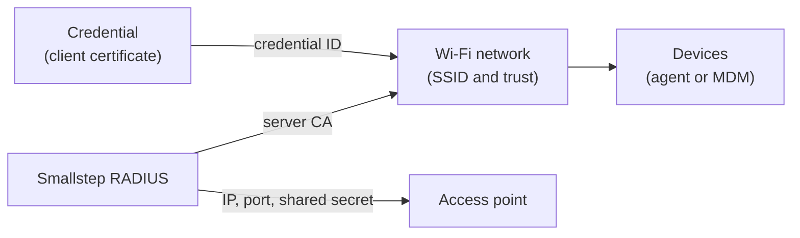

Secure Wi-Fi with device certificates.
About 20 minutes in Smallstep, plus the change on your access points.

<Alert severity="info">
  <div>
    Use a test SSID for this walk-through.
    Do not change a production network until you have seen a device join.
  </div>
</Alert>

## What you get {#what-you-get}

A device joins the network by presenting a certificate that was issued to it and whose private key never left its hardware.
The access point relays the EAP-TLS handshake to a RADIUS server, the RADIUS server checks the certificate against your authority, and the port opens only on Access-Accept.
There is no password to phish, share, or rotate.



Three objects do the work, and you create all three in this guide:

- A **credential**: which authority signs, what goes in the certificate, how the key is protected, and which devices get it.
- A **RADIUS server**: the verifier.
  Your access points delegate authentication to it and it verifies the certificate during the EAP-TLS handshake.
  Smallstep runs it for you, or you bring your own.
- A **Wi-Fi network** resource: the SSID, the RADIUS server CA that devices must trust, and the credential they authenticate with.

[Why device identity](../learn/why-device-identity.mdx) explains the argument for certificates over passwords, and [RadSec](../learn/radsec.mdx) explains the transport between your access points and the RADIUS server.

## Before you start {#before-you-start}

Each of these must exist before step 3.

1. **Devices enrolled.**
   At least one device in your [inventory](../platform/enrollment-guide.mdx), approved, and running the [agent](../platform/smallstep-agent.mdx) on macOS, Windows, or Linux.
   For MDM-delivered profiles without the agent, the device must be synced from your MDM instead.
2. **An MDM connected**, if you will deliver profiles with one: [Jamf Pro](../tutorials/connect-jamf-pro-to-smallstep.mdx), [Intune](../tutorials/connect-intune-to-smallstep.mdx), [Workspace ONE](../tutorials/connect-workspace-one-to-smallstep.mdx), [Mosyle](../tutorials/connect-mosyle-to-smallstep.mdx), [Fleet](../tutorials/connect-fleet-dm-to-smallstep.mdx), or [Google Workspace](../tutorials/connect-google-workspace-to-smallstep.mdx) for ChromeOS.
   Agent-managed devices need none.
3. **An authority** to sign the client certificates.
   Open [Authorities](https://smallstep.com/app/?next=/cm/authorities) in the Console (under the **Certificate Manager** menu today) and note its ID, <<authority-id>>.
   Download its root certificate and save it as `client_ca.crt`; the RADIUS server needs it in step 3.
   If you have no authority yet, [create a hosted authority](../certificate-manager/getting-started.mdx) first.
4. **An API token** from [Settings → API tokens](https://smallstep.com/app/?next=/settings/api/tokens/add).
   This guide creates the objects with the API because every value you need comes back in one response.
   The same objects can be created under **Protect → Wi-Fi** in the Console.
5. **Your network facts**: the public IP address your access points or wireless controller send RADIUS traffic from, and admin access to the access points and a test SSID.

Store the token in a headers file for `curl`:

```bash
set +o history
echo "Authorization: Bearer <<api-token>>" > api_headers
set -o history
```

## Create it in Smallstep {#create}

Three calls, in this order: the credential, the RADIUS server, and the Wi-Fi network.
Every object is visible afterwards: the credential under **Credentials** (labelled **Endpoints** under the **Certificate Manager** menu today), the RADIUS server and the network under **Protect → Wi-Fi**.

### 1. Create the credential

The credential names the authority, the certificate shape, the key protection, and the devices that get it.
The defaults below are the recipe for company laptops: a one-day certificate, an ECDSA P-256 key generated in the device's secure hardware with attestation, and assignment to high-assurance macOS, Windows, and Linux devices.

{/* vale Google.Spacing = NO */}

```bash
curl -sH @api_headers --request POST \
  --url https://gateway.smallstep.com/api/credentials \
  --header 'Accept: application/json' \
  --header 'Content-Type: application/json' \
  --header 'x-smallstep-api-version: 2025-01-01' \
  --data @- <<'EOF' | jq
{
  "slug": "wifi",
  "certificate": {
    "type": "X509",
    "authorityID": "<<authority-id>>",
    "duration": "24h0m0s",
    "fields": {
      "commonName": {
        "deviceMetadata": "smallstep:identity",
        "static": "Corporate Wi-Fi"
      },
      "sans": {
        "deviceMetadata": ["smallstep:identity", "Device.Serial"]
      },
      "extendedKeyUsage": ["clientAuth"]
    }
  },
  "key": {
    "type": "ECDSA_P256",
    "protection": "HARDWARE_ATTESTED"
  },
  "managementMode": "agent",
  "policy": {
    "assurance": ["high"],
    "operatingSystem": ["macOS", "Windows", "Linux"]
  }
}
EOF
```

{/* vale Google.Spacing = YES */}

What each part does:

- `certificate.fields` fills the subject.
  Each field takes a `static` value, one or more `deviceMetadata` keys, or both; the static value is the fallback when the key is absent on a device.
  Reserved keys are `smallstep:identity` (the email of the user bound to the device), `Device.Serial`, `Device.Hostname`, `Device.PermanentIdentifier`, and `Device.DisplayName`; your own metadata keys work too.
- `key.protection` is the issuance method.
  `HARDWARE_ATTESTED` generates the key in the TPM or Secure Enclave and requires attestation before the authority signs.
  `HARDWARE_WITH_FALLBACK` prefers hardware and allows a software key where there is none.
  [Attestation explained](../learn/attestation-explained.mdx) says what each level proves.
- `policy` is the assignment policy: which devices receive the credential.
  An empty policy assigns it to every device.
  Match on `assurance` (`normal`, `high`), `ownership` (`company`, `user`), `operatingSystem`, discovery `source`, and `tags`.
  Start narrow with a tag on your test devices and widen it in step 7.
- `managementMode: "agent"` makes the agent enroll, renew, and keep the key; use `mdm` when your MDM delivers and renews the certificate instead.

Save the `id` from the response as <<credential-id>>.

<Alert severity="warning">
  <div>
    Automation built on the <code>/accounts</code> or <code>/endpoint-configurations</code> endpoints should move to <code>/credentials</code> and <code>/protect/*</code>.
    The older endpoints are deprecated in the 2025-01-01 API version.
  </div>
</Alert>

### 2. Create the RADIUS server

Smallstep RADIUS verifies EAP-TLS only.
It validates the full chain against your client CA and checks revocation on every authentication.
Password methods (EAP-TTLS, PEAP-MSCHAPv2), MAC Authentication Bypass, RADIUS accounting, and Change of Authorization are not supported, by design.

Register the public IP addresses your access points send from and the authority root you downloaded:

```bash
jq -n --rawfile ca client_ca.crt \
  '{name: "Corporate RADIUS", nasIPs: ["<<nas-ip>>"], clientCA: $ca}' \
| curl -sH @api_headers --request POST \
  --url https://gateway.smallstep.com/api/managed-radius \
  --header 'Accept: application/json' \
  --header 'Content-Type: application/json' \
  --header 'x-smallstep-api-version: 2025-01-01' \
  --data @- | jq
```

- `nasIPs` is how the service attributes incoming requests to your team, so each IP must be unique across Smallstep customers.
  (The Console labels this field **WAP/NAS IP address**.)
  When an office changes ISP, update this list before anyone can join.
- `clientCA` is the bundle the server trusts to verify clients: the root of the authority from step 2.

The response holds the values your access points need: `serverIP` (<<radius-server-ip>>), `serverPort` (<<radius-server-port>>), and `serverHostname` (<<radius-server-name>>, the DNS name on the server's TLS certificate).
Save `serverCA` to a file; devices need it to trust the server:

```bash
curl -sH @api_headers --request GET \
  --url "https://gateway.smallstep.com/api/managed-radius/<<radius-server-id>>" \
  --header 'Accept: application/json' \
  --header 'x-smallstep-api-version: 2025-01-01' | jq -r '.serverCA' > radius_ca.crt
```

The shared secret is not in responses by default.
Fetch it with the `secret` query parameter and treat it like a password:

```bash
curl -sH @api_headers --request GET \
  --url "https://gateway.smallstep.com/api/managed-radius/<<radius-server-id>>?secret=true" \
  --header 'Accept: application/json' \
  --header 'x-smallstep-api-version: 2025-01-01' | jq -r '.secret'
```

That value is <<radius-secret>>.

**A dedicated deployment.**
Smallstep RADIUS is also offered as dedicated infrastructure with static IPs in the regions you choose, RadSec transport on a dedicated hostname, reply attributes for VLAN assignment, and [authorization webhooks](../reference/radius-webhooks.mdx).
Smallstep provisions it for your team today; it is not something you create in the Console or the API.
The [RadSec](../learn/radsec.mdx) article says when you want it.

**Your own RADIUS server.**
FreeRADIUS, Cisco ISE, Aruba ClearPass, NPS, or any server that speaks EAP-TLS works with Smallstep certificates.
Add `client_ca.crt` to its trusted client CA bundle, and in the next call use *your* server's CA as the `radiusServerCA`.

### 3. Create the Wi-Fi network

```bash
jq -n --rawfile ca radius_ca.crt \
  '{
    name: "Corporate Wi-Fi",
    ssid: "<<ssid>>",
    hidden: false,
    autojoin: true,
    radiusServerCA: $ca,
    radiusServerDomain: "<<radius-server-name>>",
    credentials: ["<<credential-id>>"]
  }' \
| curl -sH @api_headers --request POST \
  --url https://gateway.smallstep.com/api/protect/wifi \
  --header 'Accept: application/json' \
  --header 'Content-Type: application/json' \
  --header 'x-smallstep-api-version: 2025-01-01' \
  --data @- | jq
```

- `radiusServerCA` is what devices use to verify the RADIUS server: the `serverCA` you saved, or your own server's CA.
- `radiusServerDomain` requires the server certificate to carry this DNS name; Windows honors it.
- `credentials` lists the credentials devices authenticate with.

The network appears under [Protect → Wi-Fi](https://smallstep.com/app/?next=/protect/wifi).
Its ID is <<wifi-id>>.

## Configure your access points {#configure-external}

Every access point takes the same three values, plus the security mode.
Set the SSID to **WPA2 Enterprise** or **WPA3 Enterprise** and add the RADIUS server:

| Setting | Value |
|---|---|
| RADIUS server IP | <<radius-server-ip>> |
| RADIUS server port | <<radius-server-port>> |
| Shared secret | <<radius-secret>> |
| Server certificate name | <<radius-server-name>> |

<Tabs>
  <Tab label="Meraki">
    1. Go to **Wireless → Configure → SSIDs** and enable an unconfigured SSID.
    2. Rename it to <<ssid>> and save.
    3. Open **edit settings** to reach the SSID's Access control tab.
    4. Set **Association requirements** to **Enterprise with my RADIUS server**.
    5. Under **RADIUS servers**, add <<radius-server-ip>>, <<radius-server-port>>, and <<radius-secret>>.
    6. Save.
  </Tab>
  <Tab label="Ubiquiti UniFi">
    Create a RADIUS profile in the UniFi Network app:

    1. Go to **Settings → Profiles → RADIUS → Create New** and name it.
    2. Under **Authentication servers**, add <<radius-server-ip>>, <<radius-server-port>>, and <<radius-secret>>.
    3. Save.

    Then create the network:

    1. Go to **Settings → WiFi → Create New** and enter <<ssid>>.
    2. Under **Advanced Configuration**, choose **Manual**.
    3. Under **Security**, select **WPA-3 Enterprise** and the RADIUS profile you created.
    4. Save.
  </Tab>
  <Tab label="Aruba">
    On an Aruba mobility controller:

    1. Go to **Configuration → Authentication → Auth Servers**.
    2. Add a **Server Group**, open it, and add a server of type **RADIUS** with <<radius-server-ip>> and <<radius-server-name>>.
    3. Go to **Configuration → WLAN** and add a WLAN named <<ssid>>; choose the AP groups that broadcast it and your VLAN.
    4. On **Security → Enterprise**, set **Key management** to **WPA-3 Enterprise** and add the server group under **Auth servers**.
    5. On **Access**, pick the default role for authenticated devices, finish, and deploy the pending changes.
  </Tab>
  <Tab label="Cisco WLC">
    1. Go to **Security → RADIUS → Authentication** and add a server with <<radius-server-ip>>, <<radius-secret>>, and <<radius-server-port>>.
    2. On the **WLANs** tab, create a WLAN named <<ssid>> and enable it.
    3. On **Security → AAA Servers**, select the server you added as **Server 1** and apply.
  </Tab>
  <Tab label="Juniper Mist">
    1. Go to **Organization → WLAN Templates** and open or create a template.
    2. Add a WLAN with <<ssid>>.
    3. Under **Security**, select **WPA3** or **WPA2**, then **Enterprise (802.1X)**.
    4. Under **Authentication Servers**, add <<radius-server-ip>> and <<radius-secret>>.
    5. Save.
  </Tab>
  <Tab label="Other">
    The [access point reference](../reference/access-points.mdx) has the same steps for MikroTik, Aerohive, Extreme Networks, Sophos UTM, and Asus.
    Any access point that supports WPA Enterprise with an external RADIUS server works with the three values above.
  </Tab>
</Tabs>

## Deliver to devices {#deliver}

Every device needs three things: the client certificate, trust in the RADIUS server CA, and the network profile.
The agent does all three.
An MDM can deliver a profile that does all three without the agent, using its own SCEP or ACME flow for the certificate.
You can mix the two across a fleet.

<Tabs>
  <Tab label="Agent">
    Nothing to do.
    On its next sync, the agent on every device that matches the credential's assignment policy:

    1. Requests the client certificate, generating the private key in the device's secure hardware.
    2. Trusts the RADIUS server CA for this network.
    3. Creates the network profile (SSID, WPA Enterprise, EAP-TLS) on macOS, Windows, or Linux.
    4. Renews the certificate before it expires.
  </Tab>
  <Tab label="Jamf Pro">
    Two ways.
    Both start by [connecting Jamf Pro](../tutorials/connect-jamf-pro-to-smallstep.mdx).

    **SCEP (macOS and iOS).**
    Jamf deploys a profile that trusts the CA, gets a certificate from Smallstep's SCEP service with single-use challenges, and configures the network.
    No SCEP proxy is needed; the hosted CA is reachable from the internet.

    1. Open the network under **Protect → Wi-Fi** and choose **Configuration Profile** to download the `.mobileconfig` template for Jamf.
       The same page shows the **Jamf Settings** for this network: a webhook URL, username, and password.
    2. In Jamf, go to **Settings**, search for **Webhooks**, and add one: enabled, **Basic Authentication** with the username and password from Smallstep, the webhook URL, content type **JSON**, event **SCEPChallenge**.
       You do this once per Jamf tenant.
    3. Go to **Configuration Profiles**, choose **Upload**, select the `.mobileconfig`, and scope it to a test device that already has a basic Jamf MDM profile.

    Do not install the `.mobileconfig` by hand to test it; it only works when Jamf delivers it.
    Running your own RADIUS server? Point the Wi-Fi payload's certificate trust at your server's root CA instead, adding a Certificate payload for it if needed.
    A JumpCloud RADIUS server needs an RSA authority: create an advanced authority with key type `RSA_SIGN_PKCS1_2048_SHA256` for root and intermediate.

    **ACME device attestation (macOS).**
    A higher-assurance path: the key is hardware bound and Apple's attestation proves the request came from a genuine device.
    The device must already be synced from Jamf into your inventory, have a user assigned, and be approved.
    Create a computer-level profile, distribution **Install automatically**, with:

    - An **ACME Certificate** payload: directory URL <<acme-directory>>, client identifier `$SERIALNUMBER`, key size 384, key type **ECSECPrimeRandom**, hardware bound, subject `CN=$SERIALNUMBER`, extended key usage `1.3.6.1.5.5.7.3.2`, attest, allow all apps access, key not extractable.
    - **Certificate** payloads for your device authority's root and intermediate and for the RADIUS server CA (`radius_ca.crt`), each with **Allow all apps access**.
    - A **Network** payload: interface Wi-Fi, SSID <<ssid>>, security **WPA3 Enterprise** or **WPA2 Enterprise**, accepted EAP type **TLS**, identity certificate the ACME certificate, trusted certificate the RADIUS server CA, certificate common name <<radius-server-name>>.

    After install, the certificate shows under **Profiles** in System Settings with **Hardware Bound: Yes**.
    It does not appear in Keychain Access; inspect it with `sudo /usr/libexec/mdmclient QueryCertificates`.
  </Tab>
  <Tab label="Intune">
    Two ways.
    Both start by [connecting Intune](../tutorials/connect-intune-to-smallstep.mdx), which registers the Entra ID application Smallstep uses to validate SCEP enrollments.
    Microsoft recommends a staged rollout; create an evaluation group first.

    **SCEP (Windows).**
    Open the network under **Protect → Wi-Fi** and download the root CA, the intermediate CA, and copy the SCEP URL.
    Then create four profiles in Intune:

    1. A **Trusted certificate** profile for the root CA, destination **Computer certificate store - root**.
    2. A **Trusted certificate** profile for the intermediate CA, destination **Computer certificate store - root**.
       Not the intermediate store: that causes enrollment errors.
    3. A **SCEP certificate** profile: type Device, validity equal to the credential's duration, key storage **Enroll to TPM KSP if available, Software KSP if not**, key usage digital signature and key encipherment, key size 2048, SHA-2, extended key usage **Client Authentication**, renewal threshold 20 percent, root certificate **the intermediate CA** (the SCEP client checks the intermediate's fingerprint), and the SCEP URL from Smallstep.
    4. A **Wi-Fi** profile from the Templates list: type Enterprise, SSID <<ssid>>, EAP type **EAP - TLS**, certificate server name <<radius-server-name>>, trusted certificate the RADIUS server CA (`radius_ca.crt`, the same CA the API returned as `serverCA`), client authentication **SCEP Certificate** pointing at profile 3.

    Sync a device from **Settings → Accounts → Access work or school → Info → Sync** and check the Intune reports.

    **Agent credential with an Intune Wi-Fi profile (Windows).**
    Use this when the agent should own the certificate but Intune should own the network settings.
    Intune deploys a custom OMA-URI profile whose WLAN XML selects the certificate by the SHA-1 fingerprint of its issuing CA.
    Get the two fingerprints and strip the colons:

    ```bash
    openssl x509 -in radius_ca.crt -noout -fingerprint -sha1
    openssl x509 -in issuing_ca.crt -noout -fingerprint -sha1   # the authority's intermediate
    ```

    Create a **Custom** template policy for **Windows 10 and Later** with one OMA-URI setting: name **Wi-Fi Configuration**, OMA-URI `./Vendor/MSFT/WiFi/Profile/<<ssid>>/WlanXml` (URL-encode spaces as `%20`), data type **String**, value the [WLAN profile XML](../reference/wlan-profile-xml.mdx) with `ServerNames` set to <<radius-server-name>>, `TrustedRootCA` the RADIUS CA fingerprint, and `IssuerHash` the issuing CA fingerprint.
    `authMode` must match where the agent stores the credential: `machine` for `HARDWARE_ATTESTED` keys, `user` for every other protection level.
  </Tab>
  <Tab label="Workspace ONE">
    [Connect Workspace ONE UEM](../tutorials/connect-workspace-one-to-smallstep.mdx) first.

    **macOS.**
    Open the network under **Protect → Wi-Fi** and download the configuration profile for Workspace ONE.
    In Workspace ONE UEM go to **Resources → Profiles**, choose **Add → Upload Profile**, select **macOS** and **Device Profile**, upload the file, save, assign it to device groups, and publish.

    **Windows.**
    Workspace ONE deploys the same WLAN profile XML as the Intune agent-credential path.
    Under **Profiles**, add a **Windows** device profile, add the **WiFi** template, paste the [WLAN profile XML](../reference/wlan-profile-xml.mdx) into **Wlan Xml**, set assignments, and save and publish.
  </Tab>
  <Tab label="ChromeOS">
    ChromeOS devices get their certificate through the Smallstep extension using ACME device attestation, and the network is configured in Google Admin.
    Complete [Connect Google Workspace](../tutorials/connect-google-workspace-to-smallstep.mdx) and [ChromeOS device identity certificates](../tutorials/chromeos-device-identity-certificates.mdx) first; a Wi-Fi credential from step 3 is not used.

    1. Upload the RADIUS server CA (`radius_ca.crt`) under **Devices → Networks → Certificates**.
    2. Under **Devices → Networks → Wi-Fi**, select the organizational unit and add a network: name <<ssid>>, security **WPA/WPA2 Enterprise**, EAP method **EAP-TLS**, EAP identity `${DEVICE_ASSET_ID}` (device authority) or `${USER_EMAIL}` (user authority), CA certificate the one you uploaded.
    3. Set the **Issuer pattern → Common name** to the exact intermediate CA name, `Smallstep (<<team-slug>>) Devices Intermediate CA` or `Smallstep (<<team-slug>>) Accounts Intermediate CA`.
       Leave locality, organization, organizational unit, and the subject pattern empty; any value there prevents a match.

    If your RADIUS server is your own, its client trust must include the **root** of the authority you chose; ChromeOS sends the intermediate in the handshake.
  </Tab>
</Tabs>

## Verify {#verify}

1. On the test device, select <<ssid>>.
   It connects without asking for a password.
2. Open the network under [Protect → Wi-Fi](https://smallstep.com/app/?next=/protect/wifi).
   The issued certificate and the authentication activity for the device appear on the resource page.
3. On an agent-managed device, run the doctor and expect every row to pass:

   ```bash
   sudo step-agent doctor
   ```

   On macOS the binary is `/Applications/SmallstepAgent.app/Contents/MacOS/SmallstepAgent`; on Windows it is `'C:\Program Files\Smallstep\SmallstepAgent\smallstep-agent.exe'`.

   ```text
   +------------------------------------------+--------+-------------+
   | Check                                    | Status | Description |
   +------------------------------------------+--------+-------------+
   | Check runtime requirements               | PASS   |             |
   | Ping the agent                           | PASS   |             |
   | Check attestation CA connectivity        | PASS   |             |
   | Check API gateway connectivity           | PASS   |             |
   | Check mission control connectivity       | PASS   |             |
   | Bootstrap certificate authorities        | PASS   |             |
   | Verify issued certificates               | PASS   |             |
   | Sign with endpoint keys                  | PASS   |             |
   | Enumerate PKCS#11 objects                | PASS   |             |
   +------------------------------------------+--------+-------------+
   ```

4. On the access point or controller, confirm the client is associated with an 802.1X session.

If the device does not connect, start at step 8, Troubleshoot.

## Roll out and operate {#operate}

- **Widen the assignment policy.**
  Change the credential's `policy` from your pilot tag to the devices that should have the network, for example `ownership: ["company"]`.
  The agent picks up new assignments on its next sync.
- **Renewals** are automatic on agent-managed devices; the agent renews before expiry.
  MDM-delivered certificates renew through the MDM's SCEP or ACME flow at the threshold you set in the profile.
- **Revocation.**
  Revoke a device's certificate with [`/certificates/{serialNumber}/revoke`](https://gateway.smallstep.com/v2025-01-01/operations/RevokeCertificate) or from the device's **Certificates** tab; Smallstep RADIUS checks revocation on every authentication, so the next join fails.
- **VLANs.**
  Dynamic VLAN assignment uses RADIUS reply attributes (`Tunnel-Type`, `Tunnel-Medium-Type`, `Tunnel-Private-Group-ID`) whose values are static, taken from a certificate field by OID, or from device metadata.
  Reply attributes are part of the dedicated deployment described in step 3.
- **New sites.**
  Add the new public IP to `nasIPs` before the access points there are switched to the new SSID.
- **Reuse.**
  The same credential and RADIUS server serve a [wired network](./wired.mdx).

## Troubleshoot {#troubleshoot}

Each entry is a symptom with its cause, fix, and the step to return to.

- [`unknown CA` or `unable to get local issuer certificate` on the RADIUS server](../troubleshooting/wifi/unknown-ca.mdx)
- [No RADIUS traffic reaches Smallstep when a device tries to join](../troubleshooting/wifi/no-radius-traffic.mdx)
- [Access points at a new site get no answer from Smallstep RADIUS](../troubleshooting/wifi/new-site-no-answer.mdx)
- [The device presents a certificate with the wrong issuer](../troubleshooting/wifi/wrong-issuer.mdx)
- [The `.mobileconfig` installed by hand does not connect](../troubleshooting/wifi/mobileconfig-installed-by-hand.mdx)
- [`The SCEP Certificate payload is failing for every device`](../troubleshooting/wifi/scep-payload-failing.mdx)
- [SCEP enrollment errors after the Intune trusted certificate profiles install](../troubleshooting/wifi/intune-intermediate-store.mdx)
- [The ACME certificate does not appear in Keychain Access](../troubleshooting/wifi/acme-cert-not-in-keychain.mdx)
- [Windows does not pick up the profile until it restarts](../troubleshooting/wifi/windows-profile-needs-restart.mdx)
- [`I can't connect to Wi-Fi` on an agent-managed device](../troubleshooting/wifi/cannot-connect-agent-device.mdx)

For agent problems that are not specific to Wi-Fi, use the [agent troubleshooting page](../platform/troubleshooting-agent.mdx).

## Automate {#automate}

The same three objects, as REST calls and as Terraform resources.
The REST calls are the ones in step 3; the Terraform resources are [`smallstep_credential`](https://registry.terraform.io/providers/smallstep/smallstep/latest/docs/resources/credential), [`smallstep_managed_radius`](https://registry.terraform.io/providers/smallstep/smallstep/latest/docs/resources/managed_radius), and [`smallstep_wifi`](https://registry.terraform.io/providers/smallstep/smallstep/latest/docs/resources/wifi).

### REST

| Object | Create | Read |
|---|---|---|
| Credential | `POST /credentials` | `GET /credential/{credentialID}` |
| RADIUS server | `POST /managed-radius` | `GET /managed-radius/{managedRadiusID}?secret=true` |
| Wi-Fi network | `POST /protect/wifi` | `GET /protect/wifi/{wifiID}` |

All three take the `x-smallstep-api-version: 2025-01-01` header; the request bodies are the ones in step 3.

### Terraform

{/* vale Google.Spacing = NO */}

```hcl
resource "smallstep_credential" "wifi" {
  slug = "wifi"

  certificate = {
    authority_id = "<<authority-id>>"
    duration     = "24h"
    x509 = {
      common_name = {
        device_metadata = "smallstep:identity"
        static          = "Corporate Wi-Fi"
      }
      sans = {
        device_metadata = ["smallstep:identity", "Device.Serial"]
      }
    }
  }

  key = {
    type       = "ECDSA_P256"
    protection = "HARDWARE_ATTESTED"
  }

  policy = {
    assurance = ["high"]
    os        = ["macOS", "Windows", "Linux"]
  }
}

resource "smallstep_managed_radius" "corporate" {
  name      = "Corporate RADIUS"
  nas_ips   = ["<<nas-ip>>"]
  client_ca = file("${path.module}/client_ca.crt")
}

resource "smallstep_wifi" "corporate" {
  name                 = "Corporate Wi-Fi"
  ssid                 = "<<ssid>>"
  radius_server_ca     = smallstep_managed_radius.corporate.server_ca
  radius_server_domain = smallstep_managed_radius.corporate.server_hostname
  hidden               = false
  autojoin             = true
  credentials          = [smallstep_credential.wifi.id]
}
```

{/* vale Google.Spacing = YES */}

The shared secret is available as the [`smallstep_managed_radius_secret`](https://registry.terraform.io/providers/smallstep/smallstep/latest/docs/data-sources/managed_radius_secret) data source.
