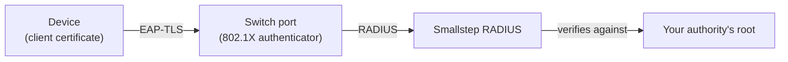

Secure wired ports with device certificates.
About 15 minutes in Smallstep if you already have Wi-Fi set up, plus the change on your switches.

## What you get {#what-you-get}

A device plugs into a port and the switch, acting as the 802.1X authenticator, relays the EAP-TLS handshake to a RADIUS server.
The RADIUS server verifies the device's certificate against your authority, and the switch forwards traffic only after Access-Accept.
Unplugging and plugging in a different device starts the check again.



The objects are the same as for [Wi-Fi](./wifi.mdx): a **credential**, a **RADIUS server**, and a **wired network** resource that tells devices to authenticate on their Ethernet interface with that credential and to trust that server.
If you have set up Wi-Fi, you reuse the first two and create only the third.

## Before you start {#before-you-start}

1. **Devices enrolled.**
   At least one device in your [inventory](../platform/enrollment-guide.mdx), approved, running the [agent](../platform/smallstep-agent.mdx) on macOS, Windows, or Linux, with a wired interface.
2. **An MDM connected**, only if you will deliver the Windows profile with [Intune](../tutorials/connect-intune-to-smallstep.mdx) or [Workspace ONE](../tutorials/connect-workspace-one-to-smallstep.mdx) while the agent manages the certificate.
3. **An authority** to sign the client certificates: note its ID, <<authority-id>>, under [Authorities](https://smallstep.com/app/?next=/cm/authorities) and download its root as `client_ca.crt`.
   If you did the [Wi-Fi guide](./wifi.mdx#before-you-start), you have this.
4. **An API token** from [Settings → API tokens](https://smallstep.com/app/?next=/settings/api/tokens/add), stored in `api_headers` as the Wi-Fi guide shows.
5. **Your network facts**: the public IP address your switches send RADIUS traffic from, and admin access to a switch with a spare access port for testing.

## Create it in Smallstep {#create}

### 1. The credential and the RADIUS server

If they exist from Wi-Fi, skip to 2 and use the same <<credential-id>>, <<radius-server-id>>, and `radius_ca.crt`.
A single credential serves both networks.

Otherwise create them exactly as the Wi-Fi guide's [step 3](./wifi.mdx#create) does, with one change: use `"slug": "dot1x"` and a static common name of `Corporate Network`.
For the RADIUS server, `nasIPs` are the public IP addresses your **switches** send from.
Smallstep RADIUS verifies EAP-TLS only and checks the full chain and revocation on every authentication; it does not do MAC Authentication Bypass, so plan for devices without certificates in step 4.

### 2. Create the wired network

```bash
jq -n --rawfile ca radius_ca.crt \
  '{
    name: "Corporate wired network",
    autojoin: true,
    radiusServerCA: $ca,
    credentials: ["<<credential-id>>"]
  }' \
| curl -sH @api_headers --request POST \
  --url https://gateway.smallstep.com/api/protect/ethernet \
  --header 'Accept: application/json' \
  --header 'Content-Type: application/json' \
  --header 'x-smallstep-api-version: 2025-01-01' \
  --data @- | jq
```

- `radiusServerCA` is what devices use to verify the RADIUS server: the `serverCA` from the RADIUS server, or your own server's CA.
- `credentials` lists the credentials devices authenticate with.

The resource appears under [Protect → Ethernet](https://smallstep.com/app/?next=/protect/ethernet).
Its ID is <<ethernet-id>>.

## Configure your switches {#configure-external}

Every switch vendor exposes 802.1X differently, but the configuration has the same shape.
The values are the same as for Wi-Fi:

| Setting | Value |
|---|---|
| RADIUS server IP | <<radius-server-ip>> |
| RADIUS server port | <<radius-server-port>> |
| Shared secret | <<radius-secret>> |

<Tabs>
  <Tab label="Any switch">
    1. **Register the RADIUS server** as an authentication server (often under AAA or RADIUS clients) with the three values above.
    2. **Enable 802.1X globally** on the switch.
    3. **Enable port authentication** on each access port.
       On a Cisco IOS-style command line that is `dot1x port-control auto`.
    4. **Decide what happens to devices without certificates.**
       Printers and other devices that cannot do 802.1X need a guest VLAN, a dedicated unauthenticated VLAN, or separate ports.
       MAC Authentication Bypass is not supported by Smallstep RADIUS; it authenticates certificates only.
    5. **Assign VLANs dynamically** with RADIUS reply attributes (`Tunnel-Type`, `Tunnel-Medium-Type`, `Tunnel-Private-Group-ID`) instead of per port, if your RADIUS deployment supports reply attributes (see [Roll out and operate](#operate)).

    Consult your switch vendor's 802.1X documentation for the exact commands.
    Per-vendor tabs for Cisco IOS-XE, Aruba CX, Juniper EX, Meraki MS, UniFi, and HPE are planned and not written yet; the shape above applies to all of them.
  </Tab>
</Tabs>

Start with one test port.
Do not enable port authentication on every port until a device has authenticated.

## Deliver to devices {#deliver}

<Tabs>
  <Tab label="Agent">
    Nothing to do.
    On its next sync, the agent on every device that matches the credential's assignment policy requests the certificate with the key in the device's secure hardware, trusts the RADIUS server CA, and configures the wired 802.1X profile: Wired AutoConfig on Windows, the Ethernet payload on macOS, NetworkManager on Linux.

    Two caveats.
    On Windows, the **Wired AutoConfig** service (`dot3svc`) must be running for 802.1X on Ethernet; the agent's profile does nothing while it is stopped.
    On Linux, keys held in the TPM through the agent's PKCS#11 interface have limits with some NetworkManager versions; check the [agent troubleshooting page](../platform/troubleshooting-agent.mdx#pkcs11-not-working-linuxmacos) if the supplicant cannot use the certificate.
  </Tab>
  <Tab label="Intune">
    Use this when the agent should own the certificate and Intune should own the network settings on Windows.
    Intune deploys a custom OMA-URI profile whose LAN XML selects the certificate by the SHA-1 fingerprint of its issuing CA.

    1. Get the two fingerprints (the RADIUS server CA and the authority's intermediate) as the [profile reference](../reference/wlan-profile-xml.mdx) shows, and remove the colons.
    2. In Intune, go to **Devices → Configuration**, choose **Create → New Policy**: platform **Windows 10 and Later**, profile type **Templates**, template **Custom**.
    3. Name the policy, for example **EAP-TLS Wired Network with Smallstep**.
    4. Add one OMA-URI setting: name **Wired Network Configuration**, OMA-URI `./Device/Vendor/MSFT/WiredNetwork/LanXML`, data type **String**, value the [LAN profile XML](../reference/wlan-profile-xml.mdx#lan) with `ServerNames` set to <<radius-server-name>>, `TrustedRootCA` the RADIUS CA fingerprint, and `IssuerHash` the issuing CA fingerprint.
    5. Save, assign to your test group, skip applicability rules, and create.

    `authMode` must match where the agent stores the credential: `machine` for `HARDWARE_ATTESTED` keys, `user` for every other protection level.
  </Tab>
  <Tab label="Workspace ONE">
    Workspace ONE UEM deploys the same LAN profile XML.
    Create a **Windows** device profile, add the **Wired Network** template, paste the [LAN profile XML](../reference/wlan-profile-xml.mdx#lan), set the assignments, and save and publish.
  </Tab>
</Tabs>

## Verify {#verify}

1. Plug the test device into the 802.1X-enabled port.
   It gets an address on the corporate VLAN without a prompt.
2. On the switch, check the port's authentication state; on a Cisco-style command line:

   ```text
   show dot1x interface <port>
   show authentication sessions
   ```

   The session shows the device's identity and **Authorized**.
3. Open the resource under [Protect → Ethernet](https://smallstep.com/app/?next=/protect/ethernet); the issued certificate and the authentication activity for the device appear there.
4. On an agent-managed device, run the doctor and expect every row to pass:

   ```bash
   sudo step-agent doctor
   ```

   On Windows, 802.1X events are in Event Viewer under **Applications and Services Logs → Microsoft → Windows → Wired-AutoConfig**.

## Roll out and operate {#operate}

- **Widen the assignment policy** on the credential once the test port works; it is the same credential as Wi-Fi, so devices that already have the certificate need no new issuance.
- **Enable port authentication** on the remaining access ports in batches, with the guest or unauthenticated VLAN in place for devices without certificates.
- **Renewals** are automatic on agent-managed devices.
- **Revocation.**
  Revoke a device's certificate with [`/certificates/{serialNumber}/revoke`](https://gateway.smallstep.com/v2025-01-01/operations/RevokeCertificate); the next re-authentication on the port fails.
- **VLANs.**
  Dynamic VLAN assignment uses RADIUS reply attributes whose values are static, taken from a certificate field by OID, or from device metadata.
  Reply attributes are part of the dedicated Smallstep RADIUS deployment described in the [Wi-Fi guide](./wifi.mdx#create); with the multi-tenant service, assign VLANs per port on the switch.
- **A second RADIUS server** for failover on the switch is configured the same way; register both public IPs.

## Troubleshoot {#troubleshoot}

- [The port never authorizes and `show authentication sessions` shows no session](../troubleshooting/wired/port-never-authorizes.mdx)
- [Windows does not attempt 802.1X on the wired interface](../troubleshooting/wired/windows-wired-autoconfig-stopped.mdx)
- [Printers and other devices lose connectivity after port authentication is enabled](../troubleshooting/wired/devices-without-certificates.mdx)
- [The Intune wired profile installs but Windows does not present the certificate](../troubleshooting/wired/lan-profile-wrong-issuer-hash.mdx)

RADIUS-side symptoms are the same as for Wi-Fi: [`unknown CA`](../troubleshooting/wifi/unknown-ca.mdx) and [no answer from a new site](../troubleshooting/wifi/new-site-no-answer.mdx).

## Automate {#automate}

### REST

| Object | Create | Read |
|---|---|---|
| Credential | `POST /credentials` | `GET /credential/{credentialID}` |
| RADIUS server | `POST /managed-radius` | `GET /managed-radius/{managedRadiusID}?secret=true` |
| Wired network | `POST /protect/ethernet` | `GET /protect/ethernet/{ethernetID}` |

### Terraform

With the credential and RADIUS server from the [Wi-Fi guide](./wifi.mdx#automate):

```hcl
resource "smallstep_ethernet" "corporate" {
  name             = "Corporate wired network"
  radius_server_ca = smallstep_managed_radius.corporate.server_ca
  autojoin         = true
  credentials      = [smallstep_credential.wifi.id]
}
```

The resource is [`smallstep_ethernet`](https://registry.terraform.io/providers/smallstep/smallstep/latest/docs/resources/ethernet).
